# Architecture — This Mind Does Not Exist

## System Overview

This Mind Does Not Exist is a self-hosted adversarial reasoning system that orchestrates multiple local LLMs
in a structured debate to produce significantly higher-quality answers than any single model alone.

```mermaid
graph TB
    subgraph USER["👤 User Interface"]
        WEB["🌐 Web UI<br/>Next.js 15"]
        CLI["💻 CLI<br/>Node.js"]
    end

    subgraph API["⚡ API Layer"]
        FASTIFY["Fastify Server<br/>REST + SSE"]
    end

    subgraph BRAIN["🧠 Core Engine"]
        RAG["RAG Retriever<br/>Template Matching"]
        DEBATE["Debate Orchestrator<br/>Proposer ↔ Skeptic"]
        SYNTH["Synthesizer<br/>Final Polish"]
        SCORE["Auto-Scorer<br/>Quality Judge"]
    end

    subgraph MODELS["🤖 Model Layer"]
        OLLAMA["Ollama<br/>Model Server"]
        PROPOSER_M["Proposer<br/>qwen3:32b"]
        SKEPTIC_M["Skeptic<br/>llama3.3:70b"]
        EMBED_M["Embeddings<br/>nomic-embed-text"]
    end

    subgraph STORAGE["💾 Storage Layer"]
        VECTORDB["ChromaDB<br/>Vector Store"]
        SQLITE["SQLite<br/>Traces & Metadata"]
        FS["Filesystem<br/>Templates & LoRA"]
    end

    subgraph IMPROVE["📈 Self-Improvement"]
        FINETUNE["LoRA Fine-Tuner<br/>Unsloth + Axolotl"]
        VERSION["Version Manager<br/>LoRA Adapters"]
    end

    WEB --> FASTIFY
    CLI --> FASTIFY
    FASTIFY --> RAG
    RAG --> VECTORDB
    RAG --> EMBED_M
    EMBED_M --> OLLAMA
    FASTIFY --> DEBATE
    DEBATE --> PROPOSER_M
    DEBATE --> SKEPTIC_M
    PROPOSER_M --> OLLAMA
    SKEPTIC_M --> OLLAMA
    DEBATE --> SYNTH
    SYNTH --> PROPOSER_M
    DEBATE --> SCORE
    SCORE --> SQLITE
    SQLITE --> FINETUNE
    FINETUNE --> VERSION
    VERSION --> FS
    FS --> OLLAMA

    style USER fill:#1a1a2e,stroke:#e94560,color:#fff
    style BRAIN fill:#16213e,stroke:#0f3460,color:#fff
    style MODELS fill:#0f3460,stroke:#533483,color:#fff
    style STORAGE fill:#1a1a2e,stroke:#e94560,color:#fff
    style IMPROVE fill:#533483,stroke:#e94560,color:#fff
```



---

## Data Flow


---

## Component Deep Dive

### 1. API Layer (Fastify)

**Location:** `packages/core/src/server/`

The API server is built with Fastify for maximum performance. It exposes:

| Endpoint | Method | Description |
|---|---|---|
| `/api/reason` | POST | Start a new reasoning debate |
| `/api/reason/:id/stream` | GET (SSE) | Stream debate events in real-time |
| `/api/traces` | GET | List all saved debate traces |
| `/api/traces/:id` | GET | Get a specific trace |
| `/api/traces/:id/rate` | POST | Rate a trace (1-10) |
| `/api/templates` | GET | List all reasoning templates |
| `/api/templates` | POST | Add a custom reasoning template |
| `/api/models` | GET | List available Ollama models |
| `/api/finetune` | POST | Trigger a fine-tuning run |
| `/api/finetune/status` | GET | Check fine-tuning status |
| `/api/health` | GET | Health check |

**Key Design Decisions:**
- **SSE over WebSockets:** Server-Sent Events are simpler, HTTP-native, and sufficient for our uni-directional streaming needs. Each debate event (proposal chunk, critique chunk, synthesis chunk) is sent as an SSE event.
- **Stateless API:** Each debate is a self-contained request. No session state. The trace ID is returned immediately and can be used to stream events.
- **Request queuing:** Long-running debates are queued to prevent resource exhaustion. Default concurrency: 2 simultaneous debates.

---

### 2. RAG Retriever

**Location:** `packages/core/src/rag/`

The RAG layer is responsible for matching user queries to reasoning templates.


**Template Storage:**
- Templates are stored as markdown files in `data/bot-buffer/` and `data/templates/`
- On startup, all templates are parsed, embedded, and indexed into ChromaDB
- Each template gets a composite embedding from its title, description, keywords, and structure

**Embedding Strategy:**
- Model: `nomic-embed-text` (768-dim, runs on Ollama)
- Chunk size: Full template (most are < 2000 tokens)
- Similarity metric: Cosine similarity
- Threshold: 0.65 minimum for a match

**Template Format:**
```yaml
---
name: "Proof by Contradiction"
domain: mathematics
complexity: moderate
methodology: deductive
keywords: [proof, contradiction, negation, assume, QED]
description: "Template for proving statements by assuming the opposite and deriving a contradiction"
---

## Steps

1. **State the Claim:** Clearly define what you want to prove.
2. **Assume the Negation:** Suppose the opposite is true.
3. **Derive Consequences:** Follow logical implications.
4. **Reach Contradiction:** Show this leads to an impossibility.
5. **Conclude:** The original claim must be true (QED).

## Checklist
- [ ] Is the claim clearly stated?
- [ ] Is the negation precisely formulated?
- [ ] Does each step follow logically?
- [ ] Is the contradiction genuine (not just unlikely)?
- [ ] Is the proof complete?
```

---

### 3. Debate Orchestrator

**Location:** `packages/core/src/debate/`

The heart of the system. Manages the multi-round adversarial debate between Proposer and Skeptic.


**Orchestrator Logic (Pseudocode):**
```typescript
async function runDebate(query: string, config: DebateConfig): AsyncGenerator<DebateEvent> {
  // Phase 0: RAG
  const templates = await ragRetriever.search(query, config.ragTopK);
  yield { type: 'rag_complete', templates };

  // Phase 1-3: Debate rounds
  let history: Round[] = [];
  for (let round = 1; round <= config.maxRounds; round++) {
    // Proposer turn
    const proposerPrompt = buildProposerPrompt(query, templates, history);
    const proposal = await streamModel(config.proposerModel, proposerPrompt);
    yield* streamChunks('proposer', round, proposal);

    // Skeptic turn
    const skepticPrompt = buildSkepticPrompt(query, proposal, history);
    const critique = await streamModel(config.skepticModel, skepticPrompt);
    yield* streamChunks('skeptic', round, critique);

    history.push({ round, proposal, critique });

    // Early termination check
    if (shouldTerminate(critique, round, config)) break;
  }

  // Phase 4: Synthesis
  const synthesisPrompt = buildSynthesisPrompt(query, history);
  const finalAnswer = await streamModel(config.synthesizerModel, synthesisPrompt);
  yield* streamChunks('synthesizer', 0, finalAnswer);

  // Phase 5: Save & Score
  const trace = await saveTrace(query, templates, history, finalAnswer);
  const score = await autoScore(query, finalAnswer);
  yield { type: 'complete', trace, score };
}
```

**Error Handling:**
- **Model timeout:** If a model doesn't respond within `OLLAMA_TIMEOUT`, retry once, then fail gracefully with partial results
- **Model unavailable:** If a model isn't pulled, return a clear error with `ollama pull` instructions
- **OOM:** If the system runs out of memory, gracefully stop the debate and synthesize from available rounds
- **Network error to Ollama:** Retry with exponential backoff (3 attempts, 1s/2s/4s delays)

---

### 4. Ollama Integration

**Location:** `packages/core/src/ollama/`

A thin client wrapper around the Ollama HTTP API.


**Key Features:**
- Streaming support via `ReadableStream` for real-time token output
- Automatic retry with exponential backoff
- Connection pooling for concurrent model calls
- Model warm-up on startup (keeps model in memory)
- Graceful fallback to llama.cpp if Ollama is unavailable

---

### 5. Storage Layer

**Location:** `packages/core/src/storage/`

#### SQLite (Traces & Metadata)

All debate traces are stored in a SQLite database for persistence and querying.

```sql
-- Traces table: One row per completed debate
CREATE TABLE traces (
    id TEXT PRIMARY KEY,
    created_at DATETIME DEFAULT CURRENT_TIMESTAMP,
    query TEXT NOT NULL,
    final_answer TEXT NOT NULL,
    total_rounds INTEGER NOT NULL,
    early_stopped BOOLEAN DEFAULT FALSE,
    quality_score REAL,
    user_rating INTEGER,
    auto_score REAL,
    proposer_model TEXT NOT NULL,
    skeptic_model TEXT NOT NULL,
    total_duration_ms INTEGER,
    templates_used TEXT, -- JSON array of template IDs
    metadata TEXT -- JSON object for extensibility
);

-- Rounds table: One row per debate round
CREATE TABLE rounds (
    id TEXT PRIMARY KEY,
    trace_id TEXT NOT NULL REFERENCES traces(id),
    round_number INTEGER NOT NULL,
    proposer_response TEXT NOT NULL,
    skeptic_response TEXT NOT NULL,
    proposer_duration_ms INTEGER,
    skeptic_duration_ms INTEGER,
    UNIQUE(trace_id, round_number)
);

-- Templates table: Reasoning template metadata
CREATE TABLE templates (
    id TEXT PRIMARY KEY,
    name TEXT NOT NULL,
    domain TEXT,
    complexity TEXT,
    methodology TEXT,
    file_path TEXT NOT NULL,
    created_at DATETIME DEFAULT CURRENT_TIMESTAMP,
    usage_count INTEGER DEFAULT 0
);

-- Fine-tune runs table
CREATE TABLE finetune_runs (
    id TEXT PRIMARY KEY,
    started_at DATETIME DEFAULT CURRENT_TIMESTAMP,
    completed_at DATETIME,
    status TEXT DEFAULT 'pending', -- pending, running, completed, failed
    traces_used INTEGER,
    lora_path TEXT,
    config TEXT, -- JSON
    metrics TEXT -- JSON: loss, eval metrics, etc.
);

-- Indexes
CREATE INDEX idx_traces_quality ON traces(quality_score);
CREATE INDEX idx_traces_created ON traces(created_at);
CREATE INDEX idx_rounds_trace ON rounds(trace_id);
```

#### ChromaDB (Vector Store)

Used for semantic search over reasoning templates.

```python
# Collection schema
collection = chroma_client.get_or_create_collection(
    name="reasoning_templates",
    metadata={"hnsw:space": "cosine"}
)

# Document format
collection.add(
    ids=["bot-proof-by-contradiction"],
    documents=["Proof by Contradiction: Template for proving..."],
    metadatas=[{
        "name": "Proof by Contradiction",
        "domain": "mathematics",
        "complexity": "moderate",
        "methodology": "deductive"
    }],
    embeddings=[[0.1, 0.2, ...]]  # 768-dim from nomic-embed-text
)
```

---

### 6. Self-Improvement Pipeline

**Location:** `packages/core/src/finetune/`

```mermaid
flowchart TB
    subgraph COLLECT["📥 Collection"]
        TRACES["High-Quality Traces<br/>(score ≥ 8)"]
        FILTER["Quality Filter<br/>(min 50 traces)"]
    end

    subgraph PREPARE["🔧 Preparation"]
        FORMAT["Format as<br/>instruction pairs"]
        SPLIT["Train/Val Split<br/>(90/10)"]
        EXPORT["Export as JSONL"]
    end

    subgraph TRAIN["🏋️ Training"]
        UNSLOTH["Unsloth<br/>4-bit QLoRA"]
        LORA["LoRA Adapter<br/>(rank 16, alpha 32)"]
        EVAL["Validation<br/>Loss tracking"]
    end

    subgraph DEPLOY["🚀 Deployment"]
        MERGE["Merge LoRA<br/>with base model"]
        VERSION_CTRL["Version Control<br/>Rollback support"]
        REGISTER["Register in<br/>Ollama"]
    end

    TRACES --> FILTER
    FILTER --> FORMAT
    FORMAT --> SPLIT
    SPLIT --> EXPORT
    EXPORT --> UNSLOTH
    UNSLOTH --> LORA
    LORA --> EVAL
    EVAL --> MERGE
    MERGE --> VERSION_CTRL
    VERSION_CTRL --> REGISTER
```



**Training Data Format (Alpaca-style):**
```json
{
  "instruction": "Prove that the sum of two even numbers is always even.",
  "input": "Use the Proof by Direct Construction template. Templates available: [Proof by Contradiction, Proof by Induction, Proof by Direct Construction]",
  "output": "[The complete final synthesized answer from the debate]"
}
```

**Hyperparameters:**
| Parameter | Default | Notes |
|---|---|---|
| LoRA rank | 16 | Balance between capacity and size |
| LoRA alpha | 32 | 2x rank is standard |
| Learning rate | 2e-4 | With cosine scheduler |
| Batch size | 4 | Gradient accumulation: 4 |
| Epochs | 3 | Early stopping on val loss |
| Max seq length | 4096 | Covers most debate traces |
| Quantization | 4-bit (QLoRA) | Memory efficient |

---

### 7. Frontend (Next.js 15)

**Location:** `apps/web/`

The web UI provides a beautiful, minimal interface for interacting with the reasoning engine.


**UI States:**
1. **Idle** — Clean input with subtle animations
2. **Thinking** — Pulsing indicator showing which model is active
3. **Debating** — Split view showing Proposer and Skeptic in real-time
4. **Synthesizing** — Final answer streaming in
5. **Complete** — Full answer with rating widget and transcript toggle

---

## Error Handling Strategy

| Error Type | Detection | Recovery |
|---|---|---|
| Ollama not running | Health check fails | Show install instructions |
| Model not pulled | 404 from Ollama | Auto-pull or show `ollama pull` command |
| Model OOM | Ollama returns OOM error | Suggest smaller quantization |
| Debate timeout | Round exceeds timeout | Synthesize from completed rounds |
| ChromaDB down | Connection refused | Fallback: skip RAG, use random template |
| SQLite locked | Write conflict | Retry with exponential backoff |
| Network error | Connection refused/timeout | Retry 3x with backoff |

---

## Security Considerations

- **All local:** No data ever leaves the machine (unless user explicitly enables cloud APIs)
- **No telemetry:** Zero tracking, no phone-home
- **File permissions:** Database and traces limited to user's permissions
- **API binding:** Default bind to `localhost:3001` — not exposed externally
- **Docker isolation:** Each service runs in its own container with minimal privileges
- **No eval/exec:** No dynamic code execution from user inputs

---

## Performance Targets

| Metric | Target | Notes |
|---|---|---|
| Time to first token | < 2s | After models are loaded |
| Full 4-round debate | < 3 min | With 32B models on M2 Max |
| RAG retrieval | < 200ms | With 100 templates indexed |
| UI responsiveness | < 100ms | No blocking operations on main thread |
| Memory usage (API) | < 500MB | Excluding model VRAM |
| Trace storage | < 1MB/trace | Compressed JSON |
