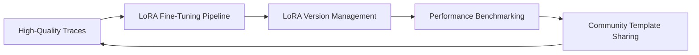

# Product Requirements Document (PRD)
## v0.3 — Self-Improvement
### This Mind Does Not Exist

---

**Document Version:** 1.0  
**Status:** Draft  
**Feature Set:** v0.3 Self-Improvement  
**Scope:** Automated LoRA Fine-Tuning Pipeline, LoRA Version Management and Rollback, Performance Benchmarking Dashboard, Community Template Sharing

---

## 1. Executive Summary

v0.3 delivers the "self-improvement" promise that is central to the product's value proposition. The system currently collects high-quality debate traces but does nothing with them. This release closes that loop: traces become training data, training data becomes LoRA adapters, adapters make the Proposer model smarter, and users can measure and share that improvement.

The four features in this release form a complete flywheel:



---

## 2. Background and Context

### 2.1 Current State (v0.1 / v0.2)

- The debate engine produces high-quality reasoning traces
- Traces are stored in SQLite with quality scores
- [`packages/core/src/finetune/manager.ts`](../packages/core/src/finetune/manager.ts) exists as a stub with all methods returning empty/placeholder values
- [`scripts/nightly-finetune.sh`](../scripts/nightly-finetune.sh) exists as a scaffold with all training steps commented out
- No Python training code exists yet
- No version management for LoRA adapters
- No benchmarking infrastructure
- No template sharing mechanism

### 2.2 The Self-Improvement Promise

From the README:
> "Every high-quality reasoning trace is saved. A lightweight fine-tuning loop (powered by Unsloth) periodically trains a LoRA adapter on your best debates. The system literally learns your problem domain and gets smarter the more you use it."

v0.3 makes this real.

### 2.3 Technical Constraints

- **Local-first:** All training must run on the user's hardware. No cloud dependencies.
- **Memory-efficient:** Must work on consumer hardware (16–32GB RAM, single GPU).
- **Non-blocking:** Fine-tuning must not interrupt active debates.
- **Reversible:** Any LoRA adapter can be rolled back instantly.
- **Privacy-preserving:** Community sharing must be opt-in and anonymized.

---

## 3. Feature 1: Automated LoRA Fine-Tuning Pipeline

### 3.1 Problem Statement

Users accumulate high-quality debate traces but have no automated way to convert them into model improvements. The fine-tuning pipeline is the core mechanism that closes the self-improvement loop.

### 3.2 User Stories

| ID | As a... | I want to... | So that... |
|----|---------|--------------|------------|
| FT-1 | Power user | Trigger a fine-tune run from the web UI | I don't need to use the command line |
| FT-2 | Power user | Schedule automatic nightly fine-tuning | The system improves without manual intervention |
| FT-3 | Developer | Run fine-tuning from the CLI | I can integrate it into my own workflows |
| FT-4 | User | See real-time progress during fine-tuning | I know the system is working and how long it will take |
| FT-5 | User | Be notified when fine-tuning completes | I can start using the improved model immediately |
| FT-6 | User | Configure fine-tuning hyperparameters | I can optimize for my specific hardware and use case |
| FT-7 | User | See which traces were used for training | I understand what the model learned from |

### 3.3 Functional Requirements

#### 3.3.1 Data Export

- **FR-FT-01:** The system MUST export traces with `quality_score >= threshold` (default: 8.0) OR `user_rating >= threshold` as training data
- **FR-FT-02:** Training data MUST be formatted as Alpaca-style instruction/input/output JSONL
- **FR-FT-03:** The system MUST split data into train (90%) and validation (10%) sets with deterministic shuffling
- **FR-FT-04:** The system MUST require a minimum of 50 traces before allowing a fine-tune run (configurable via `FINETUNE_MIN_TRACES`)
- **FR-FT-05:** Each training example MUST include: the original query as `instruction`, the templates used as `input`, and the final synthesized answer as `output`
- **FR-FT-06:** The system MUST deduplicate training examples by query hash to prevent overfitting on repeated queries

#### 3.3.2 Training Execution

- **FR-FT-07:** Training MUST use Unsloth for 4-bit QLoRA to minimize VRAM requirements
- **FR-FT-08:** The system MUST support Axolotl as an alternative training backend (configurable)
- **FR-FT-09:** Training MUST run as a Python subprocess, isolated from the Node.js API server
- **FR-FT-10:** The system MUST support the following configurable hyperparameters:
  - `lora_rank` (default: 16, range: 4–128)
  - `lora_alpha` (default: 32, range: 8–256)
  - `learning_rate` (default: 2e-4, range: 1e-5 to 1e-3)
  - `batch_size` (default: 4, range: 1–32)
  - `gradient_accumulation_steps` (default: 4, range: 1–16)
  - `epochs` (default: 3, range: 1–10)
  - `max_seq_length` (default: 4096, range: 512–8192)
  - `warmup_ratio` (default: 0.03)
  - `weight_decay` (default: 0.01)
- **FR-FT-11:** Training MUST implement early stopping based on validation loss (patience: 3 epochs)
- **FR-FT-12:** The system MUST log training metrics (loss, eval_loss, learning_rate) at each step to a structured JSON log file
- **FR-FT-13:** Training MUST support resuming from a checkpoint if interrupted

#### 3.3.3 Progress Tracking

- **FR-FT-14:** The API MUST expose a `GET /api/finetune/:runId/progress` SSE endpoint that streams real-time training progress
- **FR-FT-15:** Progress events MUST include: `step`, `total_steps`, `loss`, `eval_loss`, `eta_seconds`, `status`
- **FR-FT-16:** The system MUST persist run state in the `finetune_runs` SQLite table
- **FR-FT-17:** The system MUST handle training process crashes gracefully, marking the run as `failed` with an error message

#### 3.3.4 Scheduling

- **FR-FT-18:** The system MUST support cron-based scheduling via environment variable `FINETUNE_SCHEDULE` (default: `0 2 * * 0` — weekly Sunday 2 AM)
- **FR-FT-19:** The scheduler MUST skip a run if another run is already in progress
- **FR-FT-20:** The scheduler MUST skip a run if fewer than `FINETUNE_MIN_TRACES` new high-quality traces have been added since the last run

### 3.4 Non-Functional Requirements

- **NFR-FT-01:** Fine-tuning MUST NOT block the API server or degrade debate performance
- **NFR-FT-02:** The Python training script MUST work with Python 3.10+ and CUDA 11.8+
- **NFR-FT-03:** The system MUST provide a CPU-only fallback mode (slower but functional)
- **NFR-FT-04:** Training on 50 traces MUST complete within 30 minutes on a single RTX 3090
- **NFR-FT-05:** The training script MUST be idempotent — running it twice with the same data produces the same result

### 3.5 API Endpoints

| Method | Path | Description |
|--------|------|-------------|
| `POST` | `/api/finetune` | Start a fine-tune run |
| `GET` | `/api/finetune` | List all fine-tune runs |
| `GET` | `/api/finetune/:runId` | Get run details |
| `GET` | `/api/finetune/:runId/progress` | SSE stream of training progress |
| `DELETE` | `/api/finetune/:runId` | Cancel a running fine-tune |
| `GET` | `/api/finetune/config` | Get current fine-tune configuration |
| `PUT` | `/api/finetune/config` | Update fine-tune configuration |

### 3.6 Data Models

```typescript
interface FineTuneRun {
  id: string;                    // UUID
  startedAt: string;             // ISO 8601
  completedAt: string | null;
  status: 'pending' | 'running' | 'completed' | 'failed' | 'cancelled';
  tracesUsed: number;
  trainExamples: number;
  valExamples: number;
  loraPath: string | null;       // Path to saved adapter
  baseModel: string;             // e.g., "qwen3:32b"
  config: FineTuneConfig;
  metrics: FineTuneMetrics | null;
  errorMessage: string | null;
  triggeredBy: 'manual' | 'scheduled' | 'api';
}

interface FineTuneConfig {
  loraRank: number;
  loraAlpha: number;
  learningRate: number;
  batchSize: number;
  gradientAccumulationSteps: number;
  epochs: number;
  maxSeqLength: number;
  warmupRatio: number;
  weightDecay: number;
  minQualityScore: number;
  baseModel: string;
  backend: 'unsloth' | 'axolotl';
}

interface FineTuneMetrics {
  finalTrainLoss: number;
  finalValLoss: number;
  bestValLoss: number;
  totalSteps: number;
  trainingTimeSeconds: number;
  peakVramGb: number | null;
  perplexity: number | null;
}
```

---

## 4. Feature 2: LoRA Version Management and Rollback

### 4.1 Problem Statement

Each fine-tuning run produces a LoRA adapter. Without version management, users cannot compare adapters, roll back to a better-performing version, or understand the history of model improvements.

### 4.2 User Stories

| ID | As a... | I want to... | So that... |
|----|---------|--------------|------------|
| VM-1 | User | See all LoRA adapter versions with their performance metrics | I can choose the best one |
| VM-2 | User | Roll back to a previous adapter version with one click | I can recover if a new adapter performs worse |
| VM-3 | User | Compare two adapter versions side-by-side | I can understand what changed |
| VM-4 | User | Delete old adapter versions to free disk space | I can manage storage |
| VM-5 | User | Tag an adapter version as "stable" | I can protect it from accidental deletion |
| VM-6 | Developer | Export an adapter for use in other tools | I can use the trained adapter outside this system |
| VM-7 | User | See which adapter is currently active | I always know what model I'm using |

### 4.3 Functional Requirements

#### 4.3.1 Version Storage

- **FR-VM-01:** Each LoRA adapter MUST be stored in a versioned directory: `data/lora-adapters/{runId}/`
- **FR-VM-02:** Each adapter directory MUST contain: `adapter_model.bin`, `adapter_config.json`, `training_args.json`, `metrics.json`, `manifest.json`
- **FR-VM-03:** The `manifest.json` MUST include: `id`, `createdAt`, `baseModel`, `tracesUsed`, `metrics`, `tags`, `isActive`, `size_bytes`
- **FR-VM-04:** The system MUST maintain a `data/lora-adapters/active.json` pointer file indicating the currently active adapter
- **FR-VM-05:** The system MUST calculate and store the SHA-256 hash of each adapter for integrity verification

#### 4.3.2 Version Operations

- **FR-VM-06:** The system MUST support activating any stored adapter version via `POST /api/lora/:adapterId/activate`
- **FR-VM-07:** Activating an adapter MUST update the `active.json` pointer and restart the Proposer model with the new adapter
- **FR-VM-08:** The system MUST support tagging adapters with user-defined labels via `POST /api/lora/:adapterId/tag`
- **FR-VM-09:** The system MUST prevent deletion of the currently active adapter
- **FR-VM-10:** The system MUST support exporting an adapter as a `.tar.gz` archive via `GET /api/lora/:adapterId/export`
- **FR-VM-11:** The system MUST support importing an adapter from a `.tar.gz` archive via `POST /api/lora/import`

#### 4.3.3 Rollback

- **FR-VM-12:** The system MUST support one-click rollback to the previous adapter via `POST /api/lora/rollback`
- **FR-VM-13:** Rollback MUST be atomic — either fully succeeds or leaves the system unchanged
- **FR-VM-14:** The system MUST log all activation and rollback events to an audit trail in SQLite
- **FR-VM-15:** The system MUST support rollback to any specific version, not just the previous one

### 4.4 Non-Functional Requirements

- **NFR-VM-01:** Adapter activation MUST complete within 5 seconds (model reload time excluded)
- **NFR-VM-02:** The version list MUST load within 500ms even with 100+ stored adapters
- **NFR-VM-03:** Adapter storage MUST be filesystem-based (no additional database required)
- **NFR-VM-04:** The system MUST handle corrupted adapter files gracefully, marking them as invalid

### 4.5 API Endpoints

| Method | Path | Description |
|--------|------|-------------|
| `GET` | `/api/lora` | List all LoRA adapter versions |
| `GET` | `/api/lora/active` | Get the currently active adapter |
| `GET` | `/api/lora/:adapterId` | Get adapter details |
| `POST` | `/api/lora/:adapterId/activate` | Activate an adapter version |
| `POST` | `/api/lora/:adapterId/tag` | Add/remove tags |
| `DELETE` | `/api/lora/:adapterId` | Delete an adapter version |
| `GET` | `/api/lora/:adapterId/export` | Export adapter as archive |
| `POST` | `/api/lora/import` | Import adapter from archive |
| `POST` | `/api/lora/rollback` | Roll back to previous adapter |

### 4.6 Data Models

```typescript
interface LoRAAdapter {
  id: string;                    // Same as finetune run ID
  createdAt: string;
  baseModel: string;
  isActive: boolean;
  tags: string[];
  metrics: FineTuneMetrics;
  tracesUsed: number;
  sizeBytes: number;
  sha256: string;
  path: string;                  // Relative filesystem path
  isValid: boolean;              // False if files are corrupted/missing
}

interface LoRAActivationEvent {
  id: string;
  timestamp: string;
  adapterId: string;
  previousAdapterId: string | null;
  triggeredBy: 'user' | 'api' | 'rollback';
  success: boolean;
  errorMessage: string | null;
}
```

---

## 5. Feature 3: Performance Benchmarking Dashboard

### 5.1 Problem Statement

Users have no way to measure whether fine-tuning actually improves the system. Without benchmarking, the self-improvement claim is unverifiable. The dashboard provides objective evidence of improvement over time.

### 5.2 User Stories

| ID | As a... | I want to... | So that... |
|----|---------|--------------|------------|
| BM-1 | User | See a chart of quality scores over time | I can see if the system is improving |
| BM-2 | User | Run a standardized benchmark suite | I can compare my system to a baseline |
| BM-3 | User | Compare performance before and after a fine-tune | I can validate that the fine-tune helped |
| BM-4 | User | See per-domain performance metrics | I know which areas have improved most |
| BM-5 | User | Export benchmark results as a report | I can share results with others |
| BM-6 | Developer | Add custom benchmark questions | I can test domain-specific performance |
| BM-7 | User | See response time and token throughput metrics | I can monitor system performance |

### 5.3 Functional Requirements

#### 5.3.1 Benchmark Suite

- **FR-BM-01:** The system MUST include a built-in benchmark suite of 50 standardized questions across 5 domains: mathematics, coding, science, reasoning, and creative writing
- **FR-BM-02:** Each benchmark question MUST have a reference answer and a rubric for automated scoring
- **FR-BM-03:** The system MUST support adding custom benchmark questions via the UI and API
- **FR-BM-04:** Benchmark runs MUST be isolated from the main debate queue and run at lower priority
- **FR-BM-05:** The system MUST support running a "quick benchmark" (10 questions) and a "full benchmark" (50 questions)
- **FR-BM-06:** Benchmark results MUST be stored persistently and associated with the active LoRA adapter at the time of the run

#### 5.3.2 Metrics

- **FR-BM-07:** The system MUST track the following metrics per benchmark run:
  - Average quality score (auto-scored by judge model)
  - Per-domain average quality score
  - Average response time (ms)
  - Average tokens per second
  - Average number of debate rounds
  - Early termination rate
- **FR-BM-08:** The system MUST calculate a composite "TMDE Score" (0–100) as a weighted average of quality and efficiency metrics
- **FR-BM-09:** The system MUST track metric trends over time, comparing each run to the previous run and to the baseline (no LoRA)

#### 5.3.3 Dashboard UI

- **FR-BM-10:** The dashboard MUST display a time-series chart of TMDE Score over benchmark runs
- **FR-BM-11:** The dashboard MUST display a radar chart showing per-domain performance
- **FR-BM-12:** The dashboard MUST display a comparison table between the current adapter and the previous adapter
- **FR-BM-13:** The dashboard MUST display system resource metrics: CPU usage, RAM usage, VRAM usage (if available)
- **FR-BM-14:** The dashboard MUST support filtering benchmark history by date range and adapter version
- **FR-BM-15:** The dashboard MUST display a "before/after fine-tune" comparison when a new adapter is activated

#### 5.3.4 Automated Benchmarking

- **FR-BM-16:** The system MUST automatically run a quick benchmark after each fine-tune completes
- **FR-BM-17:** The system MUST alert the user (via UI notification) if a new adapter performs worse than the previous one
- **FR-BM-18:** The system MUST support scheduling periodic benchmark runs via cron

### 5.4 Non-Functional Requirements

- **NFR-BM-01:** A quick benchmark (10 questions) MUST complete within 20 minutes on standard hardware
- **NFR-BM-02:** Dashboard charts MUST render within 1 second even with 1000+ data points
- **NFR-BM-03:** Benchmark results MUST be exportable as JSON and CSV
- **NFR-BM-04:** The judge model for auto-scoring MUST be a lightweight model (≤7B parameters) to minimize resource usage

### 5.5 API Endpoints

| Method | Path | Description |
|--------|------|-------------|
| `POST` | `/api/benchmark` | Start a benchmark run |
| `GET` | `/api/benchmark` | List all benchmark runs |
| `GET` | `/api/benchmark/:runId` | Get benchmark run details |
| `GET` | `/api/benchmark/:runId/results` | Get detailed results |
| `DELETE` | `/api/benchmark/:runId` | Delete a benchmark run |
| `GET` | `/api/benchmark/questions` | List benchmark questions |
| `POST` | `/api/benchmark/questions` | Add a custom question |
| `DELETE` | `/api/benchmark/questions/:id` | Delete a custom question |
| `GET` | `/api/benchmark/summary` | Get aggregated metrics for dashboard |
| `GET` | `/api/benchmark/export` | Export results as JSON/CSV |

### 5.6 Data Models

```typescript
interface BenchmarkRun {
  id: string;
  startedAt: string;
  completedAt: string | null;
  status: 'pending' | 'running' | 'completed' | 'failed';
  type: 'quick' | 'full' | 'custom';
  adapterId: string | null;      // Active adapter at time of run
  questionCount: number;
  completedQuestions: number;
  metrics: BenchmarkMetrics | null;
  triggeredBy: 'manual' | 'post-finetune' | 'scheduled';
}

interface BenchmarkMetrics {
  tmdeScore: number;             // 0-100 composite score
  avgQualityScore: number;       // 0-10
  avgResponseTimeMs: number;
  avgTokensPerSecond: number;
  avgDebateRounds: number;
  earlyTerminationRate: number;  // 0-1
  domainScores: Record<string, number>;  // domain -> score
  vsBaseline: number | null;     // % improvement vs no-LoRA baseline
  vsPrevious: number | null;     // % improvement vs previous adapter
}

interface BenchmarkQuestion {
  id: string;
  domain: 'mathematics' | 'coding' | 'science' | 'reasoning' | 'creative';
  difficulty: 'easy' | 'medium' | 'hard';
  question: string;
  referenceAnswer: string;
  scoringRubric: string;
  isBuiltIn: boolean;
  createdAt: string;
}

interface BenchmarkResult {
  id: string;
  runId: string;
  questionId: string;
  finalAnswer: string;
  qualityScore: number;
  responseTimeMs: number;
  debateRounds: number;
  earlyStopped: boolean;
  traceId: string;
}
```

---

## 6. Feature 4: Community Template Sharing

### 6.1 Problem Statement

Users create high-quality reasoning templates for their specific domains, but there is no way to share them with the community. A sharing mechanism creates a network effect where the template library grows organically.

### 6.2 User Stories

| ID | As a... | I want to... | So that... |
|----|---------|--------------|------------|
| CT-1 | User | Browse community-contributed templates | I can find templates for my domain |
| CT-2 | User | Publish my custom templates to the community hub | Others can benefit from my work |
| CT-3 | User | Rate and review community templates | I can help others find the best ones |
| CT-4 | User | Import a community template with one click | I can use it immediately |
| CT-5 | User | See which templates are most popular | I can find the best ones quickly |
| CT-6 | User | Fork and modify a community template | I can customize it for my needs |
| CT-7 | Developer | Self-host the community hub | I can run a private template registry |
| CT-8 | User | Search templates by domain, methodology, and keyword | I can find relevant templates quickly |

### 6.3 Functional Requirements

#### 6.3.1 Template Registry

- **FR-CT-01:** The system MUST support a community template registry accessible via a public API
- **FR-CT-02:** The registry MUST be self-hostable — users can point to their own registry via `TEMPLATE_REGISTRY_URL` environment variable
- **FR-CT-03:** The default registry URL MUST be configurable and default to the official TMDE registry
- **FR-CT-04:** The registry API MUST be read-only for anonymous users; publishing requires authentication
- **FR-CT-05:** Authentication MUST use API keys (no OAuth required for v0.3)

#### 6.3.2 Publishing

- **FR-CT-06:** Users MUST be able to publish templates from the web UI via `POST /api/templates/:id/publish`
- **FR-CT-07:** Published templates MUST include: name, description, domain, methodology, keywords, content, author (optional, can be anonymous), version
- **FR-CT-08:** The system MUST validate templates before publishing: valid YAML frontmatter, non-empty content, no PII patterns detected
- **FR-CT-09:** Published templates MUST be versioned — updating a template creates a new version, not an overwrite
- **FR-CT-10:** Users MUST be able to unpublish their own templates

#### 6.3.3 Discovery

- **FR-CT-11:** The community hub page MUST support searching templates by: name, domain, methodology, keywords, author
- **FR-CT-12:** The community hub MUST display templates sorted by: most popular, highest rated, newest, most used
- **FR-CT-13:** Each template listing MUST show: name, domain, description, rating, download count, author, last updated
- **FR-CT-14:** The system MUST support paginated browsing (20 templates per page)

#### 6.3.4 Import

- **FR-CT-15:** Users MUST be able to import any community template with one click
- **FR-CT-16:** Imported templates MUST be stored locally in `data/templates/community/`
- **FR-CT-17:** The system MUST check for template updates when the user opens the community hub
- **FR-CT-18:** The system MUST warn users before importing templates that contain unusual patterns

#### 6.3.5 Rating and Reviews

- **FR-CT-19:** Users MUST be able to rate templates on a 1–5 star scale
- **FR-CT-20:** Users MUST be able to leave text reviews (max 500 characters)
- **FR-CT-21:** The system MUST display the average rating and review count for each template
- **FR-CT-22:** Users MUST be able to report templates for inappropriate content

### 6.4 Non-Functional Requirements

- **NFR-CT-01:** The community hub MUST work offline (showing locally cached templates) if the registry is unreachable
- **NFR-CT-02:** Template imports MUST complete within 2 seconds
- **NFR-CT-03:** The registry API MUST support rate limiting (100 requests/hour per IP for anonymous users)
- **NFR-CT-04:** All template content MUST be sanitized before display to prevent XSS

### 6.5 API Endpoints

#### Local API (Fastify)

| Method | Path | Description |
|--------|------|-------------|
| `GET` | `/api/templates` | List local templates |
| `POST` | `/api/templates` | Create a local template |
| `GET` | `/api/templates/:id` | Get template details |
| `PUT` | `/api/templates/:id` | Update a local template |
| `DELETE` | `/api/templates/:id` | Delete a local template |
| `POST` | `/api/templates/:id/publish` | Publish to community registry |
| `GET` | `/api/community/templates` | Browse community templates |
| `POST` | `/api/community/templates/:id/import` | Import a community template |
| `POST` | `/api/community/templates/:id/rate` | Rate a community template |
| `POST` | `/api/community/templates/:id/review` | Review a community template |

#### Registry API (separate service)

| Method | Path | Description |
|--------|------|-------------|
| `GET` | `/v1/templates` | List templates with search/filter |
| `GET` | `/v1/templates/:id` | Get template details |
| `POST` | `/v1/templates` | Publish a template (auth required) |
| `PUT` | `/v1/templates/:id` | Update a template (auth required) |
| `DELETE` | `/v1/templates/:id` | Unpublish a template (auth required) |
| `POST` | `/v1/templates/:id/rate` | Rate a template |
| `POST` | `/v1/templates/:id/report` | Report a template |
| `GET` | `/v1/templates/:id/versions` | List template versions |

### 6.6 Data Models

```typescript
interface CommunityTemplate {
  id: string;                    // Registry-assigned UUID
  localId: string | null;        // Local template ID if imported
  name: string;
  description: string;
  domain: string;
  methodology: string;
  keywords: string[];
  content: string;               // Full markdown content
  author: string | null;         // Anonymous if not provided
  version: string;               // Semver
  publishedAt: string;
  updatedAt: string;
  downloadCount: number;
  avgRating: number;             // 0-5
  reviewCount: number;
  isImported: boolean;
  importedAt: string | null;
}

interface TemplateReview {
  id: string;
  templateId: string;
  rating: number;                // 1-5
  comment: string | null;
  createdAt: string;
  isAnonymous: boolean;
}
```

---

## 7. UI/UX Requirements

### 7.1 New Pages

| Page | Route | Description |
|------|-------|-------------|
| Fine-Tuning Dashboard | `/finetune` | Manage and monitor fine-tuning runs |
| LoRA Version Manager | `/finetune/versions` | Browse and manage LoRA adapters |
| Benchmarking Dashboard | `/benchmark` | View performance metrics and run benchmarks |
| Community Hub | `/community` | Browse and share templates |

### 7.2 Navigation Updates

The main navigation MUST be updated to include links to all new pages.

### 7.3 Fine-Tuning Dashboard Wireframe

```
┌─────────────────────────────────────────────────────────────┐
│  🏋️ Fine-Tuning Dashboard                    [Run Now ▶]    │
├─────────────────────────────────────────────────────────────┤
│  Status: ● Idle  │  Last Run: 3 days ago  │  Next: Sunday   │
├─────────────────────────────────────────────────────────────┤
│  Training Data                                               │
│  ┌──────────────┐  ┌──────────────┐  ┌──────────────┐      │
│  │  247 traces  │  │  89 eligible │  │  3 runs done │      │
│  │  total       │  │  (score ≥ 8) │  │              │      │
│  └──────────────┘  └──────────────┘  └──────────────┘      │
├─────────────────────────────────────────────────────────────┤
│  Recent Runs                                                 │
│  ┌─────────────────────────────────────────────────────┐   │
│  │ ✅ lora_20260220  │ 89 traces │ loss: 0.42 │ 2d ago │   │
│  │ ✅ lora_20260113  │ 52 traces │ loss: 0.61 │ 3w ago │   │
│  │ ❌ lora_20260106  │ Failed    │ OOM error  │ 4w ago │   │
│  └─────────────────────────────────────────────────────┘   │
└─────────────────────────────────────────────────────────────┘
```

### 7.4 Benchmarking Dashboard Wireframe

```
┌─────────────────────────────────────────────────────────────┐
│  📊 Performance Benchmarks              [Run Benchmark ▶]   │
├─────────────────────────────────────────────────────────────┤
│  TMDE Score: 78.4  (+12.3 vs baseline)  (+3.1 vs previous) │
├─────────────────────────────────────────────────────────────┤
│  Score Over Time                                             │
│  ┌─────────────────────────────────────────────────────┐   │
│  │  100 ┤                                    ●──●       │   │
│  │   80 ┤                          ●──●──●              │   │
│  │   60 ┤              ●──●──●                          │   │
│  │   40 ┤  ●──●──●                                      │   │
│  │      └──────────────────────────────────────────     │   │
│  │         Jan    Feb    Mar    Apr    May    Jun        │   │
│  └─────────────────────────────────────────────────────┘   │
├─────────────────────────────────────────────────────────────┤
│  Domain Performance (Radar)    │  Per-Domain Scores         │
│  [Radar Chart]                 │  Math:    85.2  ████████   │
│                                │  Coding:  79.1  ███████    │
│                                │  Science: 72.4  ██████     │
│                                │  Reason:  81.0  ████████   │
│                                │  Creative:73.5  ██████     │
└─────────────────────────────────────────────────────────────┘
```

---

## 8. Dependencies and Infrastructure

### 8.1 New Python Dependencies

```
unsloth>=2024.12.0
axolotl>=0.4.0
torch>=2.1.0
transformers>=4.40.0
datasets>=2.18.0
peft>=0.10.0
trl>=0.8.0
bitsandbytes>=0.43.0
accelerate>=0.28.0
```

### 8.2 New Node.js Dependencies

```json
{
  "node-cron": "^3.0.3",
  "archiver": "^7.0.0",
  "extract-zip": "^2.0.1",
  "recharts": "^2.12.0",
  "date-fns": "^3.6.0"
}
```

### 8.3 New Docker Services

A new `finetune-worker` service MUST be added to `docker-compose.yml`:

```yaml
finetune-worker:
  build:
    context: .
    dockerfile: packages/finetune/Dockerfile
  container_name: tmde-finetune-worker
  volumes:
    - ./data:/app/data
  environment:
    - DATABASE_PATH=/app/data/traces.db
    - LORA_OUTPUT_DIR=/app/data/lora-adapters
  deploy:
    resources:
      reservations:
        devices:
          - driver: nvidia
            count: 1
            capabilities: [gpu]
  restart: "no"
```

### 8.4 New File Structure

```
packages/
├── finetune/                    # NEW: Python fine-tuning package
│   ├── Dockerfile
│   ├── requirements.txt
│   ├── src/
│   │   ├── export_traces.py     # Export SQLite traces to JSONL
│   │   ├── train_unsloth.py     # Unsloth training script
│   │   ├── train_axolotl.py     # Axolotl training script
│   │   ├── evaluate.py          # Post-training evaluation
│   │   └── utils.py             # Shared utilities
│   └── configs/
│       ├── unsloth_default.yaml
│       └── axolotl_default.yaml
packages/core/src/
├── finetune/
│   ├── manager.ts               # EXISTING (implement)
│   ├── scheduler.ts             # NEW: Cron scheduler
│   └── progress-tracker.ts     # NEW: SSE progress streaming
├── lora/                        # NEW
│   ├── version-manager.ts       # LoRA version management
│   └── types.ts
├── benchmark/                   # NEW
│   ├── runner.ts                # Benchmark execution
│   ├── scorer.ts                # Auto-scoring
│   ├── questions.ts             # Built-in question bank
│   └── types.ts
├── community/                   # NEW
│   ├── registry-client.ts       # HTTP client for registry API
│   └── types.ts
apps/web/app/
├── finetune/
│   ├── page.tsx                 # Fine-tuning dashboard
│   └── versions/
│       └── page.tsx             # LoRA version manager
├── benchmark/
│   └── page.tsx                 # Benchmarking dashboard
└── community/
    └── page.tsx                 # Community template hub
```

---

## 9. Acceptance Criteria

### 9.1 Feature 1: LoRA Fine-Tuning Pipeline

- [ ] A user with 50+ high-quality traces can trigger a fine-tune run from the web UI
- [ ] The fine-tune run completes successfully and produces a valid LoRA adapter
- [ ] Real-time progress is visible in the UI during training
- [ ] The nightly cron schedule triggers automatically
- [ ] Training can be cancelled mid-run without corrupting data
- [ ] The system gracefully handles insufficient traces (< 50)
- [ ] CPU-only mode works (slower but functional)

### 9.2 Feature 2: LoRA Version Management

- [ ] All LoRA adapters are listed with their metrics
- [ ] Activating an adapter changes the active model for subsequent debates
- [ ] Rolling back to a previous adapter works correctly
- [ ] Deleting an adapter removes it from disk and the database
- [ ] Exporting and importing an adapter round-trips correctly
- [ ] The active adapter is clearly indicated in the UI

### 9.3 Feature 3: Performance Benchmarking

- [ ] A quick benchmark (10 questions) runs and produces a TMDE Score
- [ ] The score chart shows improvement over time after fine-tuning
- [ ] Per-domain scores are displayed correctly
- [ ] Benchmark results are exportable as JSON
- [ ] An automatic benchmark runs after each fine-tune completes
- [ ] The UI alerts the user if a new adapter performs worse

### 9.4 Feature 4: Community Template Sharing

- [ ] A user can browse community templates without authentication
- [ ] A user can import a community template with one click
- [ ] A user can publish a local template to the community registry
- [ ] Templates can be searched by domain and keyword
- [ ] The hub works offline (shows cached templates)
- [ ] Template ratings and reviews are displayed correctly

---

## 10. Out of Scope for v0.3

- Multi-GPU training
- Distributed fine-tuning
- Model merging (merging multiple LoRA adapters)
- RLHF (Reinforcement Learning from Human Feedback)
- Automated hyperparameter search
- Template monetization
- User accounts for the community hub (API keys only)
- Mobile-responsive community hub (deferred to v1.0)

---

## 11. Risks and Mitigations

| Risk | Likelihood | Impact | Mitigation |
|------|-----------|--------|------------|
| Unsloth API changes break training | Medium | High | Pin Unsloth version; add integration tests |
| GPU OOM during training | High | Medium | Implement gradient checkpointing; reduce batch size automatically |
| Community registry abuse | Medium | Medium | Rate limiting; content moderation queue |
| LoRA adapter corruption | Low | High | SHA-256 integrity checks; atomic writes |
| Fine-tuning degrades model quality | Medium | High | Automatic benchmark after each run; easy rollback |
| Python subprocess crashes silently | Medium | Medium | Heartbeat monitoring; timeout detection |

---

## 12. Success Metrics

| Metric | Target |
|--------|--------|
| Fine-tune pipeline end-to-end success rate | > 95% |
| Time to complete fine-tune (50 traces, RTX 3090) | < 30 minutes |
| TMDE Score improvement after 3 fine-tune iterations | > 10% |
| Community template imports per week (post-launch) | > 100 |
| Rollback success rate | 100% |
| Benchmark run completion rate | > 99% |
