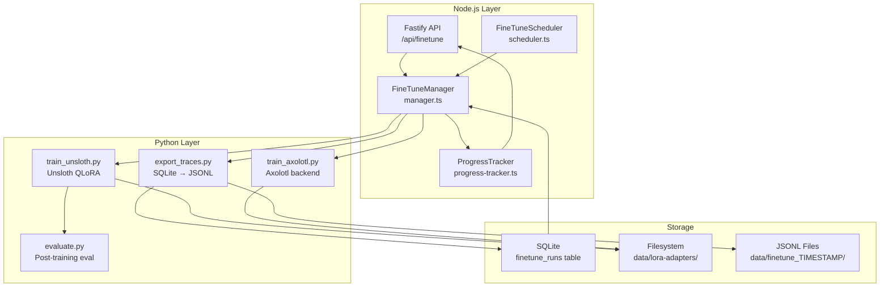

# Technical Design Document (TDD)
## Feature: Automated LoRA Fine-Tuning Pipeline
### This Mind Does Not Exist — v0.3

---

**Document Version:** 1.0  
**Status:** Draft  
**Related PRD:** [01-v0.3-PRD.md](./01-v0.3-PRD.md)

---

## 1. Overview

This document describes the technical design for the automated LoRA fine-tuning pipeline. The pipeline converts high-quality debate traces into LoRA adapters that improve the Proposer model's performance on the user's specific problem domains.

### 1.1 Architecture Summary



---

## 2. Component Design

### 2.1 FineTuneManager (TypeScript)

**File:** [`packages/core/src/finetune/manager.ts`](../packages/core/src/finetune/manager.ts)

This is the primary orchestrator for the fine-tuning pipeline. It coordinates data export, subprocess management, and status tracking.

```typescript
import { spawn, ChildProcess } from 'child_process';
import { EventEmitter } from 'events';
import path from 'path';
import fs from 'fs/promises';
import { v4 as uuidv4 } from 'uuid';
import type { TraceStore } from '../storage/trace-store';
import type { FineTuneRun, FineTuneConfig, FineTuneMetrics } from './types';

export class FineTuneManager extends EventEmitter {
  private activeProcess: ChildProcess | null = null;
  private activeRunId: string | null = null;

  constructor(
    private readonly traceStore: TraceStore,
    private readonly config: {
      dbPath: string;
      loraOutputDir: string;
      finetuneTempDir: string;
      pythonPath: string;
      scriptsDir: string;
    }
  ) {
    super();
  }

  /**
   * Export high-quality traces as JSONL training data.
   * Spawns export_traces.py as a subprocess.
   */
  async exportTrainingData(options: {
    minQuality: number;
    outputDir: string;
    runId: string;
  }): Promise<{ trainPath: string; valPath: string; count: number }>;

  /**
   * Start a fine-tuning run.
   * Returns immediately with a runId; training runs asynchronously.
   */
  async startFineTune(config?: Partial<FineTuneConfig>): Promise<FineTuneRun>;

  /**
   * Cancel a running fine-tune.
   */
  async cancelFineTune(runId: string): Promise<void>;

  /**
   * Get the current status of a fine-tune run.
   */
  async getRunStatus(runId: string): Promise<FineTuneRun>;

  /**
   * List all fine-tune runs with pagination.
   */
  async listRuns(options?: {
    limit?: number;
    offset?: number;
    status?: FineTuneRun['status'];
  }): Promise<FineTuneRun[]>;

  /**
   * Get the default fine-tune configuration.
   */
  getDefaultConfig(): FineTuneConfig;

  /**
   * Check if a fine-tune run is currently in progress.
   */
  isRunning(): boolean;

  /**
   * Internal: spawn the Python training subprocess.
   */
  private async spawnTrainingProcess(
    runId: string,
    trainPath: string,
    valPath: string,
    config: FineTuneConfig
  ): Promise<void>;

  /**
   * Internal: parse a progress line from the Python subprocess stdout.
   */
  private parseProgressLine(line: string): ProgressEvent | null;

  /**
   * Internal: handle subprocess exit.
   */
  private handleProcessExit(
    runId: string,
    code: number | null,
    signal: string | null
  ): Promise<void>;
}
```

### 2.2 FineTuneScheduler (TypeScript)

**File:** [`packages/core/src/finetune/scheduler.ts`](../packages/core/src/finetune/scheduler.ts) *(new)*

```typescript
import cron from 'node-cron';
import type { FineTuneManager } from './manager';
import type { TraceStore } from '../storage/trace-store';

export class FineTuneScheduler {
  private task: cron.ScheduledTask | null = null;

  constructor(
    private readonly manager: FineTuneManager,
    private readonly traceStore: TraceStore,
    private readonly config: {
      schedule: string;          // Cron expression
      minTraces: number;         // Minimum new traces since last run
      minQuality: number;
      enabled: boolean;
    }
  ) {}

  /**
   * Start the cron scheduler.
   */
  start(): void;

  /**
   * Stop the cron scheduler.
   */
  stop(): void;

  /**
   * Check if conditions are met for a scheduled run.
   * Returns null if conditions are met, or a reason string if not.
   */
  async checkConditions(): Promise<string | null>;

  /**
   * Execute a scheduled fine-tune run.
   * Called by the cron task.
   */
  private async executeScheduledRun(): Promise<void>;
}
```

### 2.3 ProgressTracker (TypeScript)

**File:** [`packages/core/src/finetune/progress-tracker.ts`](../packages/core/src/finetune/progress-tracker.ts) *(new)*

```typescript
import type { FastifyReply } from 'fastify';

export interface ProgressEvent {
  type: 'progress' | 'complete' | 'error' | 'heartbeat';
  runId: string;
  step?: number;
  totalSteps?: number;
  loss?: number;
  evalLoss?: number;
  learningRate?: number;
  etaSeconds?: number;
  status?: string;
  message?: string;
  timestamp: string;
}

export class ProgressTracker {
  private subscribers: Map<string, FastifyReply[]> = new Map();

  /**
   * Subscribe a client to progress events for a run.
   */
  subscribe(runId: string, reply: FastifyReply): void;

  /**
   * Unsubscribe a client.
   */
  unsubscribe(runId: string, reply: FastifyReply): void;

  /**
   * Emit a progress event to all subscribers for a run.
   */
  emit(runId: string, event: ProgressEvent): void;

  /**
   * Send heartbeat to all active subscribers (every 15s).
   */
  heartbeat(): void;

  /**
   * Get the latest progress event for a run (for late subscribers).
   */
  getLatestProgress(runId: string): ProgressEvent | null;
}
```

### 2.4 Python: export_traces.py

**File:** [`packages/finetune/src/export_traces.py`](../packages/finetune/src/export_traces.py) *(new)*

```python
"""
Export high-quality debate traces from SQLite to Alpaca-format JSONL.

Usage:
    python export_traces.py \
        --db ./data/traces.db \
        --min-quality 8.0 \
        --output-dir ./data/finetune_20260220 \
        --val-split 0.1 \
        --seed 42
"""

import argparse
import json
import sqlite3
import hashlib
import random
from pathlib import Path
from typing import Iterator

def get_eligible_traces(
    db_path: str,
    min_quality: float
) -> Iterator[dict]:
    """
    Query SQLite for traces meeting quality threshold.
    Joins traces with rounds to get full debate content.
    """

def format_as_alpaca(trace: dict) -> dict:
    """
    Convert a trace to Alpaca instruction format:
    {
        "instruction": <original query>,
        "input": <templates used + context>,
        "output": <final synthesized answer>
    }
    """

def deduplicate(examples: list[dict]) -> list[dict]:
    """
    Remove duplicate examples by hashing the instruction field.
    Keeps the highest-quality version of each duplicate.
    """

def split_train_val(
    examples: list[dict],
    val_ratio: float,
    seed: int
) -> tuple[list[dict], list[dict]]:
    """
    Deterministic train/val split.
    """

def write_jsonl(examples: list[dict], path: Path) -> None:
    """Write examples to JSONL file."""

def main():
    parser = argparse.ArgumentParser()
    parser.add_argument('--db', required=True)
    parser.add_argument('--min-quality', type=float, default=8.0)
    parser.add_argument('--output-dir', required=True)
    parser.add_argument('--val-split', type=float, default=0.1)
    parser.add_argument('--seed', type=int, default=42)
    args = parser.parse_args()

    # Export logic
    # Print JSON progress to stdout for Node.js to parse:
    # {"type": "export_complete", "train_count": 89, "val_count": 10}
```

### 2.5 Python: train_unsloth.py

**File:** [`packages/finetune/src/train_unsloth.py`](../packages/finetune/src/train_unsloth.py) *(new)*

```python
"""
LoRA fine-tuning using Unsloth (4-bit QLoRA).

Usage:
    python train_unsloth.py \
        --base-model qwen3:32b \
        --train-data ./data/finetune_20260220/train.jsonl \
        --val-data ./data/finetune_20260220/val.jsonl \
        --output-dir ./data/lora-adapters/run_abc123 \
        --lora-rank 16 \
        --lora-alpha 32 \
        --epochs 3 \
        --lr 2e-4 \
        --batch-size 4 \
        --grad-accum 4 \
        --max-seq-len 4096 \
        --run-id abc123
"""

import argparse
import json
import sys
from pathlib import Path

def emit_progress(step: int, total_steps: int, loss: float,
                  eval_loss: float | None, lr: float, eta_seconds: int):
    """
    Emit structured JSON progress to stdout.
    Node.js FineTuneManager parses this for SSE streaming.
    """
    event = {
        "type": "progress",
        "step": step,
        "total_steps": total_steps,
        "loss": loss,
        "eval_loss": eval_loss,
        "learning_rate": lr,
        "eta_seconds": eta_seconds
    }
    print(json.dumps(event), flush=True)

def load_dataset(train_path: str, val_path: str):
    """Load JSONL datasets using HuggingFace datasets library."""

def build_model_and_tokenizer(base_model: str, lora_rank: int, lora_alpha: int,
                               max_seq_len: int):
    """
    Load base model with Unsloth 4-bit quantization.
    Apply LoRA configuration.
    """

def train(model, tokenizer, train_dataset, val_dataset, config: dict,
          output_dir: Path, run_id: str):
    """
    Run training loop with SFTTrainer.
    Emits progress events to stdout.
    Saves checkpoints to output_dir.
    """

def save_adapter(model, tokenizer, output_dir: Path, run_id: str,
                 metrics: dict):
    """
    Save LoRA adapter and metadata.
    Creates manifest.json with metrics and config.
    """

def main():
    # Parse args, run training, emit completion event
    # Final event: {"type": "complete", "metrics": {...}}
    # Error event: {"type": "error", "message": "..."}
```

### 2.6 Python: train_axolotl.py

**File:** [`packages/finetune/src/train_axolotl.py`](../packages/finetune/src/train_axolotl.py) *(new)*

```python
"""
LoRA fine-tuning using Axolotl as an alternative backend.
Generates an Axolotl config YAML and runs axolotl train.
"""

def generate_axolotl_config(
    base_model: str,
    train_path: str,
    val_path: str,
    output_dir: str,
    hyperparams: dict
) -> str:
    """Generate Axolotl YAML configuration."""

def run_axolotl_training(config_path: str, run_id: str) -> dict:
    """
    Execute axolotl train command.
    Parse output for progress events.
    """
```

### 2.7 Axolotl Default Config

**File:** [`packages/finetune/configs/axolotl_default.yaml`](../packages/finetune/configs/axolotl_default.yaml) *(new)*

```yaml
base_model: qwen3:32b
model_type: AutoModelForCausalLM
tokenizer_type: AutoTokenizer

load_in_4bit: true
strict: false

datasets:
  - path: PLACEHOLDER_TRAIN_PATH
    type: alpaca

val_set_size: 0.1
output_dir: PLACEHOLDER_OUTPUT_DIR

adapter: lora
lora_r: 16
lora_alpha: 32
lora_dropout: 0.05
lora_target_modules:
  - q_proj
  - v_proj
  - k_proj
  - o_proj
  - gate_proj
  - down_proj
  - up_proj

sequence_len: 4096
sample_packing: true
pad_to_sequence_len: true

micro_batch_size: 4
gradient_accumulation_steps: 4
num_epochs: 3
optimizer: adamw_bnb_8bit
lr_scheduler: cosine
learning_rate: 0.0002
warmup_ratio: 0.03
weight_decay: 0.01

logging_steps: 10
eval_steps: 50
save_steps: 100
save_total_limit: 3
```

---

## 3. Database Schema Changes

### 3.1 New `finetune_runs` Table (Full Schema)

```sql
CREATE TABLE IF NOT EXISTS finetune_runs (
    id TEXT PRIMARY KEY,
    started_at DATETIME DEFAULT CURRENT_TIMESTAMP,
    completed_at DATETIME,
    status TEXT NOT NULL DEFAULT 'pending'
        CHECK(status IN ('pending', 'running', 'completed', 'failed', 'cancelled')),
    triggered_by TEXT NOT NULL DEFAULT 'manual'
        CHECK(triggered_by IN ('manual', 'scheduled', 'api')),
    base_model TEXT NOT NULL,
    traces_used INTEGER DEFAULT 0,
    train_examples INTEGER DEFAULT 0,
    val_examples INTEGER DEFAULT 0,
    lora_path TEXT,
    config TEXT NOT NULL,           -- JSON: FineTuneConfig
    metrics TEXT,                   -- JSON: FineTuneMetrics
    error_message TEXT,
    log_path TEXT,
    export_dir TEXT
);

CREATE INDEX IF NOT EXISTS idx_finetune_status ON finetune_runs(status);
CREATE INDEX IF NOT EXISTS idx_finetune_started ON finetune_runs(started_at);
```

### 3.2 New `finetune_progress` Table

```sql
CREATE TABLE IF NOT EXISTS finetune_progress (
    id INTEGER PRIMARY KEY AUTOINCREMENT,
    run_id TEXT NOT NULL REFERENCES finetune_runs(id),
    timestamp DATETIME DEFAULT CURRENT_TIMESTAMP,
    step INTEGER NOT NULL,
    total_steps INTEGER NOT NULL,
    loss REAL,
    eval_loss REAL,
    learning_rate REAL,
    eta_seconds INTEGER
);

CREATE INDEX IF NOT EXISTS idx_progress_run ON finetune_progress(run_id);
```

---

## 4. API Route Implementations

### 4.1 POST /api/finetune

```typescript
// Request body
interface StartFineTuneRequest {
  config?: Partial<FineTuneConfig>;
}

// Response
interface StartFineTuneResponse {
  runId: string;
  status: 'pending';
  progressUrl: string;  // SSE endpoint URL
}

// Implementation
fastify.post('/api/finetune', async (request, reply) => {
  // 1. Check if a run is already in progress
  if (manager.isRunning()) {
    return reply.status(409).send({
      error: 'A fine-tune run is already in progress'
    });
  }

  // 2. Check minimum trace count
  const stats = await traceStore.getStats();
  const minTraces = parseInt(process.env.FINETUNE_MIN_TRACES || '50');
  if (stats.fineTuneCandidates < minTraces) {
    return reply.status(422).send({
      error: `Insufficient traces: need ${minTraces}, have ${stats.fineTuneCandidates}`,
      current: stats.fineTuneCandidates,
      required: minTraces
    });
  }

  // 3. Start the run
  const run = await manager.startFineTune(request.body?.config);

  return reply.status(202).send({
    runId: run.id,
    status: run.status,
    progressUrl: `/api/finetune/${run.id}/progress`
  });
});
```

### 4.2 GET /api/finetune/:runId/progress (SSE)

```typescript
fastify.get('/api/finetune/:runId/progress', async (request, reply) => {
  const { runId } = request.params as { runId: string };

  // Verify run exists
  const run = await manager.getRunStatus(runId);
  if (!run) {
    return reply.status(404).send({ error: 'Run not found' });
  }

  // Set SSE headers
  reply.raw.writeHead(200, {
    'Content-Type': 'text/event-stream',
    'Cache-Control': 'no-cache',
    'Connection': 'keep-alive',
    'X-Accel-Buffering': 'no'
  });

  // Subscribe to progress events
  progressTracker.subscribe(runId, reply);

  // Send latest progress immediately (for reconnecting clients)
  const latest = progressTracker.getLatestProgress(runId);
  if (latest) {
    reply.raw.write(`data: ${JSON.stringify(latest)}\n\n`);
  }

  // Cleanup on disconnect
  request.raw.on('close', () => {
    progressTracker.unsubscribe(runId, reply);
  });
});
```

---

## 5. Python Subprocess Communication Protocol

The Node.js `FineTuneManager` communicates with Python training scripts via stdout/stderr:

### 5.1 Progress Events (stdout, one JSON per line)

```json
{"type": "export_complete", "train_count": 89, "val_count": 10, "timestamp": "2026-02-20T02:00:01Z"}
{"type": "training_start", "total_steps": 270, "timestamp": "2026-02-20T02:00:05Z"}
{"type": "progress", "step": 10, "total_steps": 270, "loss": 1.42, "eval_loss": null, "learning_rate": 0.0002, "eta_seconds": 1620, "timestamp": "2026-02-20T02:01:00Z"}
{"type": "eval", "step": 50, "total_steps": 270, "loss": 1.21, "eval_loss": 1.35, "learning_rate": 0.00018, "eta_seconds": 1200, "timestamp": "2026-02-20T02:05:00Z"}
{"type": "checkpoint", "step": 100, "path": "./data/lora-adapters/run_abc/checkpoint-100", "timestamp": "2026-02-20T02:10:00Z"}
{"type": "complete", "metrics": {"final_train_loss": 0.42, "final_val_loss": 0.51, "best_val_loss": 0.49, "total_steps": 270, "training_time_seconds": 1800, "peak_vram_gb": 18.4}, "adapter_path": "./data/lora-adapters/run_abc", "timestamp": "2026-02-20T02:30:00Z"}
```

### 5.2 Error Events (stderr)

```
ERROR: CUDA out of memory. Try reducing batch_size or max_seq_length.
```

The Node.js manager captures stderr and includes it in the `error_message` field of the run record.

### 5.3 Exit Codes

| Code | Meaning |
|------|---------|
| 0 | Success |
| 1 | General error |
| 2 | Insufficient data |
| 3 | CUDA/GPU error |
| 4 | Model not found |
| 130 | Cancelled (SIGINT) |

---

## 6. File System Layout

```
data/
├── traces.db                          # SQLite database
├── finetune_20260220_020000/          # Temporary export dir (per run)
│   ├── train.jsonl                    # Training examples
│   ├── val.jsonl                      # Validation examples
│   └── export_manifest.json           # Export metadata
├── lora-adapters/
│   ├── active.json                    # Pointer to active adapter
│   ├── run_abc123/                    # One dir per completed run
│   │   ├── adapter_model.bin          # LoRA weights
│   │   ├── adapter_config.json        # LoRA configuration
│   │   ├── tokenizer_config.json
│   │   ├── training_args.json         # Hyperparameters used
│   │   ├── metrics.json               # Training metrics
│   │   └── manifest.json             # TMDE metadata
│   └── run_def456/
│       └── ...
└── finetune_logs/
    ├── run_abc123.log                 # Full training log
    └── run_def456.log
```

### 6.1 manifest.json Schema

```json
{
  "id": "run_abc123",
  "createdAt": "2026-02-20T02:30:00Z",
  "baseModel": "qwen3:32b",
  "tracesUsed": 89,
  "trainExamples": 80,
  "valExamples": 9,
  "isActive": false,
  "tags": ["stable", "math-focused"],
  "sizeBytes": 134217728,
  "sha256": "a1b2c3d4...",
  "config": {
    "loraRank": 16,
    "loraAlpha": 32,
    "learningRate": 0.0002,
    "batchSize": 4,
    "epochs": 3
  },
  "metrics": {
    "finalTrainLoss": 0.42,
    "finalValLoss": 0.51,
    "bestValLoss": 0.49,
    "totalSteps": 270,
    "trainingTimeSeconds": 1800,
    "peakVramGb": 18.4
  }
}
```

---

## 7. Docker Configuration

### 7.1 packages/finetune/Dockerfile

```dockerfile
FROM nvidia/cuda:11.8.0-cudnn8-devel-ubuntu22.04

WORKDIR /app

# Install Python
RUN apt-get update && apt-get install -y \
    python3.11 python3-pip python3.11-dev \
    git curl sqlite3 \
    && rm -rf /var/lib/apt/lists/*

# Install PyTorch with CUDA
RUN pip3 install torch==2.1.0 torchvision torchaudio \
    --index-url https://download.pytorch.org/whl/cu118

# Install Unsloth
RUN pip3 install "unsloth[cu118-torch210] @ git+https://github.com/unslothai/unsloth.git"

# Install other dependencies
COPY requirements.txt .
RUN pip3 install -r requirements.txt

COPY src/ ./src/
COPY configs/ ./configs/

# Default command (overridden by Node.js subprocess call)
CMD ["python3", "src/train_unsloth.py", "--help"]
```

### 7.2 docker-compose.yml Addition

```yaml
finetune-worker:
  build:
    context: .
    dockerfile: packages/finetune/Dockerfile
  container_name: tmde-finetune-worker
  volumes:
    - ./data:/app/data
    - ./packages/finetune:/app
  environment:
    - DATABASE_PATH=/app/data/traces.db
    - LORA_OUTPUT_DIR=/app/data/lora-adapters
    - CUDA_VISIBLE_DEVICES=0
  deploy:
    resources:
      reservations:
        devices:
          - driver: nvidia
            count: 1
            capabilities: [gpu]
  profiles:
    - finetune
  restart: "no"
```

---

## 8. Configuration

### 8.1 Environment Variables

| Variable | Default | Description |
|----------|---------|-------------|
| `FINETUNE_MIN_TRACES` | `50` | Minimum traces required |
| `FINETUNE_MIN_QUALITY` | `8.0` | Minimum quality score |
| `FINETUNE_SCHEDULE` | `0 2 * * 0` | Cron schedule |
| `FINETUNE_ENABLED` | `true` | Enable/disable scheduler |
| `FINETUNE_BACKEND` | `unsloth` | Training backend |
| `LORA_RANK` | `16` | LoRA rank |
| `LORA_ALPHA` | `32` | LoRA alpha |
| `LORA_OUTPUT_DIR` | `./data/lora-adapters` | Adapter storage |
| `FINETUNE_TEMP_DIR` | `./data/finetune_temp` | Temp export dir |
| `PYTHON_PATH` | `python3` | Python executable |
| `FINETUNE_SCRIPTS_DIR` | `./packages/finetune/src` | Python scripts dir |
| `FINETUNE_MAX_SEQ_LEN` | `4096` | Max sequence length |
| `FINETUNE_EPOCHS` | `3` | Training epochs |
| `FINETUNE_LR` | `2e-4` | Learning rate |
| `FINETUNE_BATCH_SIZE` | `4` | Batch size |
| `FINETUNE_GRAD_ACCUM` | `4` | Gradient accumulation |

---

## 9. Error Handling

### 9.1 Insufficient Traces

```typescript
// In FineTuneManager.startFineTune()
const candidates = await this.traceStore.getFineTuneTraces(config.minQualityScore);
if (candidates.length < this.config.minTraces) {
  throw new InsufficientTracesError(
    `Need ${this.config.minTraces} traces, have ${candidates.length}`,
    { current: candidates.length, required: this.config.minTraces }
  );
}
```

### 9.2 GPU OOM Recovery

The Python training script catches `torch.cuda.OutOfMemoryError` and:
1. Emits an error event with `{"type": "error", "code": "OOM", "suggestion": "Reduce batch_size or max_seq_length"}`
2. Exits with code 3

The Node.js manager catches this and marks the run as `failed` with a user-friendly message.

### 9.3 Process Crash Detection

```typescript
// In FineTuneManager.spawnTrainingProcess()
const heartbeatTimeout = setTimeout(() => {
  if (this.activeProcess && !this.activeProcess.killed) {
    this.activeProcess.kill('SIGTERM');
    this.handleProcessExit(runId, null, 'TIMEOUT');
  }
}, 60_000); // 60s without output = hung process

process.stdout.on('data', () => {
  heartbeatTimeout.refresh(); // Reset timeout on any output
});
```

---

## 10. Test Specifications

See [`06-v0.3-TESTS.md`](./06-v0.3-TESTS.md) for comprehensive test cases.

### 10.1 Unit Test Summary

| Test Suite | File | Tests |
|-----------|------|-------|
| FineTuneManager | `manager.test.ts` | 24 tests |
| FineTuneScheduler | `scheduler.test.ts` | 12 tests |
| ProgressTracker | `progress-tracker.test.ts` | 10 tests |
| export_traces.py | `test_export_traces.py` | 18 tests |
| train_unsloth.py | `test_train_unsloth.py` | 15 tests |
| API routes | `finetune.routes.test.ts` | 20 tests |

### 10.2 Integration Test Summary

| Test | Description |
|------|-------------|
| Full pipeline E2E | Export → Train → Save adapter |
| Scheduler trigger | Cron fires, conditions met, run starts |
| SSE streaming | Client receives all progress events |
| Cancellation | Run cancelled mid-training, state cleaned up |
| OOM recovery | GPU OOM handled gracefully |
| Checkpoint resume | Training resumes from checkpoint after crash |
