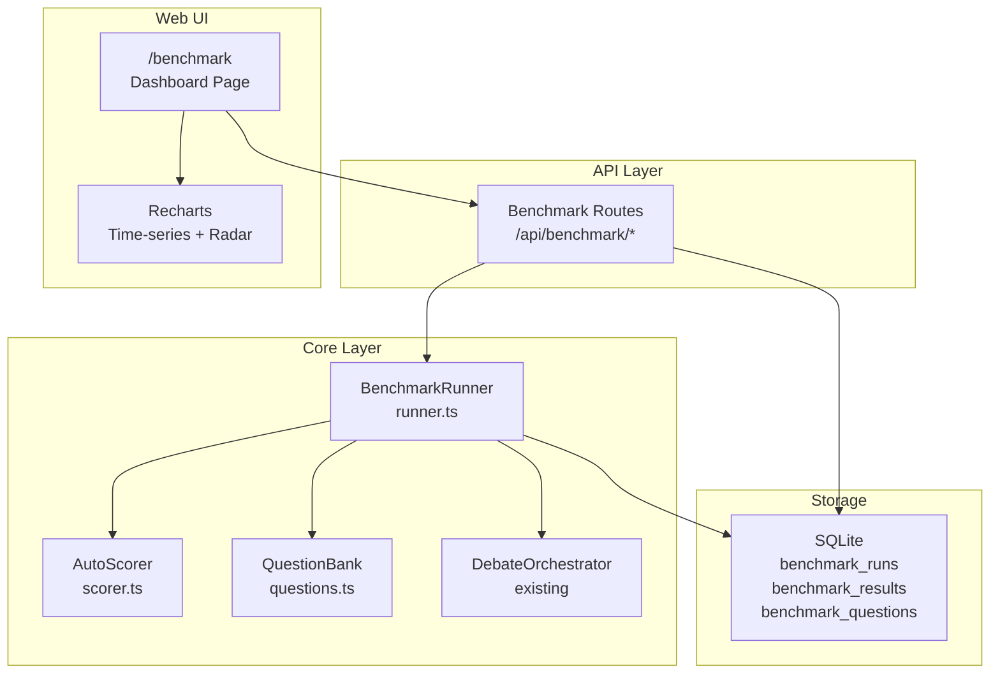

# Technical Design Document (TDD)
## Feature: Performance Benchmarking Dashboard
### This Mind Does Not Exist — v0.3

---

**Document Version:** 1.0  
**Status:** Draft  
**Related PRD:** [01-v0.3-PRD.md](./01-v0.3-PRD.md)

---

## 1. Overview

The benchmarking dashboard provides objective measurement of the system's reasoning quality over time. It runs standardized question sets against the debate engine, auto-scores the results using a lightweight judge model, and visualizes improvement trends.

### 1.1 Architecture



---

## 2. Component Design

### 2.1 BenchmarkRunner (TypeScript)

**File:** [`packages/core/src/benchmark/runner.ts`](../packages/core/src/benchmark/runner.ts) *(new)*

```typescript
import { EventEmitter } from 'events';
import type { DebateOrchestrator } from '../debate/orchestrator';
import type { AutoScorer } from './scorer';
import type { QuestionBank } from './questions';
import type { TraceStore } from '../storage/trace-store';
import type {
  BenchmarkRun,
  BenchmarkResult,
  BenchmarkQuestion,
  BenchmarkMetrics,
  BenchmarkRunConfig
} from './types';

export class BenchmarkRunner extends EventEmitter {
  constructor(
    private readonly orchestrator: DebateOrchestrator,
    private readonly scorer: AutoScorer,
    private readonly questionBank: QuestionBank,
    private readonly traceStore: TraceStore,
    private readonly db: BenchmarkStore
  ) {}

  /**
   * Start a benchmark run.
   * Returns immediately with a runId; benchmark runs asynchronously.
   * Emits 'progress' events as questions complete.
   */
  async startRun(config: BenchmarkRunConfig): Promise<BenchmarkRun>;

  /**
   * Cancel a running benchmark.
   */
  async cancelRun(runId: string): Promise<void>;

  /**
   * Get the status and results of a benchmark run.
   */
  async getRun(runId: string): Promise<BenchmarkRun>;

  /**
   * List all benchmark runs with pagination.
   */
  async listRuns(options?: {
    limit?: number;
    offset?: number;
    adapterId?: string;
  }): Promise<BenchmarkRun[]>;

  /**
   * Get aggregated metrics for the dashboard.
   * Returns time-series data for charts.
   */
  async getSummary(): Promise<BenchmarkSummary>;

  /**
   * Get detailed results for a specific run.
   */
  async getResults(runId: string): Promise<BenchmarkResult[]>;

  /**
   * Export benchmark results as JSON or CSV.
   */
  async exportResults(
    runId: string,
    format: 'json' | 'csv'
  ): Promise<string>;

  /**
   * Internal: run a single benchmark question.
   */
  private async runQuestion(
    runId: string,
    question: BenchmarkQuestion,
    activeAdapterId: string | null
  ): Promise<BenchmarkResult>;

  /**
   * Internal: compute aggregate metrics from individual results.
   */
  private computeMetrics(
    results: BenchmarkResult[],
    baselineMetrics: BenchmarkMetrics | null,
    previousMetrics: BenchmarkMetrics | null
  ): BenchmarkMetrics;

  /**
   * Internal: compute the composite TMDE Score.
   * Weighted average: quality (70%) + efficiency (30%)
   */
  private computeTMDEScore(
    avgQuality: number,
    avgResponseTimeMs: number,
    avgDebateRounds: number
  ): number;
}
```

### 2.2 AutoScorer (TypeScript)

**File:** [`packages/core/src/benchmark/scorer.ts`](../packages/core/src/benchmark/scorer.ts) *(new)*

The auto-scorer uses a lightweight judge model (e.g., `llama3.2:3b`) to evaluate answer quality against a rubric.

```typescript
import type { OllamaClient } from '../ollama/client';

export interface ScoringResult {
  score: number;          // 0-10
  reasoning: string;      // Judge's explanation
  rubricScores: Record<string, number>;  // Per-criterion scores
}

export class AutoScorer {
  constructor(
    private readonly ollamaClient: OllamaClient,
    private readonly judgeModel: string = 'llama3.2:3b'
  ) {}

  /**
   * Score a debate answer against a reference answer and rubric.
   * Uses the judge model to evaluate quality.
   */
  async scoreAnswer(options: {
    question: string;
    answer: string;
    referenceAnswer: string;
    rubric: string;
  }): Promise<ScoringResult>;

  /**
   * Build the judge prompt for scoring.
   */
  private buildJudgePrompt(options: {
    question: string;
    answer: string;
    referenceAnswer: string;
    rubric: string;
  }): string;

  /**
   * Parse the judge model's response into a structured score.
   */
  private parseJudgeResponse(response: string): ScoringResult;
}
```

### 2.3 Judge Prompt Template

```
You are an expert evaluator assessing the quality of an AI-generated answer.

## Question
{question}

## Reference Answer
{reference_answer}

## Rubric
{rubric}

## Answer to Evaluate
{answer}

## Instructions
Score the answer on each rubric criterion from 0-10.
Then provide an overall score (0-10) as a weighted average.
Be objective and consistent.

## Response Format (JSON)
{
  "overall_score": <number 0-10>,
  "reasoning": "<brief explanation>",
  "rubric_scores": {
    "<criterion_1>": <score>,
    "<criterion_2>": <score>
  }
}
```

### 2.4 QuestionBank (TypeScript)

**File:** [`packages/core/src/benchmark/questions.ts`](../packages/core/src/benchmark/questions.ts) *(new)*

```typescript
import type { BenchmarkQuestion } from './types';

export class QuestionBank {
  constructor(private readonly db: BenchmarkStore) {}

  /**
   * Get all questions (built-in + custom).
   */
  async getAllQuestions(): Promise<BenchmarkQuestion[]>;

  /**
   * Get questions for a specific run type.
   * 'quick' returns 10 questions (2 per domain).
   * 'full' returns all 50 built-in questions.
   */
  async getQuestionsForRun(
    type: 'quick' | 'full' | 'custom',
    customIds?: string[]
  ): Promise<BenchmarkQuestion[]>;

  /**
   * Add a custom question.
   */
  async addQuestion(question: Omit<BenchmarkQuestion, 'id' | 'createdAt' | 'isBuiltIn'>): Promise<BenchmarkQuestion>;

  /**
   * Delete a custom question.
   * Cannot delete built-in questions.
   */
  async deleteQuestion(id: string): Promise<void>;

  /**
   * Get the built-in question set.
   * These are hardcoded in the source and seeded on startup.
   */
  getBuiltInQuestions(): BenchmarkQuestion[];
}
```

### 2.5 Built-in Question Bank

The built-in questions cover 5 domains × 10 questions = 50 total. Here are representative examples:

```typescript
const BUILT_IN_QUESTIONS: BenchmarkQuestion[] = [
  // Mathematics (10 questions)
  {
    id: 'bm-math-001',
    domain: 'mathematics',
    difficulty: 'medium',
    question: 'Prove that the square root of 2 is irrational.',
    referenceAnswer: 'Assume √2 = p/q in lowest terms. Then 2q² = p², so p² is even, meaning p is even. Write p = 2k. Then 2q² = 4k², so q² = 2k², meaning q is also even. This contradicts p/q being in lowest terms. Therefore √2 is irrational.',
    scoringRubric: 'Correctness (40%): Is the proof logically valid? Completeness (30%): Are all steps present? Clarity (20%): Is the reasoning clear? Rigor (10%): Are edge cases handled?',
    isBuiltIn: true,
    createdAt: '2026-01-01T00:00:00Z'
  },
  {
    id: 'bm-math-002',
    domain: 'mathematics',
    difficulty: 'hard',
    question: 'Explain the Banach-Tarski paradox and why it does not violate conservation of mass.',
    referenceAnswer: '...',
    scoringRubric: '...',
    isBuiltIn: true,
    createdAt: '2026-01-01T00:00:00Z'
  },

  // Coding (10 questions)
  {
    id: 'bm-code-001',
    domain: 'coding',
    difficulty: 'medium',
    question: 'Design a thread-safe LRU cache in Python with O(1) get and put operations.',
    referenceAnswer: 'Use an OrderedDict with a threading.Lock. get() moves the key to the end. put() adds to the end and removes the oldest if over capacity. Both operations acquire the lock.',
    scoringRubric: 'Correctness (40%): Is the implementation correct? Thread safety (30%): Is locking correct? Complexity (20%): Are O(1) operations achieved? Code quality (10%): Is the code clean?',
    isBuiltIn: true,
    createdAt: '2026-01-01T00:00:00Z'
  },

  // Science (10 questions)
  {
    id: 'bm-sci-001',
    domain: 'science',
    difficulty: 'medium',
    question: 'Explain why the sky is blue and sunsets are red using Rayleigh scattering.',
    referenceAnswer: '...',
    scoringRubric: '...',
    isBuiltIn: true,
    createdAt: '2026-01-01T00:00:00Z'
  },

  // Reasoning (10 questions)
  {
    id: 'bm-reason-001',
    domain: 'reasoning',
    difficulty: 'hard',
    question: 'The Trolley Problem: A runaway trolley is heading toward 5 people. You can pull a lever to divert it to a track with 1 person. Analyze this from utilitarian, deontological, and virtue ethics perspectives.',
    referenceAnswer: '...',
    scoringRubric: '...',
    isBuiltIn: true,
    createdAt: '2026-01-01T00:00:00Z'
  },

  // Creative Writing (10 questions)
  {
    id: 'bm-creative-001',
    domain: 'creative',
    difficulty: 'medium',
    question: 'Write the opening paragraph of a science fiction story where humanity discovers that mathematics is a living entity.',
    referenceAnswer: '...',
    scoringRubric: 'Creativity (40%): Is the premise original? Writing quality (30%): Is the prose compelling? World-building (20%): Is the setting established? Hook (10%): Does it make you want to read more?',
    isBuiltIn: true,
    createdAt: '2026-01-01T00:00:00Z'
  }
];
```

---

## 3. Database Schema

### 3.1 New Tables

```sql
-- Benchmark runs
CREATE TABLE IF NOT EXISTS benchmark_runs (
    id TEXT PRIMARY KEY,
    started_at DATETIME DEFAULT CURRENT_TIMESTAMP,
    completed_at DATETIME,
    status TEXT NOT NULL DEFAULT 'pending'
        CHECK(status IN ('pending', 'running', 'completed', 'failed', 'cancelled')),
    type TEXT NOT NULL
        CHECK(type IN ('quick', 'full', 'custom')),
    adapter_id TEXT,               -- Active LoRA adapter at time of run
    question_count INTEGER NOT NULL,
    completed_questions INTEGER DEFAULT 0,
    metrics TEXT,                  -- JSON: BenchmarkMetrics
    triggered_by TEXT NOT NULL DEFAULT 'manual'
        CHECK(triggered_by IN ('manual', 'post-finetune', 'scheduled')),
    error_message TEXT
);

-- Individual benchmark results
CREATE TABLE IF NOT EXISTS benchmark_results (
    id TEXT PRIMARY KEY,
    run_id TEXT NOT NULL REFERENCES benchmark_runs(id),
    question_id TEXT NOT NULL,
    final_answer TEXT NOT NULL,
    quality_score REAL NOT NULL,
    scoring_reasoning TEXT,
    response_time_ms INTEGER NOT NULL,
    debate_rounds INTEGER NOT NULL,
    early_stopped BOOLEAN DEFAULT FALSE,
    trace_id TEXT                  -- Reference to debate trace
);

-- Benchmark questions (built-in + custom)
CREATE TABLE IF NOT EXISTS benchmark_questions (
    id TEXT PRIMARY KEY,
    domain TEXT NOT NULL
        CHECK(domain IN ('mathematics', 'coding', 'science', 'reasoning', 'creative')),
    difficulty TEXT NOT NULL
        CHECK(difficulty IN ('easy', 'medium', 'hard')),
    question TEXT NOT NULL,
    reference_answer TEXT NOT NULL,
    scoring_rubric TEXT NOT NULL,
    is_built_in BOOLEAN DEFAULT FALSE,
    created_at DATETIME DEFAULT CURRENT_TIMESTAMP
);

-- Indexes
CREATE INDEX IF NOT EXISTS idx_bench_runs_status ON benchmark_runs(status);
CREATE INDEX IF NOT EXISTS idx_bench_runs_adapter ON benchmark_runs(adapter_id);
CREATE INDEX IF NOT EXISTS idx_bench_results_run ON benchmark_results(run_id);
CREATE INDEX IF NOT EXISTS idx_bench_questions_domain ON benchmark_questions(domain);
```

---

## 4. TMDE Score Calculation

The TMDE Score is a composite metric (0–100) that balances quality and efficiency:

```typescript
function computeTMDEScore(
  avgQuality: number,        // 0-10
  avgResponseTimeMs: number, // milliseconds
  avgDebateRounds: number    // 1-5
): number {
  // Quality component (70% weight): normalize 0-10 to 0-70
  const qualityComponent = (avgQuality / 10) * 70;

  // Efficiency component (30% weight)
  // Response time: 0-15 points (< 30s = 15, > 5min = 0)
  const timeScore = Math.max(0, 15 - (avgResponseTimeMs / 1000 / 60) * 3);

  // Rounds efficiency: 0-15 points (fewer rounds = higher score)
  // 1 round = 15, 5 rounds = 3
  const roundsScore = Math.max(3, 15 - (avgDebateRounds - 1) * 3);

  const efficiencyComponent = timeScore + roundsScore;

  return Math.round((qualityComponent + efficiencyComponent) * 10) / 10;
}
```

---

## 5. Dashboard UI Design

### 5.1 Page Structure

**File:** [`apps/web/app/benchmark/page.tsx`](../apps/web/app/benchmark/page.tsx) *(new)*

```tsx
// Key sections:
// 1. Header with current TMDE Score and run button
// 2. Score trend chart (time-series line chart)
// 3. Domain performance radar chart
// 4. Comparison table (current vs previous vs baseline)
// 5. Recent benchmark runs table
// 6. System resource metrics (CPU, RAM, VRAM)
```

### 5.2 Chart Components

#### Score Trend Chart (Recharts LineChart)

```tsx
import { LineChart, Line, XAxis, YAxis, CartesianGrid, Tooltip, Legend, ReferenceLine } from 'recharts';

interface ScoreTrendChartProps {
  data: Array<{
    date: string;
    tmdeScore: number;
    adapterId: string | null;
    runType: 'quick' | 'full';
  }>;
  baselineScore: number | null;
}

// Shows TMDE Score over time with:
// - Vertical reference lines at each fine-tune event
// - Baseline reference line (no LoRA)
// - Tooltip showing adapter ID and run details
```

#### Domain Radar Chart (Recharts RadarChart)

```tsx
import { RadarChart, PolarGrid, PolarAngleAxis, Radar, Legend } from 'recharts';

interface DomainRadarChartProps {
  current: Record<string, number>;   // domain -> score
  previous: Record<string, number> | null;
  baseline: Record<string, number> | null;
}

// Shows per-domain scores for current, previous, and baseline adapters
// Domains: Mathematics, Coding, Science, Reasoning, Creative
```

### 5.3 Comparison Table

```tsx
interface ComparisonTableProps {
  current: BenchmarkMetrics;
  previous: BenchmarkMetrics | null;
  baseline: BenchmarkMetrics | null;
}

// Renders a table with rows for each metric:
// TMDE Score, Avg Quality, Avg Response Time, Avg Rounds, Early Stop Rate
// Columns: Baseline, Previous, Current, Change (vs previous)
// Color-coded: green for improvement, red for regression
```

---

## 6. Post-Fine-Tune Auto-Benchmark

After each fine-tune run completes, the system automatically triggers a quick benchmark:

```typescript
// In FineTuneManager, after training completes:
async handleTrainingComplete(runId: string, metrics: FineTuneMetrics): Promise<void> {
  // ... save adapter, update database ...

  // Trigger automatic benchmark
  if (process.env.AUTO_BENCHMARK_AFTER_FINETUNE !== 'false') {
    const benchmarkRun = await benchmarkRunner.startRun({
      type: 'quick',
      triggeredBy: 'post-finetune',
      adapterId: runId
    });

    // Emit event for UI notification
    this.emit('auto-benchmark-started', {
      fineTuneRunId: runId,
      benchmarkRunId: benchmarkRun.id
    });
  }
}
```

### 6.1 Regression Alert

If the new adapter scores worse than the previous adapter, the system emits a warning:

```typescript
// After benchmark completes:
if (metrics.vsPrevious !== null && metrics.vsPrevious < -5) {
  // More than 5% regression
  this.emit('benchmark-regression', {
    runId,
    adapterId,
    regression: metrics.vsPrevious,
    message: `New adapter performs ${Math.abs(metrics.vsPrevious).toFixed(1)}% worse than previous. Consider rolling back.`
  });
}
```

The UI displays this as a dismissible warning banner with a "Roll Back Now" button.

---

## 7. API Route Implementations

### 7.1 POST /api/benchmark

```typescript
fastify.post('/api/benchmark', async (request, reply) => {
  const { type = 'quick', questionIds } = request.body as {
    type?: 'quick' | 'full' | 'custom';
    questionIds?: string[];
  };

  const run = await benchmarkRunner.startRun({
    type,
    customQuestionIds: questionIds,
    triggeredBy: 'manual'
  });

  return reply.status(202).send({
    runId: run.id,
    questionCount: run.questionCount,
    estimatedMinutes: run.questionCount * 2  // ~2 min per question
  });
});
```

### 7.2 GET /api/benchmark/summary

```typescript
fastify.get('/api/benchmark/summary', async (request, reply) => {
  const summary = await benchmarkRunner.getSummary();
  return reply.send(summary);
});

// Response shape:
interface BenchmarkSummary {
  latestRun: BenchmarkRun | null;
  latestMetrics: BenchmarkMetrics | null;
  baselineMetrics: BenchmarkMetrics | null;  // First run ever (no LoRA)
  trend: Array<{
    runId: string;
    date: string;
    tmdeScore: number;
    adapterId: string | null;
  }>;
  domainTrend: Record<string, Array<{
    date: string;
    score: number;
  }>>;
}
```

### 7.3 GET /api/benchmark/export

```typescript
fastify.get('/api/benchmark/export', async (request, reply) => {
  const { runId, format = 'json' } = request.query as {
    runId?: string;
    format?: 'json' | 'csv';
  };

  const content = await benchmarkRunner.exportResults(runId, format);
  const contentType = format === 'csv' ? 'text/csv' : 'application/json';
  const filename = `benchmark_${runId ?? 'all'}_${Date.now()}.${format}`;

  reply.header('Content-Disposition', `attachment; filename="${filename}"`);
  reply.header('Content-Type', contentType);
  return reply.send(content);
});
```

---

## 8. System Resource Metrics

The dashboard also displays real-time system metrics using a polling endpoint:

```typescript
// GET /api/system/metrics
interface SystemMetrics {
  cpuUsagePercent: number;
  ramUsedGb: number;
  ramTotalGb: number;
  vramUsedGb: number | null;    // null if no GPU
  vramTotalGb: number | null;
  ollamaModelsLoaded: string[];
  activeDebates: number;
  activeBenchmarks: number;
  activeFineTunes: number;
}
```

Implementation uses Node.js `os` module for CPU/RAM and `nvidia-smi` subprocess for VRAM (if available).

---

## 9. Test Specifications

See [`06-v0.3-TESTS.md`](./06-v0.3-TESTS.md) for full test cases.

### 9.1 Unit Test Summary

| Test Suite | File | Tests |
|-----------|------|-------|
| BenchmarkRunner | `runner.test.ts` | 22 tests |
| AutoScorer | `scorer.test.ts` | 16 tests |
| QuestionBank | `questions.test.ts` | 12 tests |
| TMDE Score calculation | `scoring.test.ts` | 10 tests |
| API routes | `benchmark.routes.test.ts` | 18 tests |

### 9.2 Key Test Scenarios

1. **Quick benchmark completion:** 10 questions run, metrics computed, stored correctly
2. **Auto-benchmark trigger:** Fine-tune completes, benchmark starts automatically
3. **Regression detection:** New adapter scores 10% worse, warning emitted
4. **Export formats:** JSON and CSV exports contain correct data
5. **Concurrent benchmark prevention:** Second benchmark request while one is running returns 409
6. **Judge model failure:** Judge model unavailable, benchmark fails gracefully with partial results
7. **TMDE Score edge cases:** All 10s, all 0s, mixed scores
