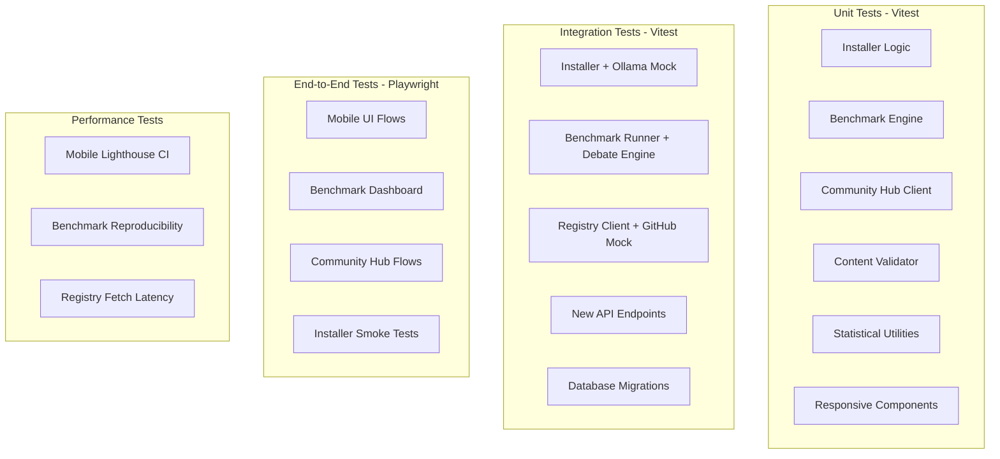

# Test Specifications — v1.0 Production
## This Mind Does Not Exist

> **IMPORTANT:** These tests are only to be implemented AFTER v0.1, v0.2, v0.3, and v0.4 PRDs and TDDs are completed and their features are fully implemented and tested.

---

## Document Metadata

| Field | Value |
|---|---|
| Version | 1.0 |
| Status | Draft |
| Milestone | Production Release |
| Test Framework | Vitest (unit/integration), Playwright (E2E), Jest (benchmark) |
| Coverage Target | 80% line coverage for new packages |

---

## 1. Test Architecture Overview



---

## 2. Unit Tests

### 2.1 Hardware Detection (`packages/core/src/system/hardware-detector.ts`)

```typescript
// packages/core/src/system/__tests__/hardware-detector.test.ts

import { describe, it, expect, vi, beforeEach } from 'vitest';
import { detectHardware, validateHardware, MODEL_TIER_REQUIREMENTS } from '../hardware-detector';

describe('detectHardware', () => {
  it('returns correct platform on macOS', async () => {
    vi.stubGlobal('process', { platform: 'darwin', arch: 'arm64' });
    const hw = await detectHardware();
    expect(hw.platform).toBe('darwin');
    expect(hw.arch).toBe('arm64');
  });

  it('returns correct platform on Windows', async () => {
    vi.stubGlobal('process', { platform: 'win32', arch: 'x64' });
    const hw = await detectHardware();
    expect(hw.platform).toBe('win32');
  });

  it('returns correct platform on Linux', async () => {
    vi.stubGlobal('process', { platform: 'linux', arch: 'x64' });
    const hw = await detectHardware();
    expect(hw.platform).toBe('linux');
  });

  it('detects RAM correctly', async () => {
    // Mock os.totalmem to return 32GB
    vi.mock('os', () => ({ totalmem: () => 32 * 1024 * 1024 * 1024 }));
    const hw = await detectHardware();
    expect(hw.ramGb).toBe(32);
  });

  it('returns null gpuVramGb when no GPU detected', async () => {
    // Mock GPU detection to return nothing
    const hw = await detectHardware();
    // On CI without GPU, should return null not throw
    expect(hw.gpuVramGb === null || typeof hw.gpuVramGb === 'number').toBe(true);
  });
});

describe('validateHardware', () => {
  const baseHw = {
    ramGb: 32,
    cpuCores: 8,
    gpuVramGb: null,
    gpuType: 'none' as const,
    diskFreeGb: 100,
    platform: 'darwin' as const,
    arch: 'arm64' as const,
  };

  it('passes validation for full tier with sufficient hardware', () => {
    const result = validateHardware(baseHw, MODEL_TIER_REQUIREMENTS.full);
    expect(result.passes).toBe(true);
    expect(result.errors).toHaveLength(0);
  });

  it('fails validation when RAM is below minimum', () => {
    const hw = { ...baseHw, ramGb: 4 };
    const result = validateHardware(hw, MODEL_TIER_REQUIREMENTS.lite);
    expect(result.passes).toBe(false);
    expect(result.errors.some(e => e.includes('RAM'))).toBe(true);
  });

  it('warns when RAM is below recommended but above minimum', () => {
    const hw = { ...baseHw, ramGb: 10 };
    const result = validateHardware(hw, MODEL_TIER_REQUIREMENTS.full);
    expect(result.warnings.some(w => w.includes('RAM'))).toBe(true);
  });

  it('fails validation when disk space is insufficient', () => {
    const hw = { ...baseHw, diskFreeGb: 5 };
    const result = validateHardware(hw, MODEL_TIER_REQUIREMENTS.lite);
    expect(result.passes).toBe(false);
    expect(result.errors.some(e => e.includes('disk'))).toBe(true);
  });

  it('passes lite tier validation with 8GB RAM', () => {
    const hw = { ...baseHw, ramGb: 8 };
    const result = validateHardware(hw, MODEL_TIER_REQUIREMENTS.lite);
    expect(result.passes).toBe(true);
  });
});
```

### 2.2 Content Validator (`packages/community/src/validator.ts`)

```typescript
// packages/community/src/__tests__/validator.test.ts

import { describe, it, expect } from 'vitest';
import { ContentValidator } from '../validator';

const VALID_TEMPLATE = `---
name: "Test Template"
domain: testing
complexity: moderate
methodology: analytical
keywords: [test, validation, example]
description: "A test template for validation purposes"
version: "1.0.0"
license: MIT
---

## Steps

1. **Step One**
   Do the first thing carefully and thoroughly.

2. **Step Two**
   Do the second thing with attention to detail.

3. **Step Three**
   Verify the results and document findings.

## Checklist
- [ ] Step one completed
- [ ] Step two completed
- [ ] Results verified
`;

describe('ContentValidator.validateTemplate', () => {
  const validator = new ContentValidator();

  it('accepts a valid template', async () => {
    const result = await validator.validateTemplate(VALID_TEMPLATE);
    expect(result.valid).toBe(true);
    expect(result.errors).toHaveLength(0);
  });

  it('rejects template with missing required fields', async () => {
    const invalid = `---
name: "Incomplete Template"
---
Some content here.
`;
    const result = await validator.validateTemplate(invalid);
    expect(result.valid).toBe(false);
    expect(result.errors.length).toBeGreaterThan(0);
  });

  it('rejects template with invalid version format', async () => {
    const invalid = VALID_TEMPLATE.replace('version: "1.0.0"', 'version: "v1"');
    const result = await validator.validateTemplate(invalid);
    expect(result.valid).toBe(false);
    expect(result.errors.some(e => e.includes('version'))).toBe(true);
  });

  it('rejects template with content too short', async () => {
    const short = `---
name: "Short Template"
domain: testing
complexity: moderate
methodology: analytical
keywords: [test]
description: "A short template"
version: "1.0.0"
---
Too short.
`;
    const result = await validator.validateTemplate(short);
    expect(result.valid).toBe(false);
    expect(result.errors.some(e => e.includes('short'))).toBe(true);
  });

  it('rejects template exceeding 50KB', async () => {
    const huge = VALID_TEMPLATE + 'x'.repeat(50 * 1024);
    const result = await validator.validateTemplate(huge);
    expect(result.valid).toBe(false);
    expect(result.errors.some(e => e.includes('50KB'))).toBe(true);
  });

  it('rejects template containing script tags', async () => {
    const malicious = VALID_TEMPLATE + '\n<script>alert("xss")</script>';
    const result = await validator.validateTemplate(malicious);
    expect(result.valid).toBe(false);
    expect(result.errors.some(e => e.includes('executable code'))).toBe(true);
  });

  it('rejects template containing eval()', async () => {
    const malicious = VALID_TEMPLATE + '\neval("malicious code")';
    const result = await validator.validateTemplate(malicious);
    expect(result.valid).toBe(false);
  });

  it('rejects template containing require()', async () => {
    const malicious = VALID_TEMPLATE + '\nrequire("fs")';
    const result = await validator.validateTemplate(malicious);
    expect(result.valid).toBe(false);
  });

  it('returns parsed metadata on valid template', async () => {
    const result = await validator.validateTemplate(VALID_TEMPLATE);
    expect(result.metadata).toBeDefined();
    expect(result.metadata?.name).toBe('Test Template');
    expect(result.metadata?.domain).toBe('testing');
    expect(result.metadata?.keywords).toContain('test');
  });

  it('rejects template with invalid YAML frontmatter', async () => {
    const invalid = `---
name: [invalid yaml
---
Content here.
`;
    const result = await validator.validateTemplate(invalid);
    expect(result.valid).toBe(false);
    expect(result.errors.some(e => e.includes('YAML'))).toBe(true);
  });

  it('rejects template with name too short', async () => {
    const invalid = VALID_TEMPLATE.replace('name: "Test Template"', 'name: "AB"');
    const result = await validator.validateTemplate(invalid);
    expect(result.valid).toBe(false);
  });

  it('rejects template with too many keywords', async () => {
    const tooManyKeywords = Array.from({ length: 25 }, (_, i) => `kw${i}`);
    const invalid = VALID_TEMPLATE.replace(
      'keywords: [test, validation, example]',
      `keywords: [${tooManyKeywords.join(', ')}]`
    );
    const result = await validator.validateTemplate(invalid);
    expect(result.valid).toBe(false);
  });
});
```

### 2.3 Statistical Utilities (`packages/benchmark/src/stats.ts`)

```typescript
// packages/benchmark/src/__tests__/stats.test.ts

import { describe, it, expect } from 'vitest';
import { bootstrapCI, wilcoxonSignedRank } from '../stats';

describe('bootstrapCI', () => {
  it('returns a tuple of [lower, upper]', () => {
    const samples = [7, 8, 9, 8, 7, 9, 8, 8, 7, 9];
    const [lower, upper] = bootstrapCI(samples, 0.95);
    expect(lower).toBeLessThan(upper);
    expect(lower).toBeGreaterThan(0);
    expect(upper).toBeLessThanOrEqual(10);
  });

  it('CI contains the true mean with high probability', () => {
    const samples = [8, 8, 8, 8, 8]; // All same value
    const [lower, upper] = bootstrapCI(samples, 0.95);
    expect(lower).toBeLessThanOrEqual(8);
    expect(upper).toBeGreaterThanOrEqual(8);
  });

  it('wider CI for more variable samples', () => {
    const lowVariance = [8, 8, 8, 8, 8, 8, 8, 8, 8, 8];
    const highVariance = [1, 10, 1, 10, 1, 10, 1, 10, 1, 10];

    const [lvLower, lvUpper] = bootstrapCI(lowVariance, 0.95);
    const [hvLower, hvUpper] = bootstrapCI(highVariance, 0.95);

    const lvWidth = lvUpper - lvLower;
    const hvWidth = hvUpper - hvLower;

    expect(hvWidth).toBeGreaterThan(lvWidth);
  });

  it('handles single-element array', () => {
    const samples = [7];
    const [lower, upper] = bootstrapCI(samples, 0.95);
    expect(lower).toBe(7);
    expect(upper).toBe(7);
  });

  it('respects confidence level parameter', () => {
    const samples = [5, 6, 7, 8, 9, 7, 6, 8, 7, 6];
    const [l95, u95] = bootstrapCI(samples, 0.95);
    const [l99, u99] = bootstrapCI(samples, 0.99);

    // 99% CI should be wider than 95% CI
    expect(u99 - l99).toBeGreaterThanOrEqual(u95 - l95);
  });
});

describe('wilcoxonSignedRank', () => {
  it('returns p-value between 0 and 1', () => {
    const s1 = [7, 8, 9, 7, 8];
    const s2 = [6, 7, 8, 6, 7];
    const p = wilcoxonSignedRank(s1, s2);
    expect(p).toBeGreaterThanOrEqual(0);
    expect(p).toBeLessThanOrEqual(1);
  });

  it('returns low p-value for clearly different distributions', () => {
    const s1 = [9, 9, 9, 9, 9, 9, 9, 9, 9, 9];
    const s2 = [1, 1, 1, 1, 1, 1, 1, 1, 1, 1];
    const p = wilcoxonSignedRank(s1, s2);
    expect(p).toBeLessThan(0.05);
  });

  it('returns high p-value for identical distributions', () => {
    const s1 = [7, 8, 7, 8, 7];
    const s2 = [7, 8, 7, 8, 7];
    const p = wilcoxonSignedRank(s1, s2);
    expect(p).toBeGreaterThan(0.05);
  });
});
```

### 2.4 Benchmark Scorer (`packages/benchmark/src/scorer.ts`)

```typescript
// packages/benchmark/src/__tests__/scorer.test.ts

import { describe, it, expect, vi, beforeEach } from 'vitest';
import { BenchmarkScorer } from '../scorer';
import type { BenchmarkQuestion } from '../questions/types';

const mockOllamaClient = {
  generate: vi.fn(),
};

describe('BenchmarkScorer', () => {
  let scorer: BenchmarkScorer;

  beforeEach(() => {
    scorer = new BenchmarkScorer(mockOllamaClient as any, 'test-judge-model');
    vi.clearAllMocks();
  });

  describe('scoreWithTestCases (coding questions)', () => {
    const codingQuestion: BenchmarkQuestion = {
      id: 'code-001',
      domain: 'coding',
      difficulty: 'medium',
      question: 'Write a function that returns the nth Fibonacci number',
      checksum: 'abc123',
      testCases: [
        { input: '0', expectedOutput: '0', isPublic: true },
        { input: '1', expectedOutput: '1', isPublic: true },
        { input: '10', expectedOutput: '55', isPublic: false },
        { input: '20', expectedOutput: '6765', isPublic: false },
      ],
    };

    it('scores 10/10 for correct implementation', async () => {
      const answer = `
def fibonacci(n):
    if n <= 1:
        return n
    a, b = 0, 1
    for _ in range(2, n + 1):
        a, b = b, a + b
    return b
`;
      const result = await scorer.score(codingQuestion, answer);
      expect(result.totalScore).toBe(10);
    });

    it('scores partial credit for partially correct implementation', async () => {
      const answer = `
def fibonacci(n):
    if n == 0: return 0
    if n == 1: return 1
    return fibonacci(n-1) + fibonacci(n-2)
    # This is correct but may timeout on large inputs
`;
      const result = await scorer.score(codingQuestion, answer);
      // Should pass public test cases but may fail on large inputs
      expect(result.totalScore).toBeGreaterThan(0);
    });

    it('scores 0 for completely wrong implementation', async () => {
      const answer = 'def fibonacci(n): return n * 2';
      const result = await scorer.score(codingQuestion, answer);
      expect(result.totalScore).toBeLessThan(5);
    });
  });

  describe('scoreExactMatch (math questions)', () => {
    const mathQuestion: BenchmarkQuestion = {
      id: 'math-001',
      domain: 'mathematics',
      difficulty: 'easy',
      question: 'What is 15 * 17?',
      groundTruth: '255',
      checksum: 'def456',
    };

    it('scores 10/10 when answer contains ground truth', async () => {
      const answer = 'The answer is 255. Here is the calculation: 15 * 17 = 255.';
      const result = await scorer.score(mathQuestion, answer);
      expect(result.totalScore).toBe(10);
    });

    it('scores 0 when answer does not contain ground truth', async () => {
      const answer = 'The answer is 256.';
      const result = await scorer.score(mathQuestion, answer);
      expect(result.totalScore).toBe(0);
    });
  });

  describe('scoreWithJudge (open-ended questions)', () => {
    const researchQuestion: BenchmarkQuestion = {
      id: 'research-001',
      domain: 'research',
      difficulty: 'hard',
      question: 'Compare the effectiveness of transformer vs LSTM architectures for NLP tasks',
      checksum: 'ghi789',
    };

    it('calls LLM judge with correct prompt structure', async () => {
      mockOllamaClient.generate.mockResolvedValue({
        response: JSON.stringify({
          scores: { accuracy: 3, completeness: 2, reasoning: 2, clarity: 2, depth: 1 },
          reasoning: 'Excellent answer',
          totalScore: 10,
        }),
      });

      await scorer.score(researchQuestion, 'A comprehensive answer...');

      expect(mockOllamaClient.generate).toHaveBeenCalledWith(
        expect.objectContaining({
          model: 'test-judge-model',
          format: 'json',
          prompt: expect.stringContaining(researchQuestion.question),
        })
      );
    });

    it('returns parsed scoring details from judge', async () => {
      mockOllamaClient.generate.mockResolvedValue({
        response: JSON.stringify({
          scores: { accuracy: 2, completeness: 1, reasoning: 2, clarity: 1, depth: 0 },
          reasoning: 'Adequate but incomplete',
          totalScore: 6,
        }),
      });

      const result = await scorer.score(researchQuestion, 'A partial answer...');
      expect(result.totalScore).toBe(6);
      expect(result.scores.accuracy).toBe(2);
    });

    it('handles malformed judge response gracefully', async () => {
      mockOllamaClient.generate.mockResolvedValue({
        response: 'not valid json',
      });

      await expect(scorer.score(researchQuestion, 'An answer')).rejects.toThrow();
    });

    it('includes reference answer in judge prompt when available', async () => {
      const questionWithRef: BenchmarkQuestion = {
        ...researchQuestion,
        referenceAnswer: 'Transformers use attention mechanisms...',
      };

      mockOllamaClient.generate.mockResolvedValue({
        response: JSON.stringify({ scores: {}, totalScore: 8, reasoning: '' }),
      });

      await scorer.score(questionWithRef, 'An answer');

      expect(mockOllamaClient.generate).toHaveBeenCalledWith(
        expect.objectContaining({
          prompt: expect.stringContaining('REFERENCE ANSWER'),
        })
      );
    });
  });
});
```

### 2.5 Registry Client (`packages/community/src/registry-client.ts`)

```typescript
// packages/community/src/__tests__/registry-client.test.ts

import { describe, it, expect, vi, beforeEach, afterEach } from 'vitest';
import { RegistryClient } from '../registry-client';
import type { Registry } from '../../shared/types/v1';

const MOCK_REGISTRY: Registry = {
  version: '1',
  lastUpdated: '2026-01-01T00:00:00Z',
  templates: [
    {
      id: 'socratic-v1',
      name: 'Socratic Questioning',
      author: 'user1',
      authorUrl: 'https://github.com/user1',
      version: '1.0.0',
      domain: 'philosophy',
      complexity: 'moderate',
      methodology: 'dialectical',
      keywords: ['socratic', 'questioning'],
      description: 'Socratic method template',
      downloadUrl: 'https://gist.github.com/user1/abc/raw/template.md',
      checksum: 'sha256:abc123',
      rating: 4.5,
      ratingCount: 10,
      downloadCount: 50,
      publishedAt: '2026-01-01T00:00:00Z',
      updatedAt: '2026-01-01T00:00:00Z',
      license: 'MIT',
    },
    {
      id: 'math-proof-v1',
      name: 'Mathematical Proof',
      author: 'user2',
      authorUrl: 'https://github.com/user2',
      version: '1.0.0',
      domain: 'mathematics',
      complexity: 'complex',
      methodology: 'deductive',
      keywords: ['math', 'proof'],
      description: 'Math proof template',
      downloadUrl: 'https://gist.github.com/user2/def/raw/template.md',
      checksum: 'sha256:def456',
      rating: 4.8,
      ratingCount: 25,
      downloadCount: 120,
      publishedAt: '2026-01-05T00:00:00Z',
      updatedAt: '2026-01-05T00:00:00Z',
      license: 'MIT',
    },
  ],
  loras: [],
};

describe('RegistryClient', () => {
  let client: RegistryClient;
  const tmpDir = '/tmp/tmde-test-cache';

  beforeEach(() => {
    client = new RegistryClient(tmpDir);
    global.fetch = vi.fn();
  });

  afterEach(() => {
    vi.restoreAllMocks();
  });

  describe('fetchRegistry', () => {
    it('fetches and returns registry from URL', async () => {
      (global.fetch as any).mockResolvedValue({
        ok: true,
        json: () => Promise.resolve(MOCK_REGISTRY),
        headers: new Headers(),
      });

      const registry = await client.fetchRegistry(true);
      expect(registry.templates).toHaveLength(2);
      expect(registry.version).toBe('1');
    });

    it('falls back to cache when network fails', async () => {
      // First call: populate cache
      (global.fetch as any).mockResolvedValueOnce({
        ok: true,
        json: () => Promise.resolve(MOCK_REGISTRY),
        headers: new Headers(),
      });
      await client.fetchRegistry(true);

      // Second call: network fails
      (global.fetch as any).mockRejectedValueOnce(new Error('Network error'));
      const registry = await client.fetchRegistry(true);
      expect(registry.templates).toHaveLength(2);
    });

    it('throws when network fails and no cache exists', async () => {
      (global.fetch as any).mockRejectedValue(new Error('Network error'));
      await expect(client.fetchRegistry(true)).rejects.toThrow();
    });

    it('uses cache when not stale', async () => {
      // Populate cache
      (global.fetch as any).mockResolvedValueOnce({
        ok: true,
        json: () => Promise.resolve(MOCK_REGISTRY),
        headers: new Headers(),
      });
      await client.fetchRegistry(true);

      // Should use cache, not fetch again
      await client.fetchRegistry(false);
      expect(global.fetch).toHaveBeenCalledTimes(1);
    });
  });

  describe('searchTemplates', () => {
    beforeEach(async () => {
      (global.fetch as any).mockResolvedValue({
        ok: true,
        json: () => Promise.resolve(MOCK_REGISTRY),
        headers: new Headers(),
      });
    });

    it('returns all templates when no filter applied', async () => {
      const results = await client.searchTemplates({});
      expect(results).toHaveLength(2);
    });

    it('filters by domain', async () => {
      const results = await client.searchTemplates({ domain: 'mathematics' });
      expect(results).toHaveLength(1);
      expect(results[0].id).toBe('math-proof-v1');
    });

    it('filters by search text (name match)', async () => {
      const results = await client.searchTemplates({ search: 'socratic' });
      expect(results).toHaveLength(1);
      expect(results[0].id).toBe('socratic-v1');
    });

    it('filters by search text (keyword match)', async () => {
      const results = await client.searchTemplates({ search: 'proof' });
      expect(results).toHaveLength(1);
      expect(results[0].id).toBe('math-proof-v1');
    });

    it('sorts by downloads descending', async () => {
      const results = await client.searchTemplates({ sort: 'downloads' });
      expect(results[0].downloadCount).toBeGreaterThanOrEqual(results[1].downloadCount);
    });

    it('sorts by rating descending', async () => {
      const results = await client.searchTemplates({ sort: 'rating' });
      expect(results[0].rating).toBeGreaterThanOrEqual(results[1].rating);
    });

    it('returns empty array when no matches', async () => {
      const results = await client.searchTemplates({ domain: 'nonexistent' });
      expect(results).toHaveLength(0);
    });
  });

  describe('downloadTemplate', () => {
    it('downloads template and verifies checksum', async () => {
      const templateContent = '---\nname: Test\n---\nContent';
      const mockChecksum = 'abc123'; // Must match entry.checksum

      (global.fetch as any)
        .mockResolvedValueOnce({
          ok: true,
          json: () => Promise.resolve(MOCK_REGISTRY),
          headers: new Headers(),
        })
        .mockResolvedValueOnce({
          ok: true,
          text: () => Promise.resolve(templateContent),
        });

      // Mock sha256 to return matching checksum
      vi.mock('../utils/crypto', () => ({
        sha256: () => Promise.resolve(mockChecksum),
      }));

      const entry = MOCK_REGISTRY.templates[0];
      const progressCalls: any[] = [];
      const destPath = await client.downloadTemplate(
        entry,
        tmpDir,
        (p) => progressCalls.push(p),
      );

      expect(destPath).toContain(entry.id);
      expect(progressCalls.some(p => p.type === 'complete')).toBe(true);
    });

    it('throws on checksum mismatch', async () => {
      (global.fetch as any).mockResolvedValue({
        ok: true,
        text: () => Promise.resolve('tampered content'),
      });

      vi.mock('../utils/crypto', () => ({
        sha256: () => Promise.resolve('wrong-checksum'),
      }));

      const entry = MOCK_REGISTRY.templates[0];
      await expect(
        client.downloadTemplate(entry, tmpDir, () => {})
      ).rejects.toThrow('Checksum mismatch');
    });
  });
});
```

### 2.6 Benchmark Runner (`packages/benchmark/src/runner.ts`)

```typescript
// packages/benchmark/src/__tests__/runner.test.ts

import { describe, it, expect, vi, beforeEach } from 'vitest';
import { BenchmarkRunner } from '../runner';

const mockDebateEngine = {
  run: vi.fn(),
};

const mockScorer = {
  score: vi.fn(),
};

const mockDb = {
  getCompletedQuestions: vi.fn(),
  saveRunResult: vi.fn(),
  saveBenchmarkResult: vi.fn(),
};

describe('BenchmarkRunner', () => {
  let runner: BenchmarkRunner;

  beforeEach(() => {
    runner = new BenchmarkRunner(
      mockDebateEngine as any,
      mockScorer as any,
      mockDb as any,
    );
    vi.clearAllMocks();

    // Default mocks
    mockDebateEngine.run.mockResolvedValue({
      finalAnswer: 'A good answer',
      durationMs: 5000,
      traceId: 'trace-123',
    });

    mockScorer.score.mockResolvedValue({
      totalScore: 8,
      scores: { accuracy: 3, completeness: 2, reasoning: 2, clarity: 1, depth: 0 },
      reasoning: 'Good answer',
    });

    mockDb.getCompletedQuestions.mockResolvedValue(new Set());
    mockDb.saveRunResult.mockResolvedValue(undefined);
    mockDb.saveBenchmarkResult.mockResolvedValue(undefined);
  });

  it('runs benchmark with correct number of questions', async () => {
    const config = {
      suite: 'quick' as const,
      domains: ['mathematics' as const],
      questionsPerDomain: 2,
      runsPerQuestion: 1,
      tmdeConfig: {},
    };

    const result = await runner.run(config, () => {});

    // 2 questions * 1 run = 2 debate engine calls
    expect(mockDebateEngine.run).toHaveBeenCalledTimes(2);
    expect(result.results).toHaveLength(2);
  });

  it('runs each question the specified number of times', async () => {
    const config = {
      suite: 'quick' as const,
      domains: ['mathematics' as const],
      questionsPerDomain: 1,
      runsPerQuestion: 3,
      tmdeConfig: {},
    };

    await runner.run(config, () => {});

    expect(mockDebateEngine.run).toHaveBeenCalledTimes(3);
  });

  it('skips completed questions when resuming', async () => {
    mockDb.getCompletedQuestions.mockResolvedValue(new Set(['math-001']));

    const config = {
      suite: 'quick' as const,
      domains: ['mathematics' as const],
      questionsPerDomain: 2,
      runsPerQuestion: 1,
      tmdeConfig: {},
      resumeFrom: 'previous-run-id',
    };

    const progressEvents: any[] = [];
    await runner.run(config, (p) => progressEvents.push(p));

    // One question skipped, one run
    expect(mockDebateEngine.run).toHaveBeenCalledTimes(1);
    expect(progressEvents.some(p => p.type === 'skip')).toBe(true);
  });

  it('computes correct mean score across runs', async () => {
    mockScorer.score
      .mockResolvedValueOnce({ totalScore: 7, scores: {}, reasoning: '' })
      .mockResolvedValueOnce({ totalScore: 9, scores: {}, reasoning: '' })
      .mockResolvedValueOnce({ totalScore: 8, scores: {}, reasoning: '' });

    const config = {
      suite: 'quick' as const,
      domains: ['mathematics' as const],
      questionsPerDomain: 1,
      runsPerQuestion: 3,
      tmdeConfig: {},
    };

    const result = await runner.run(config, () => {});

    expect(result.results[0].meanScore).toBeCloseTo(8.0, 1);
  });

  it('saves results incrementally', async () => {
    const config = {
      suite: 'quick' as const,
      domains: ['mathematics' as const],
      questionsPerDomain: 2,
      runsPerQuestion: 2,
      tmdeConfig: {},
    };

    await runner.run(config, () => {});

    // 2 questions * 2 runs = 4 incremental saves
    expect(mockDb.saveRunResult).toHaveBeenCalledTimes(4);
  });

  it('calls progress callback for each step', async () => {
    const config = {
      suite: 'quick' as const,
      domains: ['mathematics' as const],
      questionsPerDomain: 2,
      runsPerQuestion: 1,
      tmdeConfig: {},
    };

    const progressEvents: any[] = [];
    await runner.run(config, (p) => progressEvents.push(p));

    expect(progressEvents.length).toBeGreaterThan(0);
    expect(progressEvents.some(p => p.type === 'running')).toBe(true);
  });

  it('includes hardware info in result', async () => {
    const config = {
      suite: 'quick' as const,
      domains: ['mathematics' as const],
      questionsPerDomain: 1,
      runsPerQuestion: 1,
      tmdeConfig: {},
    };

    const result = await runner.run(config, () => {});

    expect(result.systemInfo).toBeDefined();
    expect(result.systemInfo.platform).toBeDefined();
  });
});
```

---

## 3. Integration Tests

### 3.1 New API Endpoints

```typescript
// packages/core/src/server/__tests__/community-routes.test.ts

import { describe, it, expect, beforeAll, afterAll, vi } from 'vitest';
import Fastify from 'fastify';
import { communityRoutes } from '../routes/community';

describe('Community API Routes', () => {
  let app: ReturnType<typeof Fastify>;

  beforeAll(async () => {
    app = Fastify();
    await app.register(communityRoutes);
    await app.ready();
  });

  afterAll(async () => {
    await app.close();
  });

  describe('GET /api/community/templates', () => {
    it('returns 200 with template list', async () => {
      const response = await app.inject({
        method: 'GET',
        url: '/api/community/templates',
      });
      expect(response.statusCode).toBe(200);
      const body = JSON.parse(response.body);
      expect(body).toHaveProperty('items');
      expect(body).toHaveProperty('total');
    });

    it('filters by domain query param', async () => {
      const response = await app.inject({
        method: 'GET',
        url: '/api/community/templates?domain=mathematics',
      });
      expect(response.statusCode).toBe(200);
      const body = JSON.parse(response.body);
      body.items.forEach((item: any) => {
        expect(item.domain).toBe('mathematics');
      });
    });

    it('paginates results', async () => {
      const response = await app.inject({
        method: 'GET',
        url: '/api/community/templates?page=1&limit=5',
      });
      expect(response.statusCode).toBe(200);
      const body = JSON.parse(response.body);
      expect(body.items.length).toBeLessThanOrEqual(5);
    });
  });

  describe('POST /api/community/templates/:id/install', () => {
    it('returns 404 for unknown template id', async () => {
      const response = await app.inject({
        method: 'POST',
        url: '/api/community/templates/nonexistent-id/install',
      });
      expect(response.statusCode).toBe(404);
    });

    it('returns 200 on successful install', async () => {
      // Mock registry client to return a known template
      vi.mock('../../../community/registry-client', () => ({
        RegistryClient: vi.fn().mockImplementation(() => ({
          fetchRegistry: () => Promise.resolve({
            templates: [{
              id: 'test-template-v1',
              downloadUrl: 'https://example.com/template.md',
              checksum: 'sha256:abc',
            }],
            loras: [],
          }),
          downloadTemplate: () => Promise.resolve('/tmp/test-template-v1.md'),
        })),
      }));

      const response = await app.inject({
        method: 'POST',
        url: '/api/community/templates/test-template-v1/install',
      });
      expect(response.statusCode).toBe(200);
      const body = JSON.parse(response.body);
      expect(body.success).toBe(true);
    });
  });

  describe('POST /api/community/loras/:id/install', () => {
    it('returns 400 when base model not installed', async () => {
      vi.mock('../../../ollama/client', () => ({
        OllamaClient: vi.fn().mockImplementation(() => ({
          list: () => Promise.resolve([]), // No models installed
        })),
      }));

      const response = await app.inject({
        method: 'POST',
        url: '/api/community/loras/math-lora-v1/install',
      });
      expect(response.statusCode).toBe(400);
      const body = JSON.parse(response.body);
      expect(body.error).toContain('Base model');
    });
  });
});
```

### 3.2 Database Migration Tests

```typescript
// packages/core/src/storage/__tests__/v1-migration.test.ts

import { describe, it, expect, beforeEach, afterEach } from 'vitest';
import Database from 'better-sqlite3';
import { runMigrations } from '../migrations';
import path from 'path';
import fs from 'fs';

describe('v1.0 Database Migrations', () => {
  let db: Database.Database;
  const testDbPath = '/tmp/tmde-test-migration.db';

  beforeEach(() => {
    if (fs.existsSync(testDbPath)) fs.unlinkSync(testDbPath);
    db = new Database(testDbPath);
    // Apply v0.x migrations first
    runMigrations(db, { upTo: '0.4' });
  });

  afterEach(() => {
    db.close();
    if (fs.existsSync(testDbPath)) fs.unlinkSync(testDbPath);
  });

  it('creates benchmark_runs table', () => {
    runMigrations(db, { upTo: '1.0' });
    const tables = db.prepare(
      "SELECT name FROM sqlite_master WHERE type='table'"
    ).all() as { name: string }[];
    expect(tables.map(t => t.name)).toContain('benchmark_runs');
  });

  it('creates benchmark_results table', () => {
    runMigrations(db, { upTo: '1.0' });
    const tables = db.prepare(
      "SELECT name FROM sqlite_master WHERE type='table'"
    ).all() as { name: string }[];
    expect(tables.map(t => t.name)).toContain('benchmark_results');
  });

  it('creates community_installed table', () => {
    runMigrations(db, { upTo: '1.0' });
    const tables = db.prepare(
      "SELECT name FROM sqlite_master WHERE type='table'"
    ).all() as { name: string }[];
    expect(tables.map(t => t.name)).toContain('community_installed');
  });

  it('creates community_ratings table', () => {
    runMigrations(db, { upTo: '1.0' });
    const tables = db.prepare(
      "SELECT name FROM sqlite_master WHERE type='table'"
    ).all() as { name: string }[];
    expect(tables.map(t => t.name)).toContain('community_ratings');
  });

  it('preserves existing data during migration', () => {
    // Insert test data before migration
    db.prepare(`
      INSERT INTO traces (id, query, final_answer, total_rounds, proposer_model, skeptic_model)
      VALUES ('test-trace-1', 'test query', 'test answer', 3, 'model-a', 'model-b')
    `).run();

    runMigrations(db, { upTo: '1.0' });

    const trace = db.prepare('SELECT * FROM traces WHERE id = ?').get('test-trace-1');
    expect(trace).toBeDefined();
    expect((trace as any).query).toBe('test query');
  });

  it('is idempotent (can run twice without error)', () => {
    runMigrations(db, { upTo: '1.0' });
    expect(() => runMigrations(db, { upTo: '1.0' })).not.toThrow();
  });

  it('benchmark_results has correct foreign key to benchmark_runs', () => {
    runMigrations(db, { upTo: '1.0' });

    // Insert a run
    db.prepare(`
      INSERT INTO benchmark_runs (id, suite, config, system_info)
      VALUES ('run-1', 'quick', '{}', '{}')
    `).run();

    // Insert a result referencing the run
    expect(() => {
      db.prepare(`
        INSERT INTO benchmark_results (id, run_id, question_id, domain, run_number, answer, score, scoring_details)
        VALUES ('result-1', 'run-1', 'math-001', 'mathematics', 1, 'answer', 8.0, '{}')
      `).run();
    }).not.toThrow();

    // Insert a result with invalid run_id should fail
    expect(() => {
      db.prepare(`
        INSERT INTO benchmark_results (id, run_id, question_id, domain, run_number, answer, score, scoring_details)
        VALUES ('result-2', 'nonexistent-run', 'math-001', 'mathematics', 1, 'answer', 8.0, '{}')
      `).run();
    }).toThrow();
  });
});
```

---

## 4. End-to-End Tests (Playwright)

### 4.1 Mobile UI Tests

```typescript
// apps/web/e2e/mobile.spec.ts

import { test, expect, devices } from '@playwright/test';

// Test on multiple mobile devices
const mobileDevices = [
  devices['iPhone 14'],
  devices['iPhone SE'],
  devices['Pixel 7'],
  devices['Galaxy S21'],
];

for (const device of mobileDevices) {
  test.describe(`Mobile UI - ${device.name}`, () => {
    test.use({ ...device });

    test('main query page renders correctly on mobile', async ({ page }) => {
      await page.goto('/');

      // Check no horizontal scroll
      const bodyWidth = await page.evaluate(() => document.body.scrollWidth);
      const viewportWidth = await page.evaluate(() => window.innerWidth);
      expect(bodyWidth).toBeLessThanOrEqual(viewportWidth + 1);

      // Check query input is visible and usable
      const queryInput = page.getByRole('textbox', { name: /ask/i });
      await expect(queryInput).toBeVisible();

      // Check submit button has adequate touch target
      const submitButton = page.getByRole('button', { name: /reason/i });
      const box = await submitButton.boundingBox();
      expect(box?.width).toBeGreaterThanOrEqual(44);
      expect(box?.height).toBeGreaterThanOrEqual(44);
    });

    test('bottom navigation is visible on mobile', async ({ page }) => {
      await page.goto('/');
      const bottomNav = page.locator('[data-testid="mobile-bottom-nav"]');
      await expect(bottomNav).toBeVisible();
    });

    test('desktop top navigation is hidden on mobile', async ({ page }) => {
      await page.goto('/');
      const topNav = page.locator('[data-testid="desktop-top-nav"]');
      await expect(topNav).not.toBeVisible();
    });

    test('can navigate to traces page via bottom nav', async ({ page }) => {
      await page.goto('/');
      await page.locator('[data-testid="mobile-bottom-nav"]')
        .getByRole('link', { name: /history/i })
        .click();
      await expect(page).toHaveURL('/traces');
    });

    test('can navigate to community page via bottom nav', async ({ page }) => {
      await page.goto('/');
      await page.locator('[data-testid="mobile-bottom-nav"]')
        .getByRole('link', { name: /community/i })
        .click();
      await expect(page).toHaveURL('/community');
    });

    test('debate viewer uses single column on mobile', async ({ page }) => {
      // Mock a completed debate
      await page.route('/api/reason', async (route) => {
        await route.fulfill({
          status: 200,
          body: JSON.stringify({ id: 'test-debate-1' }),
        });
      });

      await page.goto('/');
      await page.getByRole('textbox').fill('Test question');
      await page.getByRole('button', { name: /reason/i }).click();

      // Wait for debate viewer
      const debateViewer = page.locator('[data-testid="debate-viewer"]');
      await expect(debateViewer).toBeVisible();

      // Check single column layout (no grid)
      const hasGrid = await debateViewer.evaluate(
        el => window.getComputedStyle(el).display === 'grid'
      );
      expect(hasGrid).toBe(false);
    });

    test('rating widget has adequate touch targets', async ({ page }) => {
      await page.goto('/traces/test-trace-id');

      const ratingButtons = page.locator('[data-testid="rating-star"]');
      const count = await ratingButtons.count();

      for (let i = 0; i < count; i++) {
        const box = await ratingButtons.nth(i).boundingBox();
        expect(box?.width).toBeGreaterThanOrEqual(44);
        expect(box?.height).toBeGreaterThanOrEqual(44);
      }
    });

    test('trace browser shows card layout on mobile', async ({ page }) => {
      await page.goto('/traces');

      // Should show cards, not table
      const table = page.locator('table');
      const cards = page.locator('[data-testid="trace-card"]');

      await expect(table).not.toBeVisible();
      // Cards should be present if there are traces
    });
  });
}

test.describe('Tablet UI', () => {
  test.use({ ...devices['iPad Pro 11'] });

  test('uses two-column layout on tablet', async ({ page }) => {
    await page.goto('/');

    // Tablet should show side navigation, not bottom nav
    const sideNav = page.locator('[data-testid="tablet-side-nav"]');
    const bottomNav = page.locator('[data-testid="mobile-bottom-nav"]');

    await expect(sideNav).toBeVisible();
    await expect(bottomNav).not.toBeVisible();
  });
});
```

### 4.2 Benchmark Dashboard Tests

```typescript
// apps/web/e2e/benchmark.spec.ts

import { test, expect } from '@playwright/test';

test.describe('Benchmark Dashboard', () => {
  test.beforeEach(async ({ page }) => {
    // Mock benchmark API
    await page.route('/api/benchmark/results*', async (route) => {
      await route.fulfill({
        status: 200,
        body: JSON.stringify({
          items: [{
            runId: 'run-1',
            completedAt: '2026-01-01T00:00:00Z',
            summary: {
              overallScore: 7.8,
              byDomain: {
                mathematics: { meanScore: 8.2, stdDev: 0.5, questionCount: 10 },
                science: { meanScore: 7.5, stdDev: 0.8, questionCount: 10 },
                logic: { meanScore: 8.0, stdDev: 0.6, questionCount: 10 },
                coding: { meanScore: 7.9, stdDev: 0.7, questionCount: 10 },
                research: { meanScore: 7.4, stdDev: 0.9, questionCount: 10 },
              },
            },
          }],
          total: 1,
        }),
      });
    });
  });

  test('benchmark page loads and shows results', async ({ page }) => {
    await page.goto('/benchmark');
    await expect(page.getByRole('heading', { name: /benchmark/i })).toBeVisible();
  });

  test('shows radar chart with domain scores', async ({ page }) => {
    await page.goto('/benchmark');
    const radarChart = page.locator('[data-testid="benchmark-radar-chart"]');
    await expect(radarChart).toBeVisible();
  });

  test('shows per-domain bar chart', async ({ page }) => {
    await page.goto('/benchmark');
    const barChart = page.locator('[data-testid="domain-bar-chart"]');
    await expect(barChart).toBeVisible();
  });

  test('run benchmark button is present', async ({ page }) => {
    await page.goto('/benchmark');
    const runButton = page.getByRole('button', { name: /run benchmark/i });
    await expect(runButton).toBeVisible();
  });

  test('can export results as JSON', async ({ page }) => {
    await page.goto('/benchmark');

    const downloadPromise = page.waitForEvent('download');
    await page.getByRole('button', { name: /export/i }).click();
    await page.getByRole('menuitem', { name: /json/i }).click();

    const download = await downloadPromise;
    expect(download.suggestedFilename()).toMatch(/benchmark.*\.json/);
  });

  test('shows comparison with frontier models', async ({ page }) => {
    await page.goto('/benchmark');
    const comparison = page.locator('[data-testid="frontier-comparison"]');
    await expect(comparison).toBeVisible();
    await expect(comparison).toContainText('GPT-4o');
    await expect(comparison).toContainText('Claude');
  });
});
```

### 4.3 Community Hub Tests

```typescript
// apps/web/e2e/community.spec.ts

import { test, expect } from '@playwright/test';

const MOCK_TEMPLATES = [
  {
    id: 'socratic-v1',
    name: 'Socratic Questioning',
    domain: 'philosophy',
    rating: 4.5,
    downloadCount: 50,
    description: 'Socratic method template',
    keywords: ['socratic', 'questioning'],
  },
  {
    id: 'math-proof-v1',
    name: 'Mathematical Proof',
    domain: 'mathematics',
    rating: 4.8,
    downloadCount: 120,
    description: 'Math proof template',
    keywords: ['math', 'proof'],
  },
];

test.describe('Community Hub', () => {
  test.beforeEach(async ({ page }) => {
    await page.route('/api/community/templates*', async (route) => {
      await route.fulfill({
        status: 200,
        body: JSON.stringify({ items: MOCK_TEMPLATES, total: 2 }),
      });
    });

    await page.route('/api/community/loras*', async (route) => {
      await route.fulfill({
        status: 200,
        body: JSON.stringify({ items: [], total: 0 }),
      });
    });
  });

  test('community page loads with tabs', async ({ page }) => {
    await page.goto('/community');
    await expect(page.getByRole('tab', { name: /templates/i })).toBeVisible();
    await expect(page.getByRole('tab', { name: /lora/i })).toBeVisible();
  });

  test('shows template cards', async ({ page }) => {
    await page.goto('/community');
    await expect(page.getByText('Socratic Questioning')).toBeVisible();
    await expect(page.getByText('Mathematical Proof')).toBeVisible();
  });

  test('can search templates', async ({ page }) => {
    await page.goto('/community');

    const searchInput = page.getByRole('searchbox');
    await searchInput.fill('socratic');

    // Wait for filtered results
    await expect(page.getByText('Socratic Questioning')).toBeVisible();
  });

  test('can filter by domain', async ({ page }) => {
    await page.route('/api/community/templates?domain=mathematics*', async (route) => {
      await route.fulfill({
        status: 200,
        body: JSON.stringify({
          items: [MOCK_TEMPLATES[1]],
          total: 1,
        }),
      });
    });

    await page.goto('/community');
    await page.getByRole('combobox', { name: /domain/i }).selectOption('mathematics');

    await expect(page.getByText('Mathematical Proof')).toBeVisible();
    await expect(page.getByText('Socratic Questioning')).not.toBeVisible();
  });

  test('install button triggers installation', async ({ page }) => {
    await page.route('/api/community/templates/socratic-v1/install', async (route) => {
      await route.fulfill({
        status: 200,
        body: JSON.stringify({ success: true, path: '/data/templates/socratic-v1.md' }),
      });
    });

    await page.goto('/community');

    // Click install on first template
    const firstCard = page.locator('[data-testid="template-card"]').first();
    await firstCard.getByRole('button', { name: /install/i }).click();

    // Should show success toast
    await expect(page.getByText(/installed successfully/i)).toBeVisible();
  });

  test('shows error when installation fails', async ({ page }) => {
    await page.route('/api/community/templates/socratic-v1/install', async (route) => {
      await route.fulfill({
        status: 500,
        body: JSON.stringify({ error: 'Download failed' }),
      });
    });

    await page.goto('/community');
    const firstCard = page.locator('[data-testid="template-card"]').first();
    await firstCard.getByRole('button', { name: /install/i }).click();

    await expect(page.getByText(/failed to install/i)).toBeVisible();
  });

  test('can switch to LoRA adapters tab', async ({ page }) => {
    await page.goto('/community');
    await page.getByRole('tab', { name: /lora/i }).click();

    // Should show LoRA content
    await expect(page.locator('[data-testid="lora-grid"]')).toBeVisible();
  });

  test('template detail page shows full information', async ({ page }) => {
    await page.route('/api/community/templates/socratic-v1', async (route) => {
      await route.fulfill({
        status: 200,
        body: JSON.stringify({
          ...MOCK_TEMPLATES[0],
          author: 'community-user',
          version: '1.0.0',
          license: 'MIT',
        }),
      });
    });

    await page.goto('/community/templates/socratic-v1');

    await expect(page.getByText('Socratic Questioning')).toBeVisible();
    await expect(page.getByText('community-user')).toBeVisible();
    await expect(page.getByText('MIT')).toBeVisible();
  });
});
```

---

## 5. Performance Tests

### 5.1 Mobile Lighthouse CI

```javascript
// lighthouse.config.js

module.exports = {
  ci: {
    collect: {
      url: [
        'http://localhost:3000/',
        'http://localhost:3000/traces',
        'http://localhost:3000/community',
        'http://localhost:3000/benchmark',
        'http://localhost:3000/settings',
      ],
      settings: {
        // Simulate mobile device
        emulatedFormFactor: 'mobile',
        throttlingMethod: 'simulate',
        throttling: {
          rttMs: 40,
          throughputKbps: 10240, // 4G
          cpuSlowdownMultiplier: 4,
        },
      },
    },
    assert: {
      assertions: {
        'categories:performance': ['error', { minScore: 0.85 }],
        'categories:accessibility': ['error', { minScore: 0.90 }],
        'categories:best-practices': ['error', { minScore: 0.90 }],
        'categories:seo': ['warn', { minScore: 0.80 }],
        'first-contentful-paint': ['error', { maxNumericValue: 2000 }],
        'largest-contentful-paint': ['error', { maxNumericValue: 3000 }],
        'cumulative-layout-shift': ['error', { maxNumericValue: 0.1 }],
        'total-blocking-time': ['warn', { maxNumericValue: 300 }],
      },
    },
    upload: {
      target: 'temporary-public-storage',
    },
  },
};
```

### 5.2 Benchmark Reproducibility Test

```typescript
// packages/benchmark/src/__tests__/reproducibility.test.ts

import { describe, it, expect } from 'vitest';
import { BenchmarkRunner } from '../runner';

describe('Benchmark Reproducibility', () => {
  it('produces consistent results with same seed', async () => {
    const config = {
      suite: 'quick' as const,
      domains: ['mathematics' as const],
      questionsPerDomain: 5,
      runsPerQuestion: 1,
      seed: 42,
      tmdeConfig: { temperature: 0.0 }, // Deterministic
    };

    const runner = new BenchmarkRunner(/* ... */);

    const result1 = await runner.run(config, () => {});
    const result2 = await runner.run(config, () => {});

    // Scores should be identical with same seed and temperature=0
    result1.results.forEach((r1, i) => {
      const r2 = result2.results[i];
      expect(r1.meanScore).toBeCloseTo(r2.meanScore, 1);
    });
  });

  it('variance across runs is within acceptable bounds', async () => {
    const config = {
      suite: 'quick' as const,
      domains: ['mathematics' as const],
      questionsPerDomain: 10,
      runsPerQuestion: 3,
      tmdeConfig: { temperature: 0.7 },
    };

    const runner = new BenchmarkRunner(/* ... */);
    const result = await runner.run(config, () => {});

    // Standard deviation should be < 2.0 for any question
    result.results.forEach(r => {
      expect(r.stdDev).toBeLessThan(2.0);
    });
  });

  it('overall score variance across benchmark runs is < 5%', async () => {
    const config = {
      suite: 'quick' as const,
      questionsPerDomain: 10,
      runsPerQuestion: 3,
      tmdeConfig: {},
    };

    const runner = new BenchmarkRunner(/* ... */);

    const run1 = await runner.run(config, () => {});
    const run2 = await runner.run(config, () => {});

    const score1 = run1.summary.overallScore;
    const score2 = run2.summary.overallScore;
    const variance = Math.abs(score1 - score2) / score1;

    expect(variance).toBeLessThan(0.05); // < 5% variance
  });
});
```

### 5.3 Registry Fetch Performance

```typescript
// packages/community/src/__tests__/performance.test.ts

import { describe, it, expect, vi } from 'vitest';
import { RegistryClient } from '../registry-client';

describe('Registry Client Performance', () => {
  it('fetches registry in < 1 second', async () => {
    const client = new RegistryClient('/tmp/test-cache');

    global.fetch = vi.fn().mockResolvedValue({
      ok: true,
      json: () => Promise.resolve({ version: '1', templates: [], loras: [] }),
      headers: new Headers(),
    });

    const start = Date.now();
    await client.fetchRegistry(true);
    const duration = Date.now() - start;

    expect(duration).toBeLessThan(1000);
  });

  it('returns cached registry in < 10ms', async () => {
    const client = new RegistryClient('/tmp/test-cache');

    // Populate cache
    global.fetch = vi.fn().mockResolvedValue({
      ok: true,
      json: () => Promise.resolve({ version: '1', templates: [], loras: [] }),
      headers: new Headers(),
    });
    await client.fetchRegistry(true);

    // Measure cache hit
    const start = Date.now();
    await client.fetchRegistry(false);
    const duration = Date.now() - start;

    expect(duration).toBeLessThan(10);
  });
});
```

---

## 6. Installer Tests

### 6.1 Hardware Detection Tests (Cross-Platform)

```typescript
// installer/macos/src-tauri/src/__tests__/hardware_check.test.ts
// (Rust tests)

#[cfg(test)]
mod tests {
    use super::*;

    #[test]
    fn test_validate_hardware_passes_with_sufficient_ram() {
        let hw = HardwareInfo {
            ram_gb: 32,
            cpu_cores: 8,
            gpu_vram_gb: None,
            gpu_type: GpuType::None,
            disk_free_gb: 100,
            platform: Platform::MacOS,
            arch: Arch::Arm64,
        };
        let req = ModelTier::Full.requirements();
        let result = validate_hardware(&hw, &req);
        assert!(result.passes);
        assert!(result.errors.is_empty());
    }

    #[test]
    fn test_validate_hardware_fails_with_insufficient_ram() {
        let hw = HardwareInfo {
            ram_gb: 4,
            ..Default::default()
        };
        let req = ModelTier::Lite.requirements();
        let result = validate_hardware(&hw, &req);
        assert!(!result.passes);
        assert!(result.errors.iter().any(|e| e.contains("RAM")));
    }

    #[test]
    fn test_validate_hardware_warns_below_recommended() {
        let hw = HardwareInfo {
            ram_gb: 10,
            disk_free_gb: 50,
            ..Default::default()
        };
        let req = ModelTier::Full.requirements();
        let result = validate_hardware(&hw, &req);
        assert!(result.warnings.iter().any(|w| w.contains("RAM")));
    }

    #[test]
    fn test_validate_hardware_fails_with_insufficient_disk() {
        let hw = HardwareInfo {
            ram_gb: 32,
            disk_free_gb: 5,
            ..Default::default()
        };
        let req = ModelTier::Lite.requirements();
        let result = validate_hardware(&hw, &req);
        assert!(!result.passes);
        assert!(result.errors.iter().any(|e| e.contains("disk")));
    }
}
```

### 6.2 Linux Installer Script Tests (Bats)

```bash
#!/usr/bin/env bats
# installer/linux/tests/install.bats

setup() {
    # Create temp directory for test
    TEST_DIR=$(mktemp -d)
    export INSTALL_DIR="$TEST_DIR/tmde"
    export LOG_DIR="$TEST_DIR/logs"

    # Mock ollama command
    mkdir -p "$TEST_DIR/bin"
    cat > "$TEST_DIR/bin/ollama" << 'EOF'
#!/bin/bash
echo "ollama version 0.5.0"
EOF
    chmod +x "$TEST_DIR/bin/ollama"
    export PATH="$TEST_DIR/bin:$PATH"
}

teardown() {
    rm -rf "$TEST_DIR"
}

@test "hardware check passes with sufficient RAM" {
    # Mock free command to return 32GB
    cat > "$TEST_DIR/bin/free" << 'EOF'
#!/bin/bash
echo "Mem: 32 16 8 0 8 14"
EOF
    chmod +x "$TEST_DIR/bin/free"

    run bash -c "source installer/linux/install.sh && check_hardware"
    [ "$status" -eq 0 ]
}

@test "hardware check warns with insufficient RAM" {
    # Mock free command to return 4GB
    cat > "$TEST_DIR/bin/free" << 'EOF'
#!/bin/bash
echo "Mem: 4 2 1 0 1 2"
EOF
    chmod +x "$TEST_DIR/bin/free"

    # Simulate user pressing 'y' to continue
    run bash -c "echo 'y' | source installer/linux/install.sh && check_hardware"
    [[ "$output" =~ "WARN" ]]
}

@test "ollama detection skips install when already present" {
    run bash -c "source installer/linux/install.sh && install_ollama"
    [ "$status" -eq 0 ]
    [[ "$output" =~ "already installed" ]]
}

@test "systemd service file is created correctly" {
    run bash -c "source installer/linux/install.sh && install_systemd_service"
    [ -f "/etc/systemd/system/tmde.service" ] || \
    [[ "$output" =~ "tmde.service" ]]
}
```

---

## 7. PWA Tests

```typescript
// apps/web/e2e/pwa.spec.ts

import { test, expect } from '@playwright/test';

test.describe('PWA Features', () => {
  test('manifest.json is accessible', async ({ page }) => {
    const response = await page.goto('/manifest.json');
    expect(response?.status()).toBe(200);

    const manifest = await response?.json();
    expect(manifest.name).toBe('This Mind Does Not Exist');
    expect(manifest.short_name).toBe('TMDE');
    expect(manifest.display).toBe('standalone');
    expect(manifest.icons).toHaveLength(2);
  });

  test('service worker is registered', async ({ page }) => {
    await page.goto('/');

    const swRegistered = await page.evaluate(async () => {
      if (!('serviceWorker' in navigator)) return false;
      const registrations = await navigator.serviceWorker.getRegistrations();
      return registrations.length > 0;
    });

    expect(swRegistered).toBe(true);
  });

  test('app icons exist at correct paths', async ({ page }) => {
    const icon192 = await page.goto('/icons/icon-192.png');
    expect(icon192?.status()).toBe(200);

    const icon512 = await page.goto('/icons/icon-512.png');
    expect(icon512?.status()).toBe(200);
  });

  test('theme color meta tag is set', async ({ page }) => {
    await page.goto('/');
    const themeColor = await page.getAttribute('meta[name="theme-color"]', 'content');
    expect(themeColor).toBe('#e94560');
  });
});
```

---

## 8. Accessibility Tests

```typescript
// apps/web/e2e/accessibility.spec.ts

import { test, expect } from '@playwright/test';
import { checkA11y, injectAxe } from 'axe-playwright';

const PAGES_TO_TEST = ['/', '/traces', '/community', '/benchmark', '/settings'];

for (const pagePath of PAGES_TO_TEST) {
  test(`${pagePath} passes accessibility audit`, async ({ page }) => {
    await page.goto(pagePath);
    await injectAxe(page);

    await checkA11y(page, undefined, {
      detailedReport: true,
      detailedReportOptions: { html: true },
      axeOptions: {
        runOnly: {
          type: 'tag',
          values: ['wcag2a', 'wcag2aa'],
        },
      },
    });
  });
}

test('mobile bottom nav has accessible labels', async ({ page }) => {
  await page.setViewportSize({ width: 375, height: 812 });
  await page.goto('/');

  const navLinks = page.locator('[data-testid="mobile-bottom-nav"] a');
  const count = await navLinks.count();

  for (let i = 0; i < count; i++) {
    const link = navLinks.nth(i);
    const ariaLabel = await link.getAttribute('aria-label');
    const text = await link.textContent();
    // Either aria-label or visible text must be present
    expect(ariaLabel || text?.trim()).toBeTruthy();
  }
});

test('rating widget is keyboard navigable', async ({ page }) => {
  await page.goto('/traces/test-trace-id');

  const firstStar = page.locator('[data-testid="rating-star"]').first();
  await firstStar.focus();

  // Should be focusable
  await expect(firstStar).toBeFocused();

  // Should respond to keyboard
  await page.keyboard.press('Space');
  // Rating should be set
});
```

---

## 9. Test Configuration

### 9.1 Vitest Configuration

```typescript
// vitest.config.ts (root)

import { defineConfig } from 'vitest/config';

export default defineConfig({
  test: {
    globals: true,
    environment: 'node',
    coverage: {
      provider: 'v8',
      reporter: ['text', 'json', 'html'],
      thresholds: {
        lines: 80,
        functions: 80,
        branches: 75,
        statements: 80,
      },
      include: [
        'packages/benchmark/src/**',
        'packages/community/src/**',
        'packages/core/src/system/**',
      ],
    },
    projects: [
      {
        test: {
          name: 'benchmark',
          include: ['packages/benchmark/src/**/*.test.ts'],
        },
      },
      {
        test: {
          name: 'community',
          include: ['packages/community/src/**/*.test.ts'],
        },
      },
      {
        test: {
          name: 'core-v1',
          include: ['packages/core/src/system/**/*.test.ts'],
          include: ['packages/core/src/server/**/*.test.ts'],
        },
      },
    ],
  },
});
```

### 9.2 Playwright Configuration

```typescript
// playwright.config.ts

import { defineConfig, devices } from '@playwright/test';

export default defineConfig({
  testDir: './apps/web/e2e',
  fullyParallel: true,
  forbidOnly: !!process.env.CI,
  retries: process.env.CI ? 2 : 0,
  workers: process.env.CI ? 1 : undefined,
  reporter: [
    ['html'],
    ['junit', { outputFile: 'test-results/junit.xml' }],
  ],
  use: {
    baseURL: 'http://localhost:3000',
    trace: 'on-first-retry',
    screenshot: 'only-on-failure',
  },
  projects: [
    // Desktop
    {
      name: 'chromium',
      use: { ...devices['Desktop Chrome'] },
    },
    {
      name: 'firefox',
      use: { ...devices['Desktop Firefox'] },
    },
    // Mobile
    {
      name: 'mobile-chrome',
      use: { ...devices['Pixel 7'] },
    },
    {
      name: 'mobile-safari',
      use: { ...devices['iPhone 14'] },
    },
    // Tablet
    {
      name: 'tablet',
      use: { ...devices['iPad Pro 11'] },
    },
  ],
  webServer: {
    command: 'npm run dev',
    url: 'http://localhost:3000',
    reuseExistingServer: !process.env.CI,
  },
});
```

### 9.3 CI Test Pipeline

```yaml
# .github/workflows/test-v1.yml

name: v1.0 Tests

on:
  push:
    branches: [main, v1.0]
  pull_request:
    branches: [main]

jobs:
  unit-tests:
    runs-on: ubuntu-latest
    steps:
      - uses: actions/checkout@v4
      - uses: actions/setup-node@v4
        with:
          node-version: '20'
          cache: 'npm'
      - run: npm ci
      - run: npm run test:unit --workspace=packages/benchmark
      - run: npm run test:unit --workspace=packages/community
      - run: npm run test:unit --workspace=packages/core
      - name: Upload coverage
        uses: codecov/codecov-action@v4

  integration-tests:
    runs-on: ubuntu-latest
    steps:
      - uses: actions/checkout@v4
      - uses: actions/setup-node@v4
        with:
          node-version: '20'
          cache: 'npm'
      - run: npm ci
      - run: npm run test:integration

  e2e-tests:
    runs-on: ubuntu-latest
    steps:
      - uses: actions/checkout@v4
      - uses: actions/setup-node@v4
        with:
          node-version: '20'
          cache: 'npm'
      - run: npm ci
      - run: npx playwright install --with-deps
      - run: npm run build --workspace=apps/web
      - run: npx playwright test
      - uses: actions/upload-artifact@v4
        if: failure()
        with:
          name: playwright-report
          path: playwright-report/

  lighthouse-ci:
    runs-on: ubuntu-latest
    steps:
      - uses: actions/checkout@v4
      - uses: actions/setup-node@v4
        with:
          node-version: '20'
          cache: 'npm'
      - run: npm ci
      - run: npm run build --workspace=apps/web
      - run: npm install -g @lhci/cli
      - run: lhci autorun
        env:
          LHCI_GITHUB_APP_TOKEN: ${{ secrets.LHCI_GITHUB_APP_TOKEN }}

  accessibility-tests:
    runs-on: ubuntu-latest
    steps:
      - uses: actions/checkout@v4
      - uses: actions/setup-node@v4
        with:
          node-version: '20'
          cache: 'npm'
      - run: npm ci
      - run: npx playwright install --with-deps chromium
      - run: npm run build --workspace=apps/web
      - run: npx playwright test apps/web/e2e/accessibility.spec.ts
```

---

## 10. Test Coverage Summary

| Package/Area | Unit Tests | Integration Tests | E2E Tests | Coverage Target |
|---|---|---|---|---|
| `packages/benchmark` | ✅ Runner, Scorer, Stats | ✅ API endpoints | ✅ Dashboard | 80% |
| `packages/community` | ✅ Registry, Validator, Publisher | ✅ API endpoints | ✅ Hub flows | 80% |
| `packages/core/system` | ✅ Hardware detection | ✅ Installer flow | — | 80% |
| `apps/web` (mobile) | ✅ Components | — | ✅ All pages, all devices | — |
| `apps/web` (PWA) | — | — | ✅ Manifest, SW, icons | — |
| `installer/macos` | ✅ Rust unit tests | — | ✅ Smoke test | — |
| `installer/windows` | — | — | ✅ Smoke test | — |
| `installer/linux` | ✅ Bats tests | — | ✅ Smoke test | — |
| Accessibility | — | — | ✅ All pages (axe) | WCAG 2.1 AA |
| Performance | — | — | ✅ Lighthouse CI | Score > 85 |
