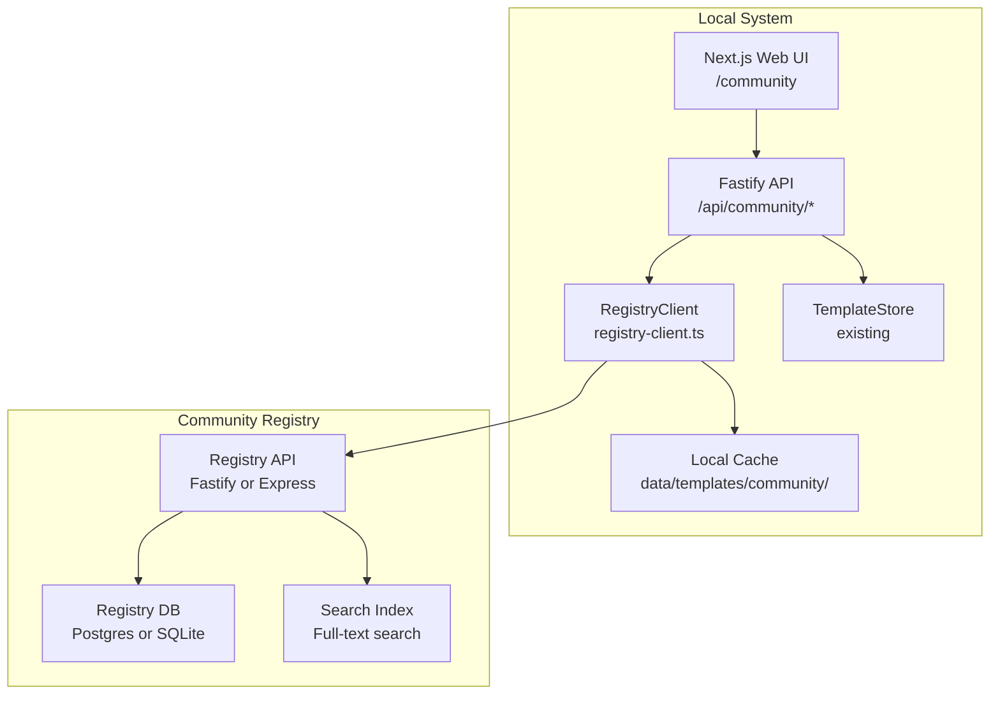

# Technical Design Document (TDD)
## Feature: Community Template Sharing
### This Mind Does Not Exist — v0.3

---

**Document Version:** 1.0  
**Status:** Draft  
**Related PRD:** [v0.3-self-improvement-PRD.md](./v0.3-self-improvement-PRD.md)

---

## 1. Overview

Community template sharing enables users to publish their custom reasoning templates to a shared registry and import templates created by others. The system is designed to be self-hostable, privacy-preserving, and functional offline.

### 1.1 Architecture



### 1.2 Self-Hosting Model

The registry is a separate, lightweight service that can be:
1. **Official TMDE Registry** (default): Hosted by the project maintainers
2. **Self-hosted**: Users can run their own registry for private teams
3. **Offline mode**: Falls back to locally cached templates when registry is unreachable

---

## 2. Component Design

### 2.1 RegistryClient (TypeScript)

**File:** [`packages/core/src/community/registry-client.ts`](../packages/core/src/community/registry-client.ts) *(new)*

```typescript
import type { CommunityTemplate, TemplateReview, RegistrySearchOptions } from './types';

export class RegistryClient {
  private readonly baseUrl: string;
  private readonly apiKey: string | null;
  private readonly cacheDir: string;
  private readonly cacheTtlMs: number;

  constructor(config: {
    registryUrl: string;
    apiKey?: string;
    cacheDir: string;
    cacheTtlMs?: number;  // Default: 1 hour
    timeoutMs?: number;   // Default: 10 seconds
  }) {}

  /**
   * Search community templates.
   * Falls back to local cache if registry is unreachable.
   */
  async searchTemplates(options: RegistrySearchOptions): Promise<{
    templates: CommunityTemplate[];
    total: number;
    page: number;
    pageSize: number;
  }>;

  /**
   * Get a specific template by ID.
   */
  async getTemplate(id: string): Promise<CommunityTemplate | null>;

  /**
   * Publish a local template to the registry.
   * Requires API key.
   */
  async publishTemplate(template: PublishTemplateRequest): Promise<CommunityTemplate>;

  /**
   * Update a published template.
   * Requires API key and ownership.
   */
  async updateTemplate(
    id: string,
    updates: Partial<PublishTemplateRequest>
  ): Promise<CommunityTemplate>;

  /**
   * Unpublish a template.
   * Requires API key and ownership.
   */
  async unpublishTemplate(id: string): Promise<void>;

  /**
   * Rate a community template (1-5 stars).
   */
  async rateTemplate(id: string, rating: number): Promise<void>;

  /**
   * Submit a review for a template.
   */
  async reviewTemplate(id: string, review: {
    rating: number;
    comment?: string;
  }): Promise<TemplateReview>;

  /**
   * Report a template for inappropriate content.
   */
  async reportTemplate(id: string, reason: string): Promise<void>;

  /**
   * Check if the registry is reachable.
   */
  async isReachable(): Promise<boolean>;

  /**
   * Internal: make an HTTP request with timeout and retry.
   */
  private async request<T>(
    method: string,
    path: string,
    body?: unknown
  ): Promise<T>;

  /**
   * Internal: read from local cache.
   */
  private async readCache<T>(key: string): Promise<T | null>;

  /**
   * Internal: write to local cache with TTL.
   */
  private async writeCache<T>(key: string, data: T): Promise<void>;

  /**
   * Internal: validate template content before publishing.
   */
  private validateTemplate(template: PublishTemplateRequest): string[];
}
```

### 2.2 Types

**File:** [`packages/core/src/community/types.ts`](../packages/core/src/community/types.ts) *(new)*

```typescript
export interface CommunityTemplate {
  id: string;
  name: string;
  description: string;
  domain: string;
  methodology: string;
  keywords: string[];
  content: string;
  author: string | null;
  version: string;
  publishedAt: string;
  updatedAt: string;
  downloadCount: number;
  avgRating: number;
  reviewCount: number;
  isImported: boolean;
  importedAt: string | null;
  localId: string | null;
}

export interface TemplateReview {
  id: string;
  templateId: string;
  rating: number;
  comment: string | null;
  createdAt: string;
  isAnonymous: boolean;
}

export interface RegistrySearchOptions {
  query?: string;
  domain?: string;
  methodology?: string;
  keywords?: string[];
  sortBy?: 'popular' | 'rating' | 'newest' | 'most-used';
  page?: number;
  pageSize?: number;
}

export interface PublishTemplateRequest {
  name: string;
  description: string;
  domain: string;
  methodology: string;
  keywords: string[];
  content: string;
  author?: string;
  version?: string;
}

export interface CacheEntry<T> {
  data: T;
  cachedAt: string;
  expiresAt: string;
}
```

---

## 3. Template Validation

Before publishing, templates are validated for:

### 3.1 Structural Validation

```typescript
function validateTemplateStructure(content: string): string[] {
  const errors: string[] = [];

  // 1. Must have valid YAML frontmatter
  if (!content.startsWith('---')) {
    errors.push('Template must start with YAML frontmatter (---)');
  }

  // 2. Frontmatter must contain required fields
  const frontmatter = parseFrontmatter(content);
  if (!frontmatter.name) errors.push('Frontmatter must include "name"');
  if (!frontmatter.domain) errors.push('Frontmatter must include "domain"');
  if (!frontmatter.description) errors.push('Frontmatter must include "description"');

  // 3. Content must be non-empty after frontmatter
  const body = extractBody(content);
  if (body.trim().length < 100) {
    errors.push('Template body must be at least 100 characters');
  }

  // 4. Must have at least one section header
  if (!body.includes('##')) {
    errors.push('Template must have at least one section (## heading)');
  }

  return errors;
}
```

### 3.2 PII Detection

```typescript
const PII_PATTERNS = [
  /\b[A-Z][a-z]+ [A-Z][a-z]+\b/,           // Full names
  /\b\d{3}[-.]?\d{3}[-.]?\d{4}\b/,          // Phone numbers
  /\b[A-Za-z0-9._%+-]+@[A-Za-z0-9.-]+\.[A-Z|a-z]{2,}\b/,  // Emails
  /\b\d{1,3}\.\d{1,3}\.\d{1,3}\.\d{1,3}\b/, // IP addresses
];

function detectPII(content: string): string[] {
  const warnings: string[] = [];
  for (const pattern of PII_PATTERNS) {
    if (pattern.test(content)) {
      warnings.push(`Potential PII detected: ${pattern.source}`);
    }
  }
  return warnings;
}
```

### 3.3 Content Sanitization

All template content is sanitized before display in the UI to prevent XSS:

```typescript
import DOMPurify from 'isomorphic-dompurify';
import { marked } from 'marked';

function renderTemplateSafely(content: string): string {
  const html = marked(content);
  return DOMPurify.sanitize(html, {
    ALLOWED_TAGS: ['h1', 'h2', 'h3', 'h4', 'p', 'ul', 'ol', 'li',
                   'code', 'pre', 'strong', 'em', 'blockquote', 'hr'],
    ALLOWED_ATTR: []
  });
}
```

---

## 4. Local Cache Design

The local cache stores community templates for offline access:

```
data/templates/community/
├── cache-index.json           # Index of all cached templates
├── templates/
│   ├── {template-id}.json     # Full template data
│   └── ...
└── search-cache/
    ├── {query-hash}.json      # Cached search results
    └── ...
```

### 4.1 Cache Index Schema

```json
{
  "lastUpdated": "2026-02-20T10:00:00Z",
  "templates": {
    "tmpl-abc123": {
      "id": "tmpl-abc123",
      "name": "Proof by Contradiction",
      "domain": "mathematics",
      "cachedAt": "2026-02-20T10:00:00Z",
      "expiresAt": "2026-02-20T11:00:00Z",
      "isImported": true,
      "importedAt": "2026-02-15T09:00:00Z"
    }
  }
}
```

### 4.2 Cache Invalidation

- Search results: 1 hour TTL
- Individual templates: 24 hour TTL
- Imported templates: Never expire (they're local copies)
- On app startup: Check for updates to imported templates

---

## 5. Registry API Design

The registry is a separate service. For v0.3, it can be a simple Fastify app deployed to any Node.js host.

### 5.1 Registry Server Structure

```
packages/registry/                 # NEW: Registry service
├── Dockerfile
├── package.json
├── src/
│   ├── index.ts                   # Fastify server
│   ├── routes/
│   │   ├── templates.ts           # Template CRUD
│   │   ├── reviews.ts             # Ratings and reviews
│   │   └── auth.ts                # API key management
│   ├── storage/
│   │   ├── template-store.ts      # SQLite storage
│   │   └── search.ts              # Full-text search
│   └── middleware/
│       ├── auth.ts                # API key validation
│       ├── rate-limit.ts          # Rate limiting
│       └── sanitize.ts            # Input sanitization
└── migrations/
    └── 001_initial.sql
```

### 5.2 Registry Database Schema

```sql
-- Templates
CREATE TABLE templates (
    id TEXT PRIMARY KEY,
    name TEXT NOT NULL,
    description TEXT NOT NULL,
    domain TEXT NOT NULL,
    methodology TEXT NOT NULL,
    keywords TEXT NOT NULL,        -- JSON array
    content TEXT NOT NULL,
    author TEXT,
    version TEXT NOT NULL DEFAULT '1.0.0',
    published_at DATETIME DEFAULT CURRENT_TIMESTAMP,
    updated_at DATETIME DEFAULT CURRENT_TIMESTAMP,
    download_count INTEGER DEFAULT 0,
    is_active BOOLEAN DEFAULT TRUE,
    owner_key_hash TEXT NOT NULL   -- SHA-256 of API key
);

-- Reviews
CREATE TABLE reviews (
    id TEXT PRIMARY KEY,
    template_id TEXT NOT NULL REFERENCES templates(id),
    rating INTEGER NOT NULL CHECK(rating BETWEEN 1 AND 5),
    comment TEXT,
    created_at DATETIME DEFAULT CURRENT_TIMESTAMP,
    reviewer_ip_hash TEXT          -- Anonymized IP for dedup
);

-- Reports
CREATE TABLE reports (
    id TEXT PRIMARY KEY,
    template_id TEXT NOT NULL REFERENCES templates(id),
    reason TEXT NOT NULL,
    created_at DATETIME DEFAULT CURRENT_TIMESTAMP,
    resolved BOOLEAN DEFAULT FALSE
);

-- API Keys (for publishing)
CREATE TABLE api_keys (
    key_hash TEXT PRIMARY KEY,     -- SHA-256 of the actual key
    created_at DATETIME DEFAULT CURRENT_TIMESTAMP,
    last_used DATETIME,
    is_active BOOLEAN DEFAULT TRUE,
    label TEXT
);

-- Full-text search index
CREATE VIRTUAL TABLE templates_fts USING fts5(
    name, description, keywords, content,
    content=templates, content_rowid=rowid
);

-- Triggers to keep FTS in sync
CREATE TRIGGER templates_ai AFTER INSERT ON templates BEGIN
    INSERT INTO templates_fts(rowid, name, description, keywords, content)
    VALUES (new.rowid, new.name, new.description, new.keywords, new.content);
END;
```

### 5.3 Rate Limiting

```typescript
// In registry middleware
const rateLimits = {
  anonymous: {
    windowMs: 60 * 60 * 1000,  // 1 hour
    max: 100                    // 100 requests per hour
  },
  authenticated: {
    windowMs: 60 * 60 * 1000,
    max: 1000                   // 1000 requests per hour
  },
  publish: {
    windowMs: 24 * 60 * 60 * 1000,  // 24 hours
    max: 20                          // 20 publishes per day
  }
};
```

---

## 6. API Route Implementations (Local Fastify)

### 6.1 GET /api/community/templates

```typescript
fastify.get('/api/community/templates', async (request, reply) => {
  const { query, domain, sortBy = 'popular', page = 1, pageSize = 20 } =
    request.query as RegistrySearchOptions;

  try {
    const results = await registryClient.searchTemplates({
      query, domain, sortBy, page, pageSize
    });
    return reply.send(results);
  } catch (err) {
    // Registry unreachable — return cached results
    const cached = await registryClient.getCachedSearch({ query, domain, sortBy, page });
    if (cached) {
      return reply.send({ ...cached, fromCache: true });
    }
    return reply.status(503).send({
      error: 'Registry unavailable and no cached results found',
      offline: true
    });
  }
});
```

### 6.2 POST /api/community/templates/:id/import

```typescript
fastify.post('/api/community/templates/:id/import', async (request, reply) => {
  const { id } = request.params as { id: string };

  // 1. Fetch template from registry
  const template = await registryClient.getTemplate(id);
  if (!template) {
    return reply.status(404).send({ error: 'Template not found in registry' });
  }

  // 2. Validate content
  const errors = validateTemplateStructure(template.content);
  if (errors.length > 0) {
    return reply.status(422).send({ error: 'Template validation failed', details: errors });
  }

  // 3. Save to local templates
  const localTemplate = await templateStore.saveFromCommunity(template);

  // 4. Update registry download count (best-effort)
  registryClient.incrementDownloadCount(id).catch(() => {});

  return reply.status(201).send({
    localId: localTemplate.id,
    template: localTemplate
  });
});
```

### 6.3 POST /api/templates/:id/publish

```typescript
fastify.post('/api/templates/:id/publish', async (request, reply) => {
  const { id } = request.params as { id: string };
  const { apiKey, author } = request.body as { apiKey?: string; author?: string };

  // 1. Get local template
  const localTemplate = await templateStore.getTemplate(id);
  if (!localTemplate) {
    return reply.status(404).send({ error: 'Local template not found' });
  }

  // 2. Validate before publishing
  const errors = validateTemplateStructure(localTemplate.content);
  const piiWarnings = detectPII(localTemplate.content);

  if (errors.length > 0) {
    return reply.status(422).send({ error: 'Validation failed', details: errors });
  }

  // 3. Publish to registry
  const published = await registryClient.publishTemplate({
    name: localTemplate.name,
    description: localTemplate.description,
    domain: localTemplate.domain,
    methodology: localTemplate.methodology,
    keywords: localTemplate.keywords,
    content: localTemplate.content,
    author: author ?? undefined
  });

  // 4. Update local template with registry ID
  await templateStore.updateTemplate(id, { communityId: published.id });

  return reply.status(201).send({
    communityId: published.id,
    template: published,
    piiWarnings: piiWarnings.length > 0 ? piiWarnings : undefined
  });
});
```

---

## 7. Community Hub UI

### 7.1 Page Structure

**File:** [`apps/web/app/community/page.tsx`](../apps/web/app/community/page.tsx) *(new)*

```
┌─────────────────────────────────────────────────────────────┐
│  🌐 Community Templates                    [Publish ▶]      │
├─────────────────────────────────────────────────────────────┤
│  Search: [___________________] Domain: [All ▼] Sort: [▼]   │
├─────────────────────────────────────────────────────────────┤
│  ┌─────────────────────────────────────────────────────┐   │
│  │ ⭐⭐⭐⭐⭐ Proof by Contradiction          [Import] │   │
│  │ Mathematics • Deductive • 1.2k downloads            │   │
│  │ Template for proving statements by assuming the...  │   │
│  │ By: anonymous • Updated: 2 days ago                 │   │
│  └─────────────────────────────────────────────────────┘   │
│  ┌─────────────────────────────────────────────────────┐   │
│  │ ⭐⭐⭐⭐½ System Design Decomposition    [Import] │   │
│  │ Coding • Architectural • 892 downloads              │   │
│  │ Break down complex systems into components...       │   │
│  │ By: tmde-team • Updated: 1 week ago                 │   │
│  └─────────────────────────────────────────────────────┘   │
│  [Load More]                                                 │
└─────────────────────────────────────────────────────────────┘
```

### 7.2 Key UI Components

- `TemplateCard` — Displays template summary with import button
- `TemplateDetail` — Full template view with content preview and reviews
- `PublishModal` — Form for publishing a local template
- `ImportButton` — One-click import with loading state
- `RatingWidget` — 1-5 star rating input
- `ReviewList` — Paginated list of reviews
- `OfflineBanner` — Shown when registry is unreachable
- `SearchBar` — Debounced search with domain filter

---

## 8. Offline Mode

When the registry is unreachable, the system:

1. Shows an `OfflineBanner` at the top of the community page
2. Displays locally cached templates (from previous successful fetches)
3. Disables publish, rate, and review actions
4. Still allows browsing and using already-imported templates

```typescript
// In RegistryClient
async searchTemplates(options: RegistrySearchOptions): Promise<SearchResult> {
  try {
    const result = await this.request<SearchResult>('GET', '/v1/templates', options);
    await this.writeCache(`search:${JSON.stringify(options)}`, result);
    return result;
  } catch (err) {
    if (isNetworkError(err)) {
      const cached = await this.readCache<SearchResult>(`search:${JSON.stringify(options)}`);
      if (cached) return { ...cached, fromCache: true };
    }
    throw err;
  }
}
```

---

## 9. Security Considerations

### 9.1 API Key Management

- API keys are generated as 32-byte random hex strings
- Only the SHA-256 hash is stored in the registry database
- Keys are transmitted only over HTTPS
- Keys can be revoked by the registry admin

### 9.2 Content Security

- All template content is sanitized with DOMPurify before rendering
- PII detection warns users before publishing
- The registry has a content moderation queue for reported templates
- Rate limiting prevents abuse

### 9.3 Import Safety

- Templates are validated before import
- Content is sanitized before storage
- No executable code is allowed in templates (markdown only)

---

## 10. Test Specifications

See [`v0.3-tests-comprehensive.md`](./v0.3-tests-comprehensive.md) for full test cases.

### 10.1 Unit Test Summary

| Test Suite | File | Tests |
|-----------|------|-------|
| RegistryClient | `registry-client.test.ts` | 24 tests |
| Template validation | `template-validation.test.ts` | 20 tests |
| Cache management | `cache.test.ts` | 14 tests |
| API routes | `community.routes.test.ts` | 22 tests |
| Registry server | `registry.test.ts` | 18 tests |

### 10.2 Key Test Scenarios

1. **Offline fallback:** Registry unreachable, cached results returned
2. **Import validation:** Invalid template structure rejected with clear errors
3. **PII detection:** Template with email address triggers warning
4. **Publish flow:** Local template published, registry ID stored locally
5. **Rate limiting:** 101st request in an hour returns 429
6. **Cache TTL:** Cached search results expire after 1 hour
7. **XSS prevention:** Template with `<script>` tag is sanitized
8. **Concurrent imports:** Same template imported twice, deduplication works
