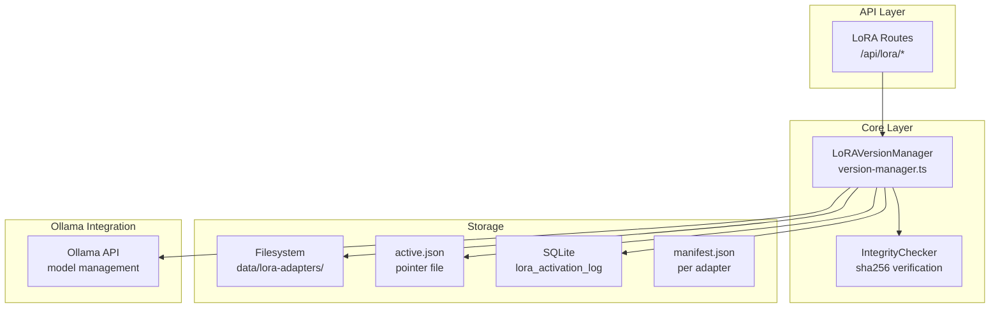

# Technical Design Document (TDD)
## Feature: LoRA Version Management and Rollback
### This Mind Does Not Exist — v0.3

---

**Document Version:** 1.0  
**Status:** Draft  
**Related PRD:** [v0.3-self-improvement-PRD.md](./v0.3-self-improvement-PRD.md)

---

## 1. Overview

This document describes the technical design for LoRA adapter version management. The system maintains a versioned history of all trained LoRA adapters, supports one-click activation and rollback, and provides export/import capabilities.

### 1.1 Design Principles

- **Filesystem-first:** All adapter data lives on disk. The database is an index, not the source of truth.
- **Atomic operations:** Activation and rollback are atomic — they either fully succeed or leave the system unchanged.
- **Integrity verification:** Every adapter is SHA-256 hashed on save and verified on load.
- **Audit trail:** All activation events are logged to SQLite for accountability.

### 1.2 Architecture



---

## 2. Component Design

### 2.1 LoRAVersionManager (TypeScript)

**File:** [`packages/core/src/lora/version-manager.ts`](../packages/core/src/lora/version-manager.ts) *(new)*

```typescript
import fs from 'fs/promises';
import path from 'path';
import crypto from 'crypto';
import { createReadStream } from 'fs';
import type { OllamaClient } from '../ollama/client';
import type { TraceStore } from '../storage/trace-store';
import type {
  LoRAAdapter,
  LoRAActivationEvent,
  LoRAManifest
} from './types';

export class LoRAVersionManager {
  constructor(
    private readonly adaptersDir: string,
    private readonly ollamaClient: OllamaClient,
    private readonly traceStore: TraceStore
  ) {}

  /**
   * List all stored LoRA adapters, sorted by creation date (newest first).
   * Validates each adapter's integrity before returning.
   */
  async listAdapters(): Promise<LoRAAdapter[]>;

  /**
   * Get details for a specific adapter.
   * Returns null if not found.
   */
  async getAdapter(adapterId: string): Promise<LoRAAdapter | null>;

  /**
   * Get the currently active adapter.
   * Returns null if no adapter is active (using base model).
   */
  async getActiveAdapter(): Promise<LoRAAdapter | null>;

  /**
   * Activate a specific adapter version.
   * Atomically updates active.json and notifies Ollama.
   * Logs the activation event.
   */
  async activateAdapter(
    adapterId: string,
    triggeredBy: 'user' | 'api' | 'rollback'
  ): Promise<void>;

  /**
   * Roll back to the previous adapter version.
   * If no previous version exists, deactivates all adapters.
   */
  async rollback(): Promise<LoRAAdapter | null>;

  /**
   * Roll back to a specific adapter version.
   */
  async rollbackTo(adapterId: string): Promise<void>;

  /**
   * Add or remove tags on an adapter.
   */
  async updateTags(
    adapterId: string,
    tags: string[]
  ): Promise<void>;

  /**
   * Delete an adapter version.
   * Throws if the adapter is currently active.
   */
  async deleteAdapter(adapterId: string): Promise<void>;

  /**
   * Export an adapter as a .tar.gz archive.
   * Returns the path to the archive file.
   */
  async exportAdapter(
    adapterId: string,
    outputPath: string
  ): Promise<string>;

  /**
   * Import an adapter from a .tar.gz archive.
   * Validates the archive contents before importing.
   * Returns the imported adapter's ID.
   */
  async importAdapter(archivePath: string): Promise<string>;

  /**
   * Verify the integrity of an adapter using its stored SHA-256 hash.
   */
  async verifyIntegrity(adapterId: string): Promise<boolean>;

  /**
   * Get the activation history for audit purposes.
   */
  async getActivationHistory(options?: {
    limit?: number;
    adapterId?: string;
  }): Promise<LoRAActivationEvent[]>;

  /**
   * Internal: compute SHA-256 hash of adapter_model.bin.
   */
  private async computeHash(adapterPath: string): Promise<string>;

  /**
   * Internal: read and parse manifest.json for an adapter.
   */
  private async readManifest(adapterId: string): Promise<LoRAManifest>;

  /**
   * Internal: write manifest.json atomically.
   */
  private async writeManifest(
    adapterId: string,
    manifest: LoRAManifest
  ): Promise<void>;

  /**
   * Internal: update active.json atomically using write-then-rename.
   */
  private async setActivePointer(adapterId: string | null): Promise<void>;

  /**
   * Internal: log an activation event to SQLite.
   */
  private async logActivationEvent(
    event: Omit<LoRAActivationEvent, 'id'>
  ): Promise<void>;
}
```

### 2.2 Types

**File:** [`packages/core/src/lora/types.ts`](../packages/core/src/lora/types.ts) *(new)*

```typescript
export interface LoRAAdapter {
  id: string;
  createdAt: string;
  baseModel: string;
  isActive: boolean;
  tags: string[];
  metrics: {
    finalTrainLoss: number;
    finalValLoss: number;
    bestValLoss: number;
    totalSteps: number;
    trainingTimeSeconds: number;
    peakVramGb: number | null;
  };
  tracesUsed: number;
  trainExamples: number;
  valExamples: number;
  sizeBytes: number;
  sha256: string;
  path: string;
  isValid: boolean;
  invalidReason: string | null;
}

export interface LoRAManifest {
  id: string;
  createdAt: string;
  baseModel: string;
  isActive: boolean;
  tags: string[];
  tracesUsed: number;
  trainExamples: number;
  valExamples: number;
  sizeBytes: number;
  sha256: string;
  config: {
    loraRank: number;
    loraAlpha: number;
    learningRate: number;
    batchSize: number;
    epochs: number;
    maxSeqLength: number;
  };
  metrics: {
    finalTrainLoss: number;
    finalValLoss: number;
    bestValLoss: number;
    totalSteps: number;
    trainingTimeSeconds: number;
    peakVramGb: number | null;
  };
}

export interface LoRAActivationEvent {
  id: string;
  timestamp: string;
  adapterId: string;
  previousAdapterId: string | null;
  triggeredBy: 'user' | 'api' | 'rollback';
  success: boolean;
  errorMessage: string | null;
}

export interface ActivePointer {
  adapterId: string | null;
  activatedAt: string;
  previousAdapterId: string | null;
}
```

---

## 3. Database Schema

### 3.1 New `lora_activation_log` Table

```sql
CREATE TABLE IF NOT EXISTS lora_activation_log (
    id TEXT PRIMARY KEY,
    timestamp DATETIME DEFAULT CURRENT_TIMESTAMP,
    adapter_id TEXT NOT NULL,
    previous_adapter_id TEXT,
    triggered_by TEXT NOT NULL
        CHECK(triggered_by IN ('user', 'api', 'rollback')),
    success BOOLEAN NOT NULL DEFAULT TRUE,
    error_message TEXT
);

CREATE INDEX IF NOT EXISTS idx_activation_adapter ON lora_activation_log(adapter_id);
CREATE INDEX IF NOT EXISTS idx_activation_timestamp ON lora_activation_log(timestamp);
```

---

## 4. Atomic Operations Design

### 4.1 Atomic Activation

The activation operation must be atomic to prevent the system from being in an inconsistent state (e.g., `active.json` pointing to a non-existent adapter).

```typescript
async activateAdapter(adapterId: string, triggeredBy: 'user' | 'api' | 'rollback'): Promise<void> {
  // 1. Verify adapter exists and is valid
  const adapter = await this.getAdapter(adapterId);
  if (!adapter) throw new AdapterNotFoundError(adapterId);
  if (!adapter.isValid) throw new InvalidAdapterError(adapterId, adapter.invalidReason);

  // 2. Get current active adapter for rollback reference
  const currentActive = await this.getActiveAdapter();
  const previousId = currentActive?.id ?? null;

  // 3. Write new active.json to a temp file first
  const tempPath = path.join(this.adaptersDir, 'active.json.tmp');
  const activePath = path.join(this.adaptersDir, 'active.json');
  const pointer: ActivePointer = {
    adapterId,
    activatedAt: new Date().toISOString(),
    previousAdapterId: previousId
  };
  await fs.writeFile(tempPath, JSON.stringify(pointer, null, 2));

  // 4. Atomic rename (POSIX-atomic on same filesystem)
  await fs.rename(tempPath, activePath);

  // 5. Update manifest.json for old and new adapters
  if (previousId) {
    const prevManifest = await this.readManifest(previousId);
    await this.writeManifest(previousId, { ...prevManifest, isActive: false });
  }
  const newManifest = await this.readManifest(adapterId);
  await this.writeManifest(adapterId, { ...newManifest, isActive: true });

  // 6. Log the activation event
  await this.logActivationEvent({
    timestamp: new Date().toISOString(),
    adapterId,
    previousAdapterId: previousId,
    triggeredBy,
    success: true,
    errorMessage: null
  });

  // 7. Notify Ollama to reload with new adapter (best-effort)
  try {
    await this.ollamaClient.reloadModel(newManifest.baseModel, {
      loraPath: path.join(this.adaptersDir, adapterId)
    });
  } catch (err) {
    // Log but don't fail — Ollama will pick up the adapter on next request
    console.warn('Failed to hot-reload Ollama model:', err);
  }
}
```

### 4.2 Atomic Rollback

```typescript
async rollback(): Promise<LoRAAdapter | null> {
  const activePointer = await this.readActivePointer();
  if (!activePointer?.previousAdapterId) {
    // No previous adapter — deactivate all
    await this.setActivePointer(null);
    return null;
  }

  await this.activateAdapter(activePointer.previousAdapterId, 'rollback');
  return this.getAdapter(activePointer.previousAdapterId);
}
```

---

## 5. Export/Import Design

### 5.1 Export Format

The export archive is a `.tar.gz` containing:

```
lora_export_abc123.tar.gz
├── manifest.json          # TMDE metadata
├── adapter_model.bin      # LoRA weights
├── adapter_config.json    # LoRA configuration
├── tokenizer_config.json  # Tokenizer config
└── training_args.json     # Hyperparameters
```

### 5.2 Export Implementation

```typescript
async exportAdapter(adapterId: string, outputPath: string): Promise<string> {
  const adapter = await this.getAdapter(adapterId);
  if (!adapter) throw new AdapterNotFoundError(adapterId);

  // Verify integrity before export
  const isValid = await this.verifyIntegrity(adapterId);
  if (!isValid) throw new InvalidAdapterError(adapterId, 'Integrity check failed');

  const adapterDir = path.join(this.adaptersDir, adapterId);
  const archivePath = path.join(outputPath, `lora_export_${adapterId}.tar.gz`);

  // Use archiver to create tar.gz
  await createTarGz(adapterDir, archivePath);

  return archivePath;
}
```

### 5.3 Import Validation

Before importing, the system validates:
1. Archive can be extracted without errors
2. `manifest.json` is present and valid JSON
3. `adapter_model.bin` is present
4. SHA-256 of `adapter_model.bin` matches `manifest.json.sha256`
5. `baseModel` in manifest matches a model available in Ollama

```typescript
async importAdapter(archivePath: string): Promise<string> {
  // 1. Extract to temp directory
  const tempDir = await fs.mkdtemp(path.join(os.tmpdir(), 'tmde-import-'));

  try {
    await extractTarGz(archivePath, tempDir);

    // 2. Validate contents
    const manifest = await this.validateImportContents(tempDir);

    // 3. Generate new ID if collision
    const newId = manifest.id in await this.getAdapterIds()
      ? `${manifest.id}_imported_${Date.now()}`
      : manifest.id;

    // 4. Move to adapters directory
    const destDir = path.join(this.adaptersDir, newId);
    await fs.rename(tempDir, destDir);

    // 5. Update manifest with new ID
    await this.writeManifest(newId, { ...manifest, id: newId, isActive: false });

    return newId;
  } catch (err) {
    // Cleanup temp dir on failure
    await fs.rm(tempDir, { recursive: true, force: true });
    throw err;
  }
}
```

---

## 6. API Route Implementations

### 6.1 GET /api/lora

```typescript
fastify.get('/api/lora', async (request, reply) => {
  const adapters = await versionManager.listAdapters();
  return reply.send({ adapters });
});
```

### 6.2 POST /api/lora/:adapterId/activate

```typescript
fastify.post('/api/lora/:adapterId/activate', async (request, reply) => {
  const { adapterId } = request.params as { adapterId: string };

  try {
    await versionManager.activateAdapter(adapterId, 'user');
    const adapter = await versionManager.getAdapter(adapterId);
    return reply.send({ success: true, adapter });
  } catch (err) {
    if (err instanceof AdapterNotFoundError) {
      return reply.status(404).send({ error: err.message });
    }
    if (err instanceof InvalidAdapterError) {
      return reply.status(422).send({ error: err.message, reason: err.reason });
    }
    throw err;
  }
});
```

### 6.3 POST /api/lora/rollback

```typescript
fastify.post('/api/lora/rollback', async (request, reply) => {
  const previousAdapter = await versionManager.rollback();
  return reply.send({
    success: true,
    rolledBackTo: previousAdapter?.id ?? null,
    message: previousAdapter
      ? `Rolled back to ${previousAdapter.id}`
      : 'Deactivated all adapters (using base model)'
  });
});
```

### 6.4 DELETE /api/lora/:adapterId

```typescript
fastify.delete('/api/lora/:adapterId', async (request, reply) => {
  const { adapterId } = request.params as { adapterId: string };

  const active = await versionManager.getActiveAdapter();
  if (active?.id === adapterId) {
    return reply.status(409).send({
      error: 'Cannot delete the currently active adapter. Activate another adapter first.'
    });
  }

  await versionManager.deleteAdapter(adapterId);
  return reply.status(204).send();
});
```

### 6.5 GET /api/lora/:adapterId/export

```typescript
fastify.get('/api/lora/:adapterId/export', async (request, reply) => {
  const { adapterId } = request.params as { adapterId: string };
  const tempDir = await fs.mkdtemp(path.join(os.tmpdir(), 'tmde-export-'));

  try {
    const archivePath = await versionManager.exportAdapter(adapterId, tempDir);
    const filename = path.basename(archivePath);

    reply.header('Content-Disposition', `attachment; filename="${filename}"`);
    reply.header('Content-Type', 'application/gzip');

    const stream = createReadStream(archivePath);
    return reply.send(stream);
  } finally {
    // Cleanup temp dir after response
    setTimeout(() => fs.rm(tempDir, { recursive: true, force: true }), 5000);
  }
});
```

---

## 7. Ollama Integration for LoRA Loading

Ollama supports loading LoRA adapters via a custom Modelfile. The version manager creates a Modelfile when activating an adapter:

```typescript
private async createOllamaModelfile(
  baseModel: string,
  adapterPath: string
): Promise<string> {
  return `FROM ${baseModel}\nADAPTER ${adapterPath}`;
}

private async registerWithOllama(
  adapterId: string,
  baseModel: string,
  adapterPath: string
): Promise<void> {
  const modelName = `${baseModel}-lora-${adapterId}`;
  const modelfile = await this.createOllamaModelfile(baseModel, adapterPath);

  // POST to Ollama /api/create
  await this.ollamaClient.createModel(modelName, modelfile);
}
```

The active adapter's Ollama model name is stored in `active.json` and used by the debate orchestrator when selecting the Proposer model.

---

## 8. UI Components

### 8.1 LoRA Version Manager Page

**File:** [`apps/web/app/finetune/versions/page.tsx`](../apps/web/app/finetune/versions/page.tsx) *(new)*

Key components:
- `AdapterList` — Table of all adapters with metrics, tags, and actions
- `AdapterCard` — Detailed view of a single adapter
- `ActivateButton` — One-click activation with confirmation dialog
- `RollbackButton` — One-click rollback with confirmation
- `TagEditor` — Inline tag editing
- `ExportButton` — Download adapter as archive
- `ImportDropzone` — Drag-and-drop import

### 8.2 Adapter Comparison View

When two adapters are selected, a side-by-side comparison shows:

| Metric | Adapter A | Adapter B |
|--------|-----------|-----------|
| Created | 2026-02-20 | 2026-02-13 |
| Traces Used | 89 | 52 |
| Train Loss | 0.42 | 0.61 |
| Val Loss | 0.51 | 0.72 |
| TMDE Score | 78.4 | 71.2 |
| Size | 128 MB | 128 MB |

---

## 9. Error Types

```typescript
export class AdapterNotFoundError extends Error {
  constructor(adapterId: string) {
    super(`LoRA adapter not found: ${adapterId}`);
    this.name = 'AdapterNotFoundError';
  }
}

export class InvalidAdapterError extends Error {
  constructor(adapterId: string, public readonly reason: string | null) {
    super(`LoRA adapter is invalid: ${adapterId}. Reason: ${reason}`);
    this.name = 'InvalidAdapterError';
  }
}

export class ActiveAdapterDeletionError extends Error {
  constructor(adapterId: string) {
    super(`Cannot delete active adapter: ${adapterId}`);
    this.name = 'ActiveAdapterDeletionError';
  }
}

export class ImportValidationError extends Error {
  constructor(public readonly details: string[]) {
    super(`Import validation failed: ${details.join(', ')}`);
    this.name = 'ImportValidationError';
  }
}
```

---

## 10. Test Specifications

See [`v0.3-tests-comprehensive.md`](./v0.3-tests-comprehensive.md) for full test cases.

### 10.1 Unit Test Summary

| Test Suite | File | Tests |
|-----------|------|-------|
| LoRAVersionManager | `version-manager.test.ts` | 28 tests |
| Atomic operations | `atomic-ops.test.ts` | 10 tests |
| Export/Import | `export-import.test.ts` | 14 tests |
| API routes | `lora.routes.test.ts` | 18 tests |

### 10.2 Key Test Scenarios

1. **Activation atomicity:** Simulate filesystem failure mid-activation; verify system remains consistent
2. **Rollback chain:** Activate A → B → C, rollback twice, verify A is active
3. **Integrity verification:** Corrupt `adapter_model.bin`, verify `isValid: false` is returned
4. **Export/import round-trip:** Export adapter, import it, verify all fields match
5. **Concurrent activation:** Two simultaneous activation requests; verify only one succeeds
6. **Active adapter protection:** Attempt to delete active adapter; verify 409 error
