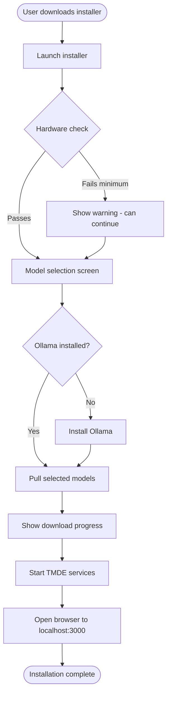
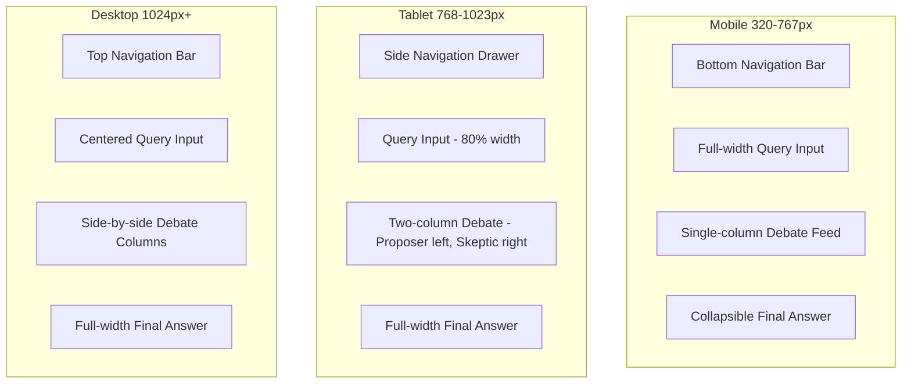
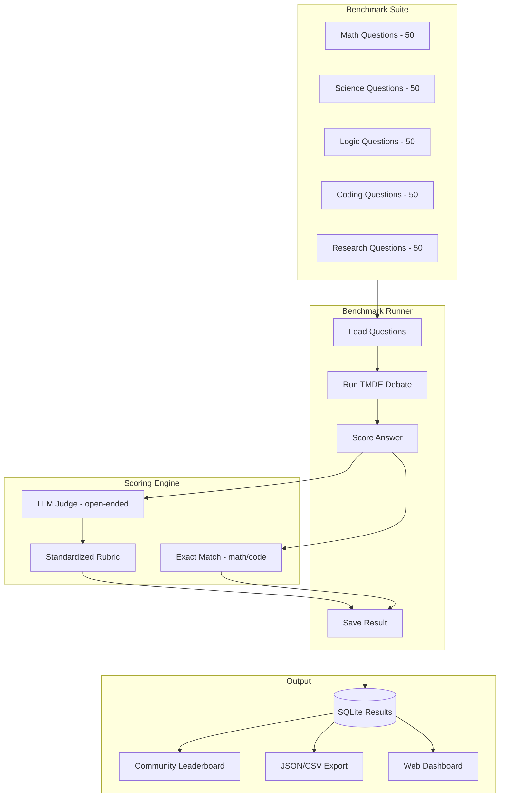
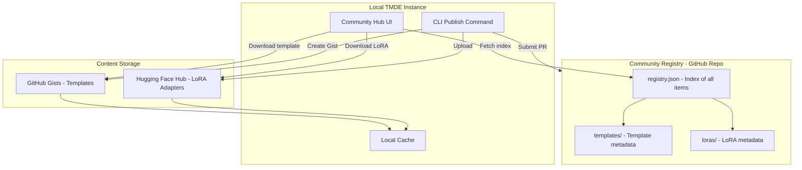

# Product Requirements Document — v1.0 Production
## This Mind Does Not Exist

> **IMPORTANT:** This PRD is only to be implemented AFTER v0.1, v0.2, v0.3, and v0.4 PRDs and TDDs are completed and their features are fully implemented and tested.

---

## Document Metadata

| Field | Value |
|---|---|
| Version | 1.0 |
| Status | Draft |
| Milestone | Production Release |
| Depends On | v0.1 Foundation, v0.2 Intelligence, v0.3 Self-Improvement, v0.4 Multi-Modal |
| Authors | Engineering Team |
| Last Updated | 2026-02-27 |

---

## 1. Executive Summary

v1.0 marks the **Production Release** of This Mind Does Not Exist (TMDE). Having established the core reasoning engine (v0.1), intelligence layer (v0.2), self-improvement pipeline (v0.3), and multi-modal capabilities (v0.4), v1.0 focuses on **distribution, accessibility, validation, and community**.

The four pillars of v1.0 are:

1. **One-click installer** — Eliminate all friction from installation on macOS, Windows, and Linux
2. **Mobile-responsive UI** — Full feature parity on phones and tablets
3. **Benchmark suite** — Rigorous, reproducible comparisons against frontier models
4. **Community hub** — A platform for sharing templates and LoRA adapters

---

## 2. Goals and Non-Goals

### Goals

- Reduce time-to-first-debate from ~15 minutes (manual setup) to < 3 minutes (one-click)
- Achieve full mobile usability with no degraded functionality
- Provide statistically rigorous benchmarks that can be reproduced by the community
- Enable community-driven growth through template and LoRA sharing
- Establish TMDE as a credible, production-grade open-source project

### Non-Goals

- Cloud-hosted SaaS version (remains self-hosted only)
- Paid tier or monetization
- Mobile native apps (iOS/Android) — web-responsive only in v1.0
- Centralized model hosting
- Real-time collaborative debates

---

## 3. User Personas

### Persona A: The Curious Developer
- **Background:** Software engineer, comfortable with CLI but wants a smooth experience
- **Pain Point:** Current setup requires too many manual steps; wants to try TMDE in minutes
- **v1.0 Value:** One-click installer gets them running in < 3 minutes

### Persona B: The Mobile Power User
- **Background:** Uses TMDE daily, often on the go with a phone or tablet
- **Pain Point:** Current UI is desktop-only; mobile experience is broken
- **v1.0 Value:** Full mobile-responsive UI with touch-optimized debate viewer

### Persona C: The AI Researcher
- **Background:** Academic or industry researcher evaluating local LLM systems
- **Pain Point:** No standardized benchmarks to compare TMDE against GPT-4, Claude, etc.
- **v1.0 Value:** Reproducible benchmark suite with published results

### Persona D: The Community Builder
- **Background:** Power user who has created excellent templates and fine-tuned LoRA adapters
- **Pain Point:** No way to share their work with others or discover community contributions
- **v1.0 Value:** Community hub for discovery, sharing, and rating of templates and adapters

---

## 4. Feature Specifications

---

### Feature 1: One-Click Installer

#### 4.1.1 Overview

A native installer for each major platform that handles all dependencies, downloads required models, and launches TMDE with a single user action.

#### 4.1.2 User Stories

| ID | Story | Priority |
|---|---|---|
| US-1.1 | As a macOS user, I want to double-click a `.dmg` file and have TMDE running in < 3 minutes | P0 |
| US-1.2 | As a Windows user, I want to run a `.exe` installer and have TMDE running in < 3 minutes | P0 |
| US-1.3 | As a Linux user, I want to run a single shell command and have TMDE running in < 3 minutes | P0 |
| US-1.4 | As any user, I want the installer to detect if Ollama is already installed and skip re-installation | P1 |
| US-1.5 | As any user, I want to choose which models to download during installation (full vs. lite) | P1 |
| US-1.6 | As any user, I want the installer to show clear progress with estimated time remaining | P1 |
| US-1.7 | As any user, I want the installer to validate my hardware and warn if requirements are not met | P2 |
| US-1.8 | As any user, I want a clean uninstaller that removes all TMDE components | P2 |
| US-1.9 | As any user, I want auto-update notifications when new versions are available | P2 |

#### 4.1.3 Acceptance Criteria

**macOS Installer:**
- [ ] Distributable as a signed `.dmg` with drag-to-Applications install
- [ ] Installs Ollama if not present (using official Ollama macOS installer)
- [ ] Pulls default models (`qwen3:32b`, `nomic-embed-text`) with progress bar
- [ ] Launches TMDE backend as a macOS LaunchAgent (auto-start on login)
- [ ] Opens browser to `http://localhost:3000` on first launch
- [ ] Works on macOS 13 Ventura and later (Intel + Apple Silicon)
- [ ] Installer is code-signed with Apple Developer certificate
- [ ] Total install time < 3 minutes (excluding model download, which depends on internet speed)

**Windows Installer:**
- [ ] Distributable as a signed `.exe` (NSIS or WiX-based)
- [ ] Installs Ollama if not present (using official Ollama Windows installer)
- [ ] Pulls default models with progress bar
- [ ] Registers TMDE as a Windows Service (auto-start on boot)
- [ ] Creates Start Menu shortcut and Desktop icon
- [ ] Opens browser to `http://localhost:3000` on first launch
- [ ] Works on Windows 10 (build 19041+) and Windows 11
- [ ] Installer is code-signed with EV certificate
- [ ] Total install time < 3 minutes (excluding model download)

**Linux Installer:**
- [ ] Distributable as a single `install.sh` script (curl-pipe-bash compatible)
- [ ] Also available as `.deb` (Debian/Ubuntu) and `.rpm` (Fedora/RHEL) packages
- [ ] Installs Ollama if not present
- [ ] Pulls default models with progress bar
- [ ] Registers TMDE as a systemd service
- [ ] Works on Ubuntu 22.04+, Debian 12+, Fedora 38+, Arch Linux
- [ ] Total install time < 3 minutes (excluding model download)

**All Platforms:**
- [ ] Hardware detection: warns if < 8GB RAM (minimum), recommends 16GB+
- [ ] GPU detection: shows whether GPU acceleration will be used
- [ ] Disk space check: warns if < 30GB free
- [ ] Model selection: "Full" (qwen3:32b + llama3.3:70b) vs "Lite" (llama3.1:8b + mistral:7b)
- [ ] Uninstaller removes all TMDE files, services, and optionally models
- [ ] Version check on startup; notification if update available

#### 4.1.4 Installation Flow



#### 4.1.5 Technical Constraints

- macOS: Must use Electron or Tauri for the installer GUI, or a native Swift/Objective-C installer
- Windows: NSIS or WiX Toolset for installer creation
- Linux: Bash script + optional `.deb`/`.rpm` packaging
- All installers must be built via CI/CD (GitHub Actions) and published to GitHub Releases
- Code signing is mandatory for macOS and Windows to avoid security warnings

---

### Feature 2: Mobile-Responsive UI

#### 4.2.1 Overview

A fully responsive web UI that provides complete feature parity on mobile devices (phones and tablets), with touch-optimized interactions and adaptive layouts.

#### 4.2.2 User Stories

| ID | Story | Priority |
|---|---|---|
| US-2.1 | As a mobile user, I want to submit queries and view debates on my phone | P0 |
| US-2.2 | As a mobile user, I want the debate viewer to be readable without horizontal scrolling | P0 |
| US-2.3 | As a mobile user, I want touch-friendly controls (large tap targets, swipe gestures) | P0 |
| US-2.4 | As a tablet user, I want a two-column layout that uses the larger screen effectively | P1 |
| US-2.5 | As a mobile user, I want to browse and search my trace history | P1 |
| US-2.6 | As a mobile user, I want to rate debates using a touch-friendly rating control | P1 |
| US-2.7 | As a mobile user, I want the UI to work in both portrait and landscape orientation | P1 |
| US-2.8 | As a mobile user, I want the app to be installable as a PWA (add to home screen) | P2 |
| US-2.9 | As a mobile user, I want offline access to previously viewed traces | P2 |

#### 4.2.3 Acceptance Criteria

**Responsive Breakpoints:**
- [ ] Mobile: 320px – 767px (single column, stacked layout)
- [ ] Tablet: 768px – 1023px (adaptive two-column where appropriate)
- [ ] Desktop: 1024px+ (existing layout preserved)

**Query Interface (Mobile):**
- [ ] Full-width text area with auto-resize
- [ ] Submit button is at least 44x44px (Apple HIG minimum tap target)
- [ ] Settings accessible via bottom sheet or slide-out drawer
- [ ] Model selector uses native mobile select or custom bottom sheet

**Debate Viewer (Mobile):**
- [ ] Proposer and Skeptic turns displayed in a single scrollable column (not side-by-side)
- [ ] Round indicator shows current round (e.g., "Round 2 of 4")
- [ ] Collapsible round cards to reduce scroll length
- [ ] Streaming text renders correctly on mobile (no layout thrash)
- [ ] Final answer section is visually distinct and easy to find

**Trace Browser (Mobile):**
- [ ] Card-based list view (not table) on mobile
- [ ] Search bar is sticky at top
- [ ] Infinite scroll or pagination
- [ ] Swipe-to-rate gesture on trace cards

**Rating Widget (Mobile):**
- [ ] Touch-friendly star rating or large slider
- [ ] Minimum tap target 44x44px

**PWA (Progressive Web App):**
- [ ] `manifest.json` with app name, icons, theme color
- [ ] Service worker for offline caching of static assets
- [ ] "Add to Home Screen" prompt on supported browsers
- [ ] App icon in 192x192 and 512x512 PNG

**Performance (Mobile):**
- [ ] First Contentful Paint < 2s on 4G connection
- [ ] Largest Contentful Paint < 3s on 4G connection
- [ ] No layout shift during streaming (CLS < 0.1)
- [ ] Touch response < 100ms

#### 4.2.4 Responsive Layout Architecture



---

### Feature 3: Benchmark Suite vs Frontier Models

#### 4.3.1 Overview

A rigorous, reproducible benchmark suite that measures TMDE's reasoning quality against frontier models (GPT-4o, Claude Opus, Grok-4) across multiple domains and task types.

#### 4.3.2 User Stories

| ID | Story | Priority |
|---|---|---|
| US-3.1 | As a researcher, I want to run standardized benchmarks to compare TMDE vs frontier models | P0 |
| US-3.2 | As a user, I want to see a live benchmark dashboard showing TMDE's performance | P0 |
| US-3.3 | As a researcher, I want to add custom benchmark questions to the suite | P1 |
| US-3.4 | As a researcher, I want to export benchmark results in standard formats (JSON, CSV) | P1 |
| US-3.5 | As a user, I want to see how my specific hardware configuration affects benchmark scores | P1 |
| US-3.6 | As a researcher, I want to compare different TMDE configurations (rounds, models, templates) | P2 |
| US-3.7 | As a community member, I want to submit my benchmark results to a public leaderboard | P2 |

#### 4.3.3 Benchmark Domains and Tasks

**Domain 1: Mathematical Reasoning**
- Proof construction (undergraduate level)
- Olympiad-style problem solving
- Statistical reasoning and probability
- Number theory and combinatorics
- Reference: MATH dataset, GSM8K, AIME problems

**Domain 2: Scientific Reasoning**
- Physics problem solving (mechanics, thermodynamics, electromagnetism)
- Chemistry (stoichiometry, organic reactions, thermodynamics)
- Biology (genetics, molecular biology, ecology)
- Reference: SciQ, ARC-Challenge

**Domain 3: Logical Reasoning**
- Deductive reasoning
- Inductive reasoning
- Abductive reasoning
- Causal reasoning
- Reference: LogiQA, ReClor, AR-LSAT

**Domain 4: Coding and System Design**
- Algorithm implementation
- Code debugging
- System architecture design
- API design
- Reference: HumanEval, MBPP, custom system design rubrics

**Domain 5: Research and Analysis**
- Literature synthesis
- Argument analysis
- Comparative analysis
- Evidence evaluation
- Reference: Custom curated questions with expert-written reference answers

#### 4.3.4 Evaluation Methodology

**Automated Scoring:**
- For domains with ground truth (math, coding): exact match or unit test pass rate
- For open-ended domains: LLM-as-judge using a standardized rubric

**LLM Judge Rubric (1-10 scale):**
```
Accuracy (0-3): Is the answer factually correct?
Completeness (0-2): Does it address all aspects of the question?
Reasoning Quality (0-2): Is the reasoning chain sound and well-structured?
Clarity (0-2): Is the answer clear and well-organized?
Depth (0-1): Does it demonstrate genuine understanding beyond surface level?
```

**Statistical Rigor:**
- Minimum 50 questions per domain
- 3 runs per question (to account for temperature variance)
- Report mean ± standard deviation
- Bootstrap confidence intervals (95%)
- Wilcoxon signed-rank test for statistical significance

#### 4.3.5 Acceptance Criteria

**Benchmark Runner:**
- [ ] CLI command: `tmde benchmark run --suite full|quick|domain:<name>`
- [ ] Quick suite: 10 questions per domain, ~30 minutes
- [ ] Full suite: 50 questions per domain, ~3 hours
- [ ] Progress bar with ETA
- [ ] Resumable (can stop and continue)
- [ ] Results saved to SQLite with full metadata

**Benchmark Dashboard (Web UI):**
- [ ] `/benchmark` page showing current results
- [ ] Radar chart comparing TMDE vs frontier models across domains
- [ ] Bar chart showing per-domain scores
- [ ] Historical trend line (score over time as system improves)
- [ ] Hardware info displayed alongside results
- [ ] Export to JSON, CSV, Markdown

**Frontier Model Comparison:**
- [ ] Pre-computed reference scores for GPT-4o, Claude Opus 4, Grok-4 (from published benchmarks or API runs)
- [ ] Clear methodology documentation for how reference scores were obtained
- [ ] Disclaimer that frontier model scores may change over time

**Reproducibility:**
- [ ] All benchmark questions are versioned and checksummed
- [ ] Random seed is fixed and recorded
- [ ] Full configuration (models, rounds, temperature) is recorded with results
- [ ] Results can be shared as a single JSON file

#### 4.3.6 Benchmark Architecture



---

### Feature 4: Community Hub

#### 4.4.1 Overview

A community platform (integrated into the TMDE web UI and backed by a lightweight server) for discovering, sharing, rating, and downloading reasoning templates and LoRA adapters created by the community.

#### 4.4.2 User Stories

| ID | Story | Priority |
|---|---|---|
| US-4.1 | As a user, I want to browse community-contributed reasoning templates | P0 |
| US-4.2 | As a user, I want to download and install a community template with one click | P0 |
| US-4.3 | As a creator, I want to publish my reasoning template to the community hub | P0 |
| US-4.4 | As a user, I want to browse community-contributed LoRA adapters | P0 |
| US-4.5 | As a user, I want to download and apply a community LoRA adapter with one click | P0 |
| US-4.6 | As a creator, I want to publish my LoRA adapter to the community hub | P1 |
| US-4.7 | As a user, I want to rate and review templates and adapters | P1 |
| US-4.8 | As a user, I want to search and filter by domain, model, rating, and recency | P1 |
| US-4.9 | As a user, I want to see usage statistics for templates and adapters | P2 |
| US-4.10 | As a moderator, I want to flag and remove inappropriate or malicious content | P2 |

#### 4.4.3 Architecture Decision: Federated vs Centralized

The community hub uses a **hybrid federated model**:

- **Primary registry:** A lightweight GitHub-backed registry (similar to npm or Homebrew) where the manifest is a JSON file in a public GitHub repository
- **Content storage:** Templates stored as GitHub Gists or repository files; LoRA adapters stored on Hugging Face Hub
- **No central server required:** The hub is a curated index, not a hosting service
- **Local caching:** Downloaded templates and adapters are cached locally

This approach:
- Requires no infrastructure to maintain
- Leverages existing trusted platforms (GitHub, Hugging Face)
- Allows community contributions via pull requests
- Scales infinitely without cost

#### 4.4.4 Content Types

**Reasoning Templates:**
- Format: Markdown with YAML frontmatter (existing format)
- Metadata: name, domain, complexity, methodology, keywords, author, version, license
- Validation: Schema validation before publishing
- Size limit: 50KB per template

**LoRA Adapters:**
- Format: Safetensors files hosted on Hugging Face Hub
- Metadata: base model, training data description, domain, performance metrics, author, version, license
- Validation: Adapter must include a `README.md` with usage instructions and benchmark results
- Size limit: 500MB per adapter (enforced by Hugging Face)

#### 4.4.5 Acceptance Criteria

**Hub Browser (Web UI):**
- [ ] `/community` page with tabs: Templates | LoRA Adapters
- [ ] Search bar with real-time filtering
- [ ] Filter by: domain, rating (min stars), recency, model compatibility
- [ ] Sort by: most downloaded, highest rated, newest, trending
- [ ] Card view showing: name, author, domain, rating, download count, description preview
- [ ] Detail page for each item with full description, metadata, reviews, and install button

**Template Installation:**
- [ ] One-click install from hub to local `data/templates/`
- [ ] Automatic re-indexing of RAG after install
- [ ] Version tracking (know which community templates are installed)
- [ ] Update notification when new version available

**LoRA Adapter Installation:**
- [ ] One-click download from Hugging Face Hub
- [ ] Progress bar for download
- [ ] Automatic registration in Ollama after download
- [ ] Compatibility check (warns if adapter is for a different base model)

**Publishing (Templates):**
- [ ] CLI command: `tmde publish template <path>`
- [ ] Validates template format and metadata
- [ ] Creates a GitHub Gist or PR to the community registry
- [ ] Generates a shareable URL

**Publishing (LoRA Adapters):**
- [ ] CLI command: `tmde publish lora <path> --model <base-model>`
- [ ] Validates adapter format and metadata
- [ ] Uploads to Hugging Face Hub (requires HF token)
- [ ] Registers in community registry

**Rating and Reviews:**
- [ ] 1-5 star rating system
- [ ] Optional text review (max 500 characters)
- [ ] Ratings stored locally and synced to registry (via GitHub PR or API)
- [ ] Aggregate rating displayed on cards

**Moderation:**
- [ ] Report button on each item
- [ ] Reported items reviewed by maintainers via GitHub issues
- [ ] Malicious content removed from registry within 24 hours

#### 4.4.6 Community Hub Data Flow



---

## 5. Cross-Cutting Requirements

### 5.1 Performance

| Metric | Target |
|---|---|
| Installer completion time | < 3 min (excl. model download) |
| Mobile FCP | < 2s on 4G |
| Mobile LCP | < 3s on 4G |
| Benchmark quick suite | < 30 min |
| Community hub page load | < 1s |
| Template install from hub | < 5s |
| LoRA adapter download | Depends on size; progress shown |

### 5.2 Accessibility

- WCAG 2.1 AA compliance for all new UI components
- Mobile UI must support screen readers (VoiceOver on iOS, TalkBack on Android)
- Minimum contrast ratio 4.5:1 for all text
- All interactive elements have accessible labels

### 5.3 Security

- Installer code signing (macOS: Apple Developer cert, Windows: EV cert)
- Community hub content is sandboxed — templates cannot execute code
- LoRA adapters are validated before loading (safetensors format is safe by design)
- No telemetry or analytics without explicit opt-in
- Community hub uses HTTPS for all registry fetches

### 5.4 Internationalization

- UI strings externalized for future i18n (not translated in v1.0, but prepared)
- Date/time formatting uses locale-aware APIs
- RTL layout support prepared but not activated in v1.0

---

## 6. Success Metrics

| Metric | Target | Measurement Method |
|---|---|---|
| Installer success rate | > 95% | Installer telemetry (opt-in) |
| Time to first debate (new user) | < 5 min | User testing |
| Mobile usability score | > 85 (Lighthouse) | Automated testing |
| Benchmark reproducibility | < 5% variance across runs | Automated benchmark CI |
| Community templates published (30 days post-launch) | > 50 | Registry count |
| Community LoRA adapters published (30 days post-launch) | > 10 | Registry count |
| GitHub stars growth | 2x in 90 days | GitHub API |

---

## 7. Dependencies and Prerequisites

### Must Be Complete Before v1.0 Development Begins

| Dependency | Version | Why Required |
|---|---|---|
| Core debate engine | v0.1 | Foundation for all features |
| Template library (50+ templates) | v0.2 | Community hub needs content to share |
| Auto-scoring system | v0.2 | Benchmark suite uses auto-scorer |
| LoRA fine-tuning pipeline | v0.3 | Community hub shares LoRA adapters |
| LoRA version management | v0.3 | Community hub needs versioned adapters |
| Performance benchmarking dashboard | v0.3 | Benchmark suite builds on this |
| Plugin system | v0.4 | Community hub uses plugin architecture |

### External Dependencies

| Dependency | Purpose | Risk |
|---|---|---|
| GitHub API | Community registry | Low — well-established API |
| Hugging Face Hub API | LoRA adapter hosting | Low — standard ML platform |
| Apple Developer Program | macOS code signing | Medium — requires paid membership |
| Windows EV Certificate | Windows code signing | Medium — requires purchase |
| Electron or Tauri | macOS/Windows installer GUI | Low — mature frameworks |

---

## 8. Risks and Mitigations

| Risk | Probability | Impact | Mitigation |
|---|---|---|---|
| Code signing delays | Medium | High | Start Apple/Windows cert process early |
| Ollama API changes break installer | Low | High | Pin Ollama version; test against multiple versions |
| Community hub spam/abuse | Medium | Medium | Require GitHub account for publishing; manual review for first 100 submissions |
| Benchmark scores disputed by community | Medium | Medium | Publish full methodology; allow community to reproduce |
| Mobile performance on low-end devices | Medium | Medium | Test on real low-end devices; provide "lite mode" |
| Hugging Face Hub rate limits | Low | Low | Cache adapter metadata locally; implement retry logic |

---

## 9. Release Criteria

v1.0 is ready for release when:

- [ ] All P0 acceptance criteria are met for all four features
- [ ] All P1 acceptance criteria are met for all four features
- [ ] Installer success rate > 95% on clean machines (tested in CI)
- [ ] Mobile Lighthouse score > 85 on all pages
- [ ] Benchmark suite produces reproducible results (< 5% variance)
- [ ] Community hub has at least 10 seed templates and 2 seed LoRA adapters
- [ ] All v1.0 tests pass (unit, integration, E2E)
- [ ] Security review completed
- [ ] Documentation updated (README, user guide, architecture docs)
- [ ] CHANGELOG.md updated

---

## 10. Out of Scope for v1.0

The following are explicitly deferred to future versions:

- Native iOS/Android apps
- Cloud-hosted version
- Real-time collaborative debates
- Multi-language UI (i18n)
- Enterprise SSO/authentication
- Paid features or monetization
- Windows ARM support (deferred to v1.1)
